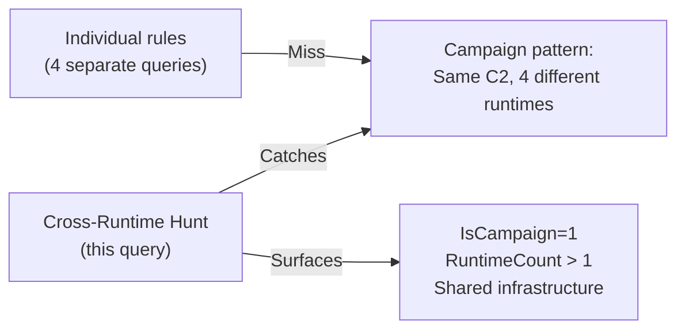

# Hunt Query — WebApp_RCE_CrossRuntime_Hunt

**Architecture:** 4 — Hunt Query (PEAK/TAHITI)  
**Author:** Ala Dabat | MTDF 2026  
**MITRE ATT&CK:** T1059.004 · T1059.006 · T1059.007 · T1059  
**Platform:** MDE Advanced Hunting  
**PEAK Type:** P — Pattern (Estate-wide anomaly sweep)  
**Lifecycle:** Single investigation — not for production deployment  

---

> ⚠️ **HUNT MODE — NOT FOR PRODUCTION DEPLOYMENT**

---

## Purpose

Estate-wide cross-runtime threat hunt covering PHP, Python, Java, and Node.js simultaneously. Designed to detect **coordinated campaigns** where an adversary exploits multiple web application runtimes on the same estate using shared C2 infrastructure.

---

## Why a Cross-Runtime Hunt Matters

Individual composite sensors and router rules cover one runtime at a time. They are designed for production alerting on specific techniques. They will not show you that the same C2 IP is receiving reverse shells from a Node.js app on Server-A and a PHP webshell on Server-B.

This hunt aggregates across all runtimes per device and per estate, surfacing:

1. **Campaign indicator:** Multiple runtimes firing on the same device → attacker targeting multiple applications on one host
2. **Infrastructure reuse:** Same C2 IP appearing across different runtime exploits on different devices
3. **Low-and-slow activity:** Sub-threshold events that individually would not fire composites but collectively show a pattern

---

## What Makes This Different From Running Each Rule Separately



The `IsCampaign` field flags devices where more than one runtime has been exploited — a high-confidence indicator of a coordinated campaign or a misconfigured host running multiple vulnerable applications.

---

## PEAK Classification

**P — Pattern Hunt:** This is not looking for a specific known TTP (that would be E — Entity). It is looking for an estate-wide anomalous pattern: web runtimes spawning children with RCE signals, aggregated to surface campaign indicators.

```
P — Pattern: "Something is structurally wrong with our web application estate"
→ Statistical aggregation: dcount(RuntimesHit) by DeviceName
→ Campaign indicator: RuntimeCount > 1 on same host
→ Infrastructure indicator: shared RemoteIP across devices
```

---

## How to Use Results

### Priority 1 — IsCampaign = 1 (RuntimeCount > 1)
Multiple runtimes exploited on the same device. This indicates either:
- An attacker targeting multiple applications on one server
- A mass exploit tool scanning for any vulnerable runtime

**Action:** Isolate device. Check all web application logs. Pivot network events to find C2.

### Priority 2 — High-signal single runtime hits
Rows with `[REVERSE_SHELL]` or `[PIPE_TO_SHELL]` + `[REMOTE_URL]` tags.

**Action:** Promote to the appropriate composite sensor. Validate the finding. Build a new composite if one does not exist.

### Priority 3 — Low-signal patterns across estate
Multiple devices showing `[REMOTE_URL]` from the same runtime type.

**Action:** Investigate for shared C2 infrastructure. Compare `CommandLines` field across devices.

---

## TAHITI Lifecycle

```
T1 Trigger     : Threat intel about active campaign / quarterly proactive hunt
T2 Hypothesis  : Web runtimes spawning shells with shared C2 across estate
T3 Data        : MDE DeviceProcessEvents — 30d lookback confirmed healthy
T4 Analysis    : Run this query (you are here)
T5 Iterate     : 
    If IsCampaign hits found → pivot DeviceNetworkEvents for C2 IP clustering
    If single-runtime hits → run individual composite hunt for that runtime
T6 Outcome     :
    True Positive  → Promotion Package → new composite per runtime found
    No Findings    → Document gap → verify web server MDE onboarding
    Refined        → New hypothesis: specific C2 infrastructure hunt
```

---

## Suggested Folder Name

For your GitHub repository, this rule and all cousin rules fit naturally in:

```
/Web-Application-Runtime-RCE/
├── NodeJS/
│   ├── PC_NodeJS_ChildProcess_Atomic.kql
│   ├── CS_NodeJS_SuspiciousChildProcesses.kql
│   ├── RR_NodeJS_ChildProcess_Abuse_Router.kql
│   └── HQ_NodeJS_RCE_ChildProcess_Hunt.kql
├── PHP/
│   ├── CS_PHP_exec_Abuse_T1059_004.kql
│   └── (PC + Router pending)
├── Python/
│   ├── CS_Python_subprocess_Abuse_T1059_006.kql
│   └── (PC + Router pending)
├── Java/
│   ├── RR_Java_Runtime_Exec_Abuse_T1059.kql
│   └── (Composites pending — see decomp tracker)
└── Cross-Runtime/
    └── HQ_WebApp_RCE_CrossRuntime_Hunt.kql
```

This naming makes the ecosystem structure immediately clear to any engineer browsing the repository.
