# Advanced Threat Hunting — Senior Analyst Reference Guide
### BYOVD · SilverFox · ValleyRAT · EtherRAT · Living-off-the-Land · Sub-EDR Evasion

**Author:** Ala Dabat | 2026  
**Repository:** [azdabat/Threat-Hunting](https://github.com/azdabat/Threat-Hunting)  
**Framework:** [Minimum Truth Detection Framework](https://github.com/azdabat/Minimum-Truth-Detection-Framework-ADX-Validated-Composite-Rules)  
**License:** [CC BY-NC-SA 4.0](https://creativecommons.org/licenses/by-nc-sa/4.0/legalcode)

---

> *"Traditional detection asks: is this file known bad?*  
> *Advanced threat hunting asks: did this behaviour need to happen for the attack to succeed?*  
> *The second question is the only one that survives AI-generated polymorphism, byte-flip evasion, and living-off-the-land execution."*

---

## Table of Contents

- [Part I — The Threat Landscape](#part-i--the-threat-landscape)
- [Part II — BYOVD: SilverFox / ValleyRAT Deep Dive](#part-ii--byovd-silverfox--valleyrat-deep-dive)
- [Part III — EtherRAT: Blockchain C2 Deep Dive](#part-iii--etherrat-blockchain-c2-deep-dive)
- [Part IV — Threat 3: Kerberoasting & AS-REP Roasting](#part-iv--threat-3-kerberoasting--as-rep-roasting)
- [Part V — Threat 4: Living-off-the-Land Fileless Execution](#part-v--threat-4-living-off-the-land-fileless-execution)
- [Part VI — Threat 5: AI-Native Supply Chain Compromise](#part-vi--threat-5-ai-native-supply-chain-compromise)
- [Part VII — Senior Incident Response Methodology](#part-vii--senior-incident-response-methodology)
- [Part VIII — Blast Radius Assessment](#part-viii--blast-radius-assessment)
- [Part IX — MTDF Framework Alignment](#part-ix--mtdf-framework-alignment)

---

## Part I — The Threat Landscape

### Attacks That Evade Traditional EDR — The Taxonomy

Traditional EDR operates on three pillars: signature matching, process tree analysis, and behavioural heuristics. Each pillar has a structural blind spot that advanced threat actors deliberately exploit.

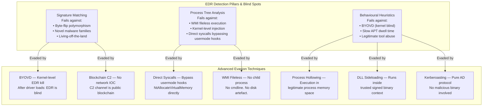

### The 2026 Priority Threat Matrix

| Threat | EDR Evasion Method | Dwell Time | Detection Surface | MTDF Tier |
|--------|-------------------|------------|------------------|-----------|
| SilverFox BYOVD | Byte-flip + kernel blind | Hours–Days | Behavioural chain only | Tier 3 |
| EtherRAT | Blockchain C2 — no net IOC | Weeks–Months | Network anomaly + process | Tier 2 |
| Kerberoasting | Pure protocol abuse | Minutes | Identity telemetry only | Tier 1 |
| WMI Fileless | No process/cmdline | Days–Weeks | DLL load events only | Tier 2 |
| Direct Syscall injection | Bypasses usermode hooks | Hours | Memory + kernel events | Tier 3 |
| Supply chain CI/CD | Legitimate pipeline | Weeks | Build artefact anomaly | Tier 2 |
| AI-generated polymorphic | Hash invariant | Campaign | Behaviour only | Tier 3 |

---

## Part II — BYOVD: SilverFox / ValleyRAT Deep Dive

### What Makes BYOVD Fundamentally Different

BYOVD (Bring Your Own Vulnerable Driver) is the only commonly deployed technique that achieves kernel-level code execution using a *Microsoft-validated* attack path. The OS trusts the driver. The security product is killed from a layer it cannot defend against. After Stage 6 the attacker operates in a detection vacuum.

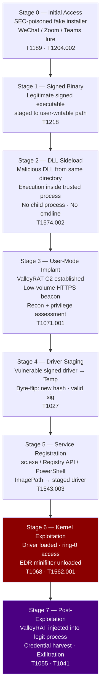

### Investigation Methodology — BYOVD

#### Step 1 — Triage the Alert

When a BYOVD Tier 2 or Tier 3 alert fires, the first decision is whether EDR is still operational.

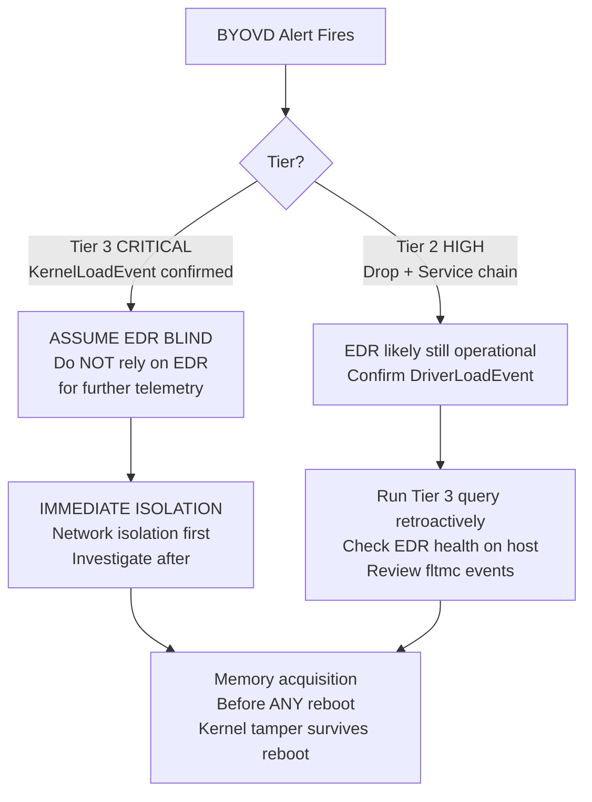

#### Step 2 — MDE Hunt Queries

**Hunt 1 — Signed binary in user-writable path loading mismatched DLL:**

```kql
// BYOVD Hunt 1: DLL Sideload Precursor
// Look back 7 days for signed binaries loading unsigned/mismatched DLLs from writable paths
// This is Stage 2 — often the earliest visible telemetry

let WritablePaths = dynamic([
    "\\Temp\\", "\\AppData\\", "\\ProgramData\\",
    "\\Public\\", "\\Downloads\\", "\\Users\\"
]);

DeviceImageLoadEvents
| where Timestamp > ago(7d)
| where InitiatingProcessSignatureStatus == "Signed"
| where FolderPath has_any (WritablePaths)
      or InitiatingProcessFolderPath has_any (WritablePaths)
| where SignatureStatus != "Signed"
      or Signer != InitiatingProcessSigner
| extend AnomalyType = case(
    SignatureStatus != "Signed", "UNSIGNED_DLL_FROM_SIGNED_LOADER",
    Signer != InitiatingProcessSigner, "SIGNER_MISMATCH",
    "UNKNOWN"
)
| project
    Timestamp, DeviceName, AccountName,
    LoaderProcess    = InitiatingProcessFileName,
    LoaderPath       = InitiatingProcessFolderPath,
    LoaderSigner     = InitiatingProcessSigner,
    LoadedDLL        = FileName,
    LoadedDLLPath    = FolderPath,
    LoadedDLLSigner  = Signer,
    AnomalyType
| order by Timestamp desc
```

**Hunt 2 — Driver staged to writable path (hash-invariant):**

```kql
// BYOVD Hunt 2: Driver Staging
// Any .sys or .drv written to user-writable path is anomalous
// Legitimate drivers install to System32\drivers only

DeviceFileEvents
| where Timestamp > ago(7d)
| where ActionType in ("FileCreated", "FileModified", "FileRenamed")
| where FolderPath matches regex @"(?i)\\(Temp|AppData|ProgramData|Public|Users\\[^\\]+\\)"
| where FileName matches regex @"\.(sys|drv)$"
      or (FileName matches regex @"\.(dat|bin|tmp)$"
          and InitiatingProcessFileName !in~ ("svchost.exe", "trustedinstaller.exe"))
| extend RiskReason = "Driver-like artifact staged to user-writable path"
| project
    Timestamp, DeviceName, AccountName,
    DropperProcess = InitiatingProcessFileName,
    DropperCmdLine = InitiatingProcessCommandLine,
    DropperHash    = InitiatingProcessSHA256,
    DroppedFile    = FileName,
    DropPath       = FolderPath,
    RiskReason
| order by Timestamp desc
```

**Hunt 3 — Service ImagePath pointing to writable location:**

```kql
// BYOVD Hunt 3: Service Registration from Writable Path
// ImagePath pointing outside System32 is anomalous for kernel drivers

DeviceRegistryEvents
| where Timestamp > ago(7d)
| where ActionType == "RegistryValueSet"
| where RegistryKey has @"CurrentControlSet\Services"
| where RegistryValueName =~ "ImagePath"
| where RegistryValueData matches regex @"(?i)\\(Temp|AppData|ProgramData|Public|Users\\)"
| project
    Timestamp, DeviceName,
    ServiceKey       = RegistryKey,
    ServiceImagePath = RegistryValueData,
    WriterProcess    = InitiatingProcessFileName,
    WriterCmdLine    = InitiatingProcessCommandLine,
    WriterHash       = InitiatingProcessSHA256,
    AccountName      = InitiatingProcessAccountName
| order by Timestamp desc
```

**Hunt 4 — EDR Blinding: fltmc unload:**

```kql
// BYOVD Hunt 4: Security Product Tamper
// fltmc.exe unload removes the EDR minifilter from the filter stack
// This is Stage 6 — if you see this, assume EDR is already blind

DeviceProcessEvents
| where Timestamp > ago(7d)
| where FileName =~ "fltmc.exe"
| where ProcessCommandLine has "unload"
| extend TamperTarget = extract(@"unload\s+(\S+)", 1, ProcessCommandLine)
| project
    Timestamp, DeviceName, AccountName,
    TamperCmdLine  = ProcessCommandLine,
    TamperTarget,
    ParentProcess  = InitiatingProcessFileName,
    ParentCmdLine  = InitiatingProcessCommandLine
| order by Timestamp desc
```

**Hunt 5 — Correlate full chain (retrospective after alert):**

```kql
// BYOVD Hunt 5: Retrospective Full Chain on Specific Device
// Run this after a BYOVD alert to reconstruct the complete timeline
// Replace DeviceName value with the affected host

let TargetDevice = "REPLACE_WITH_DEVICE_NAME";
let AnchorTime   = ago(48h);

let SideloadEvents =
    DeviceImageLoadEvents
    | where Timestamp > AnchorTime
    | where DeviceName =~ TargetDevice
    | where InitiatingProcessSignatureStatus == "Signed"
    | where SignatureStatus != "Signed" or Signer != InitiatingProcessSigner
    | project Time=Timestamp, Layer="DLL_SIDELOAD",
              Detail=strcat(InitiatingProcessFileName, " loaded ", FileName,
                           " (sig: ", tostring(SignatureStatus), ")");

let DriverDrops =
    DeviceFileEvents
    | where Timestamp > AnchorTime
    | where DeviceName =~ TargetDevice
    | where FileName matches regex @"\.(sys|drv|dat|bin)$"
    | where FolderPath matches regex @"(?i)\\(Temp|AppData|ProgramData|Public)\\"
    | project Time=Timestamp, Layer="DRIVER_STAGED",
              Detail=strcat(FileName, " dropped to ", FolderPath,
                           " by ", InitiatingProcessFileName);

let ServiceCreates =
    DeviceRegistryEvents
    | where Timestamp > AnchorTime
    | where DeviceName =~ TargetDevice
    | where RegistryKey has "Services" and RegistryValueName =~ "ImagePath"
    | where RegistryValueData matches regex @"(?i)\\(Temp|AppData|ProgramData|Public)\\"
    | project Time=Timestamp, Layer="SERVICE_REGISTERED",
              Detail=strcat(RegistryKey, " → ", RegistryValueData));

let KernelLoads =
    DeviceEvents
    | where Timestamp > AnchorTime
    | where DeviceName =~ TargetDevice
    | where ActionType == "DriverLoadEvent"
    | project Time=Timestamp, Layer="KERNEL_LOAD_CONFIRMED",
              Detail=strcat(FileName, " loaded from ", FolderPath));

let TamperEvents =
    DeviceProcessEvents
    | where Timestamp > AnchorTime
    | where DeviceName =~ TargetDevice
    | where (FileName =~ "fltmc.exe" and ProcessCommandLine has "unload")
          or ProcessCommandLine has_any ("WinDefend", "Sense", "MsMpEng")
    | project Time=Timestamp, Layer="EDR_TAMPER",
              Detail=ProcessCommandLine);

union SideloadEvents, DriverDrops, ServiceCreates, KernelLoads, TamperEvents
| order by Time asc
| project Time, Layer, Detail
```

#### Step 3 — Sentinel Hunt Queries

```kql
// BYOVD Sentinel Hunt: Service Install from Writable Path (EID 7045)
// Requires System event log forwarding via AMA

SecurityEvent
| where TimeGenerated > ago(7d)
| where EventID == 7045  // New service installed
| extend ServiceName = tostring(EventData.ServiceName)
| extend ServiceFileName = tostring(EventData.ImagePath)
| extend ServiceType = tostring(EventData.ServiceType)
| where ServiceFileName matches regex @"(?i)\\(Temp|AppData|ProgramData|Public|Users\\)"
| where ServiceType =~ "kernel mode driver" or ServiceFileName matches regex @"\.(sys|drv)\b"
| project
    TimeGenerated, Computer,
    ServiceName, ServiceFileName, ServiceType,
    AccountName = Account
| order by TimeGenerated desc
```

#### Cousin Techniques to Hunt Simultaneously

When BYOVD is detected, always hunt these adjacent surfaces — they represent the techniques used immediately before and after:

| Phase | Cousin Technique | MITRE | Hunt Table |
|-------|-----------------|-------|-----------|
| Before BYOVD | DLL Sideloading (Stage 2) | T1574.002 | DeviceImageLoadEvents |
| Before BYOVD | Script stager (Stage 1) | T1059.001 | DeviceProcessEvents |
| After BYOVD | Process injection (Stage 8) | T1055 | DeviceEvents |
| After BYOVD | LSASS credential access | T1003.001 | DeviceEvents |
| After BYOVD | Network C2 beacon | T1071.001 | DeviceNetworkEvents |
| After BYOVD | Lateral movement | T1021.002/003 | DeviceNetworkEvents |

---

## Part III — EtherRAT: Blockchain C2 Deep Dive

### Why Blockchain C2 Is Fundamentally Different

Traditional C2 detection works by identifying anomalous network connections: unusual domains, first-seen IPs, DNS tunnelling patterns, jitter-based beacon detection. EtherRAT eliminates every one of these detection surfaces by routing C2 through the public Ethereum blockchain.

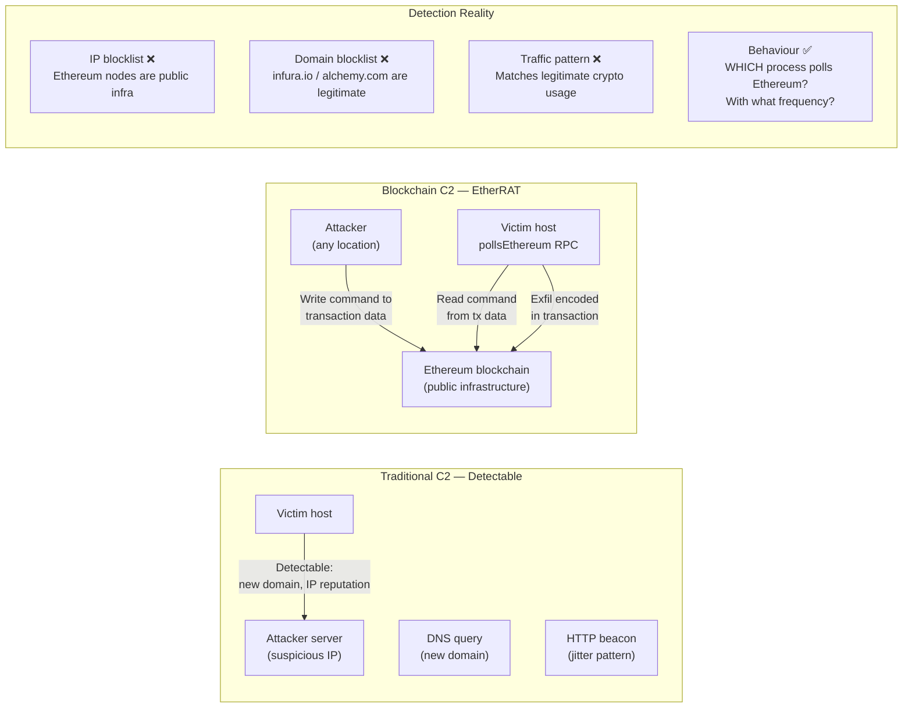

### EtherRAT Attack Flow

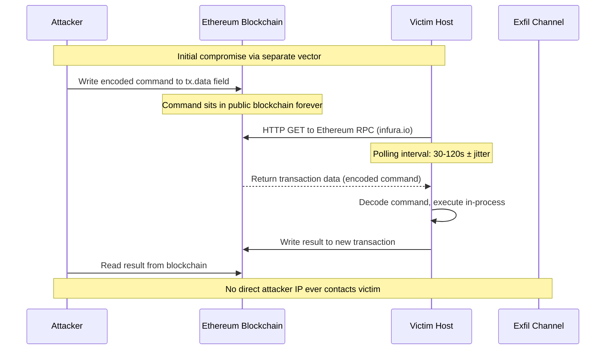

### Investigation Methodology — Blockchain C2

#### The Hunt Hypothesis

*"A process on this host is polling an Ethereum RPC endpoint at regular intervals. This process has no business reason to interact with blockchain infrastructure. The polling behaviour matches a C2 beacon pattern."*

#### Step 1 — Identify Anomalous Blockchain Connections

```kql
// EtherRAT Hunt 1: Process polling Ethereum RPC endpoints
// Legitimate Ethereum RPC providers
// A non-crypto application polling these is highly anomalous

let EthereumRPC = dynamic([
    "infura.io", "alchemy.com", "quicknode.io", "moralis.io",
    "ankr.com", "cloudflare-eth.com", "mainnet.infura.io",
    "eth-mainnet.alchemyapi.io", "rpc.ankr.com"
]);

let EthereumIPs = dynamic([
    // Cloudflare Ethereum gateway
    "162.159.200.1", "162.159.200.2"
]);

DeviceNetworkEvents
| where Timestamp > ago(30d)
| where RemoteUrl has_any (EthereumRPC)
      or RemoteIP in (EthereumIPs)
      or (RemotePort == 8545 or RemotePort == 8546)  // Default Ethereum RPC ports
// Exclude expected crypto applications
| where InitiatingProcessFileName !in~ (
    "brave.exe", "metamask.exe", "exodus.exe",
    "coinbase.exe", "ledger live.exe"
)
| summarize
    ConnectionCount = count(),
    UniqueRemotes   = dcount(RemoteUrl),
    FirstSeen       = min(Timestamp),
    LastSeen        = max(Timestamp),
    SampleURLs      = make_set(RemoteUrl, 5)
  by DeviceName, InitiatingProcessFileName,
     InitiatingProcessSHA256, InitiatingProcessFolderPath
| extend DwellDays = datetime_diff("day", LastSeen, FirstSeen)
| extend IsHighFreq = toint(ConnectionCount > 100)
| order by ConnectionCount desc
```

**Hunt 2 — Beacon interval analysis (the smoking gun):**

```kql
// EtherRAT Hunt 2: Beacon interval analysis
// C2 beacons show regular polling intervals ± jitter
// Legitimate apps do not poll blockchain at machine-clock regularity

let TargetProcess = "REPLACE_WITH_SUSPICIOUS_PROCESS";
let TargetDevice  = "REPLACE_WITH_DEVICE_NAME";

DeviceNetworkEvents
| where Timestamp > ago(7d)
| where DeviceName =~ TargetDevice
| where InitiatingProcessFileName =~ TargetProcess
| where RemoteUrl has_any ("infura.io", "alchemy.com", "rpc.ankr.com")
| sort by Timestamp asc
| extend PrevTimestamp = prev(Timestamp)
| extend IntervalSeconds = datetime_diff("second", Timestamp, PrevTimestamp)
| where isnotempty(IntervalSeconds)
| summarize
    AvgInterval   = avg(IntervalSeconds),
    StdDev        = stdev(IntervalSeconds),
    MinInterval   = min(IntervalSeconds),
    MaxInterval   = max(IntervalSeconds),
    SampleCount   = count()
| extend JitterPct = (StdDev / AvgInterval) * 100
| extend BeaconAssessment = case(
    JitterPct < 30 and AvgInterval between (10 .. 300), "HIGH_CONFIDENCE_BEACON",
    JitterPct < 50 and AvgInterval between (5 .. 600),  "MEDIUM_CONFIDENCE_BEACON",
    "LOW_CONFIDENCE"
)
```

**Hunt 3 — Sentinel: Anomalous blockchain connections via proxy/firewall:**

```kql
// EtherRAT Sentinel Hunt: Proxy logs via CommonSecurityLog
// Catches HTTPS to Ethereum RPC endpoints that evade endpoint detection

CommonSecurityLog
| where TimeGenerated > ago(30d)
| where DeviceVendor in ("Zscaler", "Palo Alto", "Cisco", "Forcepoint", "BlueCoat")
| where RequestURL has_any (
    "infura.io", "alchemy.com", "quicknode.io",
    "rpc.ankr.com", "cloudflare-eth.com"
)
| summarize
    HitCount     = count(),
    UniqueUsers  = dcount(SourceUserName),
    UniqueHosts  = dcount(DeviceName),
    FirstSeen    = min(TimeGenerated),
    LastSeen     = max(TimeGenerated)
  by SourceUserName, DeviceName, RequestURL
| where HitCount > 50  // Regular polling threshold
| order by HitCount desc
```

### Cousin Techniques — EtherRAT Context

| Phase | Technique | Rationale |
|-------|-----------|-----------|
| Initial delivery | Malvertising, SEO poisoning | Same delivery as SilverFox |
| Pre-C2 | DLL sideloading | Execution in trusted process context |
| C2 channel | Blockchain polling | The primary novel technique |
| Post-C2 | Credential harvesting | Standard post-exploitation |
| Persistence | WMI subscription | Fileless, survives reboots |
| Exfil | Blockchain write | Exfil via tx.data encoding |

---

## Part IV — Threat 3: Kerberoasting & AS-REP Roasting

### Why These Evade Traditional EDR

Kerberoasting is pure Active Directory protocol abuse. No malicious binary executes on disk. No suspicious process runs. The attack is a series of entirely legitimate Kerberos ticket requests — indistinguishable from normal domain activity without identity telemetry analysis.

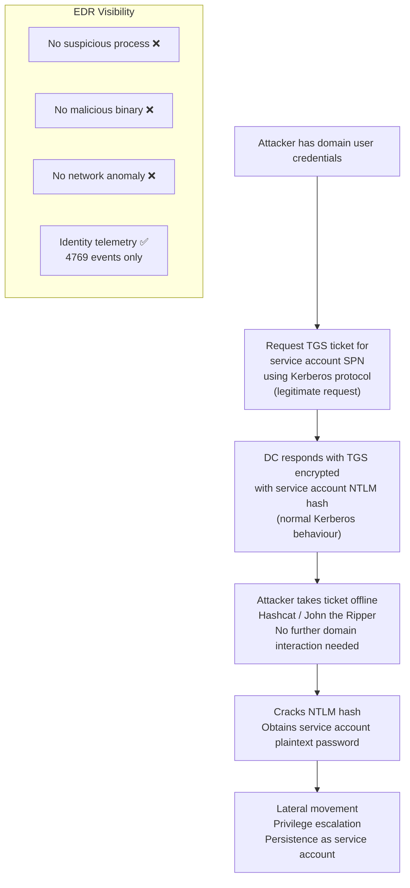

### AS-REP Roasting — Pre-Authentication Disabled

AS-REP Roasting targets accounts with Kerberos pre-authentication disabled — a misconfiguration that allows requesting an AS-REP without knowing the account password. The encrypted portion is crackable offline.

### Investigation Methodology — Kerberoasting

#### The Hunt Hypothesis

*"An account is requesting an unusual volume of TGS tickets for service account SPNs using RC4 encryption. This pattern is inconsistent with normal user behaviour and consistent with Kerberoasting enumeration."*

#### MDE Hunt Queries

```kql
// Kerberoasting Hunt 1: TGS requests with RC4 encryption (4769)
// Modern Kerberos uses AES256. RC4 requests are legacy compatibility or attack.
// Volume anomaly: legitimate users rarely request multiple service tickets in a burst.

IdentityLogonEvents
| where Timestamp > ago(7d)
| where Protocol =~ "Kerberos"
| where ActionType =~ "LogonSuccess"
// RC4 encryption type = 0x17 (23) — indicates Kerberoasting tool usage
| extend EncryptionType = tostring(AdditionalFields.EncryptionType)
| where EncryptionType == "0x17" or EncryptionType == "rc4-hmac"
// Exclude computer accounts (end in $)
| where AccountName !endswith "$"
| summarize
    TicketCount    = count(),
    UniqueServices = dcount(Application),
    FirstSeen      = min(Timestamp),
    LastSeen       = max(Timestamp),
    Services       = make_set(Application, 20)
  by AccountName, AccountUpn, IPAddress, DeviceName
| extend BurstMinutes = datetime_diff("minute", LastSeen, FirstSeen)
| extend TicketsPerMin = iff(BurstMinutes > 0,
    todouble(TicketCount) / BurstMinutes, todouble(TicketCount))
| where TicketCount > 5
| extend Severity = case(
    TicketCount > 20 or TicketsPerMin > 5, "CRITICAL",
    TicketCount > 10, "HIGH",
    "MEDIUM"
)
| order by TicketCount desc
```

```kql
// Kerberoasting Hunt 2: AS-REP Roasting (4768 without pre-auth)
// EventID 4768 with pre-auth not required = AS-REP Roasting candidate

SecurityEvent
| where TimeGenerated > ago(7d)
| where EventID == 4768  // Kerberos authentication ticket requested
| extend PreauthType = tostring(EventData.PreAuthType)
| where PreauthType == "0"  // No pre-authentication
| where AccountName !endswith "$"  // Exclude computer accounts
| project
    TimeGenerated, Computer,
    AccountName, IpAddress,
    PreauthType,
    TargetDomainName = tostring(EventData.TargetDomainName)
| order by TimeGenerated desc
```

```kql
// Kerberoasting Hunt 3: Correlate with subsequent lateral movement
// If Kerberoasting succeeded, look for service account logons shortly after

let KerberoastAccounts =
    IdentityLogonEvents
    | where Timestamp > ago(7d)
    | where Protocol =~ "Kerberos"
    | extend EncryptionType = tostring(AdditionalFields.EncryptionType)
    | where EncryptionType == "0x17"
    | where AccountName !endswith "$"
    | summarize LastRoast = max(Timestamp) by AccountName;

IdentityLogonEvents
| where Timestamp > ago(7d)
| where ActionType =~ "LogonSuccess"
| join kind=inner (KerberoastAccounts) on AccountName
| where Timestamp > LastRoast  // Logon AFTER roasting attempt
| where LogonType in ("Network", "RemoteInteractive")
| project
    Timestamp, AccountName, IPAddress, DeviceName,
    LogonType, Application,
    MinutesAfterRoast = datetime_diff("minute", Timestamp, LastRoast)
| order by MinutesAfterRoast asc
```

### Sentinel Queries

```kql
// Kerberoasting Sentinel: Volume TGS with RC4 from single source
// Requires Microsoft Defender for Identity or AD audit logs

SecurityEvent
| where TimeGenerated > ago(7d)
| where EventID == 4769  // Kerberos service ticket requested
| extend TicketOptions     = tostring(EventData.TicketOptions)
| extend TicketEncType     = tostring(EventData.TicketEncryptionType)
| extend ServiceName       = tostring(EventData.ServiceName)
| extend ClientAddress     = tostring(EventData.IpAddress)
| where TicketEncType == "0x17"  // RC4
| where ServiceName !endswith "$" and ServiceName !in~ ("krbtgt", "kadmin")
| summarize
    TicketCount = count(),
    Services    = make_set(ServiceName, 30),
    FirstSeen   = min(TimeGenerated),
    LastSeen    = max(TimeGenerated)
  by Account, ClientAddress, Computer
| where TicketCount >= 5
| extend BurstWindow = datetime_diff("minute", LastSeen, FirstSeen)
| order by TicketCount desc
```

---

## Part V — Threat 4: Living-off-the-Land Fileless Execution

### The LOLBin Ecosystem

Living-off-the-land execution abuses legitimate, signed Windows binaries to execute attacker payloads. No malicious file ever touches disk. The execution chain is entirely composed of trusted system components.

```mermaid
graph LR
    subgraph Delivery["Delivery Vector"]
        D1["Phishing → Office macro"]
        D2["Drive-by → Browser exploit"]
        D3["Supply chain → Installer"]
    end

    subgraph LOLChain["LOLBin Execution Chain"]
        L1["winword.exe\n(Office macro trigger)"]
        L2["powershell.exe\n(-EncodedCommand)"]
        L3["rundll32.exe\n(DLL execution proxy)"]
        L4["regsvr32.exe\n(/i:http squiblydoo)"]
        L5["mshta.exe\n(HTA remote exec)"]
        L6["certutil.exe\n(-urlcache download)"]
        L7["wmic.exe\n(process create)"]
    end

    subgraph Memory["In-Memory Execution"]
        M1["Reflective DLL injection\nVirtualAlloc + VirtualProtect"]
        M2["Process hollowing\nNtUnmapViewOfSection"]
        M3["Thread hijacking\nSuspendThread + SetContext"]
    end

    Delivery --> LOLChain
    LOLChain --> Memory
```

### Direct Syscall Bypass — Sub-EDR Execution

The most advanced LOLBin evasion technique is direct syscall execution — bypassing the usermode hooks that EDR places on Windows API functions by calling the kernel directly via syscall numbers.

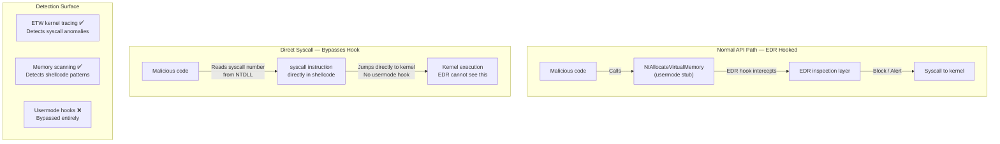

### Hunt Queries — Fileless Execution

```kql
// Fileless Hunt 1: PowerShell with reflective injection markers
// These primitives appear in the command line when PowerShell is used as loader

DeviceProcessEvents
| where Timestamp > ago(7d)
| where FileName in~ ("powershell.exe", "pwsh.exe")
| extend Cmd = tolower(ProcessCommandLine)
| where Cmd has_any (
    "virtualalloc", "virtualprotect", "createthread",
    "reflection.assembly", "[system.reflection",
    "marshal.getdelegateforfunctionpointer",
    "ntcreatethreaded", "ntunmapviewofsection"
)
| extend InjectionType = case(
    Cmd has "virtualalloc" and Cmd has "createthread", "SHELLCODE_INJECT",
    Cmd has "reflection.assembly", "REFLECTIVE_DLL",
    Cmd has "ntunmapviewofsection", "PROCESS_HOLLOW",
    "INJECTION_UNKNOWN"
)
| project
    Timestamp, DeviceName, AccountName,
    ProcessCommandLine, InjectionType,
    ParentProcess = InitiatingProcessFileName,
    ParentCmdLine = InitiatingProcessCommandLine,
    ParentSigner  = InitiatingProcessSignerType
| order by Timestamp desc
```

```kql
// Fileless Hunt 2: AMSI bypass patterns
// AMSI bypass is a prerequisite for in-memory execution of detected payloads
// Presence = attacker preparing in-memory execution chain

DeviceEvents
| where Timestamp > ago(7d)
| where ActionType == "AmsiScriptDetection"
| extend ScriptContent = tostring(AdditionalFields.ScriptContent)
| where ScriptContent has_any (
    "AmsiScanBuffer", "amsiInitFailed", "AmsiUtils",
    "amsiContext", "ForceAmsi", "bypass"
)
| project
    Timestamp, DeviceName, AccountName,
    ScriptContent = substring(ScriptContent, 0,
                   min(strlen(ScriptContent), 500)),
    InitiatingProcessFileName,
    InitiatingProcessCommandLine
| order by Timestamp desc
```

```kql
// Fileless Hunt 3: Suspicious LOLBin parent-child relationships
// Maps common LOLBin abuse chains

let SuspiciousChains = datatable(Parent:string, Child:string, Technique:string)
[
    "winword.exe",    "powershell.exe",  "T1566.001 Phishing → PS",
    "excel.exe",      "cmd.exe",         "T1566.001 Phishing → CMD",
    "outlook.exe",    "powershell.exe",  "T1566.001 Email → PS",
    "mshta.exe",      "powershell.exe",  "T1218.005 mshta proxy",
    "wscript.exe",    "powershell.exe",  "T1059.005 VBS → PS",
    "cscript.exe",    "cmd.exe",         "T1059.005 VBS → CMD",
    "regsvr32.exe",   "powershell.exe",  "T1218.010 Squiblydoo",
    "rundll32.exe",   "cmd.exe",         "T1218.011 rundll32 proxy",
    "msiexec.exe",    "powershell.exe",  "T1218.007 MSI abuse",
    "svchost.exe",    "powershell.exe",  "T1569 Service → PS (anomalous)"
];

DeviceProcessEvents
| where Timestamp > ago(7d)
| extend ParentLower = tolower(InitiatingProcessFileName)
| extend ChildLower  = tolower(FileName)
| join kind=inner (
    SuspiciousChains
    | extend Parent = tolower(Parent)
    | extend Child  = tolower(Child)
) on $left.ParentLower == $right.Parent,
   $left.ChildLower  == $right.Child
| project
    Timestamp, DeviceName, AccountName,
    ParentProcess    = InitiatingProcessFileName,
    ParentCmdLine    = InitiatingProcessCommandLine,
    ChildProcess     = FileName,
    ChildCmdLine     = ProcessCommandLine,
    Technique,
    ParentSigner     = InitiatingProcessSignerType
| order by Timestamp desc
```

---

## Part VI — Threat 5: AI-Native Supply Chain Compromise

### The 2026 Supply Chain Threat

Supply chain compromise via CI/CD pipeline injection represents one of the highest-impact, lowest-visibility attack vectors in 2026. AI accelerates it by automating dependency confusion attacks, generating convincing malicious packages, and identifying vulnerable build pipelines. Unlike SolarWinds-style supply chain attacks (which required compromising a vendor's build server), modern supply chain attacks target the *process* — injecting into GitHub Actions, poisoning package registries, or hijacking developer credentials.

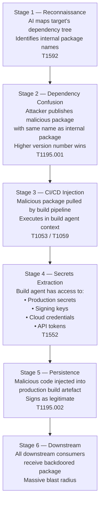

### Hunt Queries — CI/CD Supply Chain

```kql
// Supply Chain Hunt 1: Node/Java/Python runtime spawning shells
// Build agents SHOULD NOT spawn interactive shells during normal operation

let RuntimeParents = dynamic([
    "node.exe", "node", "java.exe", "java",
    "python.exe", "python3", "dotnet.exe", "mvn"
]);

let SuspiciousChildren = dynamic([
    "powershell.exe", "pwsh.exe", "cmd.exe", "sh", "bash",
    "nc", "ncat", "curl", "wget"
]);

DeviceProcessEvents
| where Timestamp > ago(7d)
| where InitiatingProcessFileName has_any (RuntimeParents)
| where FileName has_any (SuspiciousChildren)
| extend IsCI = DeviceName has_any ("build", "runner", "agent", "ci", "jenkins")
| project
    Timestamp, DeviceName, AccountName,
    IsCI,
    ParentProcess = InitiatingProcessFileName,
    ParentCmdLine = InitiatingProcessCommandLine,
    ChildProcess  = FileName,
    ChildCmdLine  = ProcessCommandLine
| order by Timestamp desc
```

```kql
// Supply Chain Hunt 2: Secrets access from build agent context
// Build agents reading credential files outside expected paths = compromise indicator

let CredentialPaths = dynamic([
    ".aws/credentials", ".azure/", ".npmrc",
    ".env", "id_rsa", "service-account.json",
    "kubeconfig", ".docker/config.json"
]);

DeviceFileEvents
| where Timestamp > ago(7d)
| where ActionType in ("FileCreated", "FileModified")
| where FileName has_any (CredentialPaths)
      or FolderPath has_any (".aws", ".azure", ".ssh", ".kube")
| where InitiatingProcessFileName has_any (
    "node.exe", "node", "python.exe", "python3",
    "java.exe", "mvn", "gradle"
)
| project
    Timestamp, DeviceName, AccountName,
    AccessedFile  = strcat(FolderPath, "\\", FileName),
    AccessProcess = InitiatingProcessFileName,
    AccessCmdLine = InitiatingProcessCommandLine
| order by Timestamp desc
```

---

## Part VII — Senior Incident Response Methodology

### The MTDF IR Framework

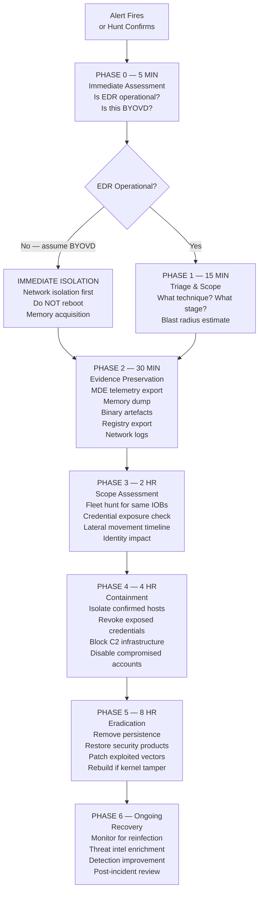

### Phase 0 — Immediate Assessment Decision Tree

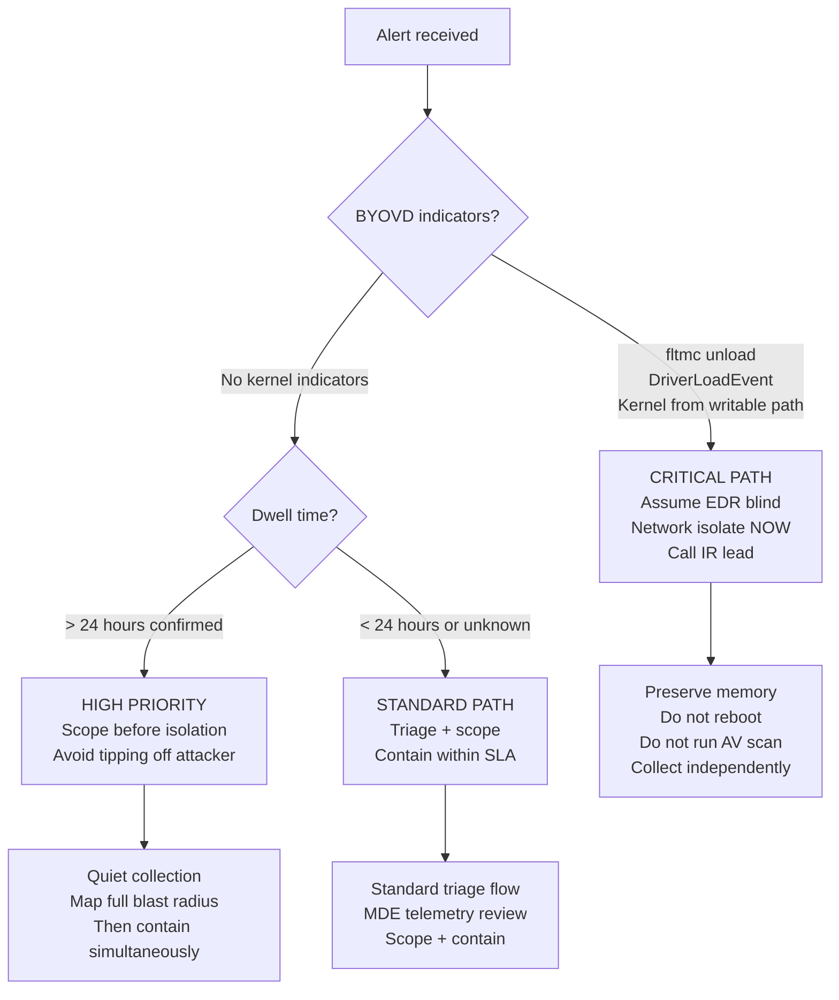

### The Attack Timeline Methodology

Every senior IR investigation must produce a timeline. The timeline is constructed from primitive stitching — correlating events across telemetry sources using entity keys.

```kql
// Master Timeline Builder
// Run after containment to reconstruct the full attack timeline
// Replace TargetDevice and AnchorTime with investigation-specific values

let TargetDevice = "COMPROMISED_HOST_NAME";
let AnchorTime   = datetime(2026-01-01T00:00:00Z);  // Replace with first indicator
let LookbackHrs  = 48h;
let ForwardHrs   = 24h;

// Process execution layer
let ProcLayer =
    DeviceProcessEvents
    | where Timestamp between ((AnchorTime - LookbackHrs) .. (AnchorTime + ForwardHrs))
    | where DeviceName =~ TargetDevice
    | where FileName in~ (
        "powershell.exe", "cmd.exe", "rundll32.exe", "mshta.exe",
        "wscript.exe", "certutil.exe", "sc.exe", "fltmc.exe",
        "reg.exe", "net.exe", "whoami.exe", "nltest.exe"
    )
    | project
        Time = Timestamp, Layer = "PROCESS",
        Event = strcat(FileName, " ← ", InitiatingProcessFileName),
        Detail = substring(ProcessCommandLine, 0,
                 min(strlen(ProcessCommandLine), 300)),
        MITRE = "T1059";

// File system layer
let FileLayer =
    DeviceFileEvents
    | where Timestamp between ((AnchorTime - LookbackHrs) .. (AnchorTime + ForwardHrs))
    | where DeviceName =~ TargetDevice
    | where ActionType in ("FileCreated", "FileModified")
    | where FolderPath matches regex @"(?i)\\(Temp|AppData|ProgramData|Public|System32)\\"
    | project
        Time = Timestamp, Layer = "FILE",
        Event = strcat(ActionType, ": ", FileName),
        Detail = FolderPath,
        MITRE = "T1105";

// Registry layer
let RegLayer =
    DeviceRegistryEvents
    | where Timestamp between ((AnchorTime - LookbackHrs) .. (AnchorTime + ForwardHrs))
    | where DeviceName =~ TargetDevice
    | where ActionType == "RegistryValueSet"
    | where RegistryKey has_any ("Run", "Services", "TaskCache", "Startup")
    | project
        Time = Timestamp, Layer = "REGISTRY",
        Event = strcat("RegWrite: ", RegistryValueName),
        Detail = substring(RegistryKey, 0, 100),
        MITRE = "T1547";

// Network layer
let NetLayer =
    DeviceNetworkEvents
    | where Timestamp between ((AnchorTime - LookbackHrs) .. (AnchorTime + ForwardHrs))
    | where DeviceName =~ TargetDevice
    | where RemoteIPType == "Public"
    | where InitiatingProcessFileName !in~ ("svchost.exe", "wuauclt.exe", "MicrosoftEdge.exe")
    | project
        Time = Timestamp, Layer = "NETWORK",
        Event = strcat(InitiatingProcessFileName, " → ", RemoteIP, ":", RemotePort),
        Detail = coalesce(RemoteUrl, RemoteIP),
        MITRE = "TA0011";

// Logon layer
let LogonLayer =
    DeviceLogonEvents
    | where Timestamp between ((AnchorTime - LookbackHrs) .. (AnchorTime + ForwardHrs))
    | where DeviceName =~ TargetDevice
    | where ActionType =~ "LogonSuccess"
    | where LogonType in (3, 10)  // Network + RemoteInteractive
    | project
        Time = Timestamp, Layer = "LOGON",
        Event = strcat("Logon: ", AccountName, " (Type ", tostring(LogonType), ")"),
        Detail = strcat("From: ", RemoteIP, " → ", RemoteDeviceName),
        MITRE = "T1078";

// Union and sort
union ProcLayer, FileLayer, RegLayer, NetLayer, LogonLayer
| order by Time asc
| project Time, Layer, Event, Detail, MITRE
```

---

## Part VIII — Blast Radius Assessment

### The Blast Radius Model

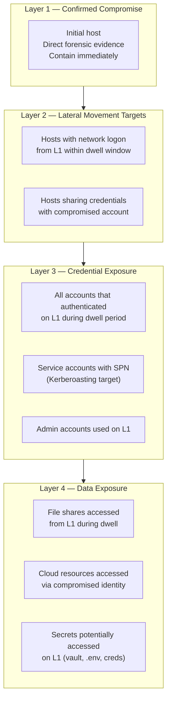

### Blast Radius Hunt Queries

```kql
// Blast Radius 1: All hosts that received network logons from compromised host
// These are lateral movement candidates

let CompromisedHost = "COMPROMISED_HOST_NAME";
let DwellStart      = datetime(2026-01-01T00:00:00Z);
let DwellEnd        = now();

DeviceLogonEvents
| where Timestamp between (DwellStart .. DwellEnd)
| where RemoteDeviceName =~ CompromisedHost
| where ActionType =~ "LogonSuccess"
| where LogonType in (3, 10)  // Network + RemoteInteractive
| summarize
    LogonCount   = count(),
    AccountsUsed = make_set(AccountName, 20),
    FirstSeen    = min(Timestamp),
    LastSeen     = max(Timestamp)
  by DeviceName
| extend IsLateralMovement = toint(LogonCount > 0)
| order by LogonCount desc
```

```kql
// Blast Radius 2: Accounts exposed on compromised host
// Any account that authenticated on the host during dwell = potentially harvested

let CompromisedHost = "COMPROMISED_HOST_NAME";
let DwellStart      = datetime(2026-01-01T00:00:00Z);

DeviceLogonEvents
| where Timestamp between (DwellStart .. now())
| where DeviceName =~ CompromisedHost
| where ActionType =~ "LogonSuccess"
| summarize
    LogonCount = count(),
    LogonTypes = make_set(LogonType, 5),
    FirstSeen  = min(Timestamp),
    LastSeen   = max(Timestamp)
  by AccountName, AccountDomain
| extend Priority = case(
    LogonTypes has "2" or LogonTypes has "10", "HIGH — Interactive logon",
    LogonTypes has "3",                         "MEDIUM — Network logon",
    "LOW"
)
| order by Priority asc, LogonCount desc
```

```kql
// Blast Radius 3: Cloud resources accessed by compromised identity
// Identity-level blast radius — cloud pivot from on-prem compromise

let CompromisedAccount = "compromised@domain.com";
let DwellStart         = datetime(2026-01-01T00:00:00Z);

CloudAppEvents
| where Timestamp between (DwellStart .. now())
| where AccountUpn =~ CompromisedAccount
| summarize
    ActionCount = count(),
    UniqueApps  = dcount(Application),
    Actions     = make_set(ActionType, 20),
    Apps        = make_set(Application, 20)
  by AccountUpn, IPAddress
| order by ActionCount desc
```

---

## Part IX — MTDF Framework Alignment

### How These Hunts Map to MTDF Doctrine

Every hunt in this document follows the Minimum Truth Framework principles:

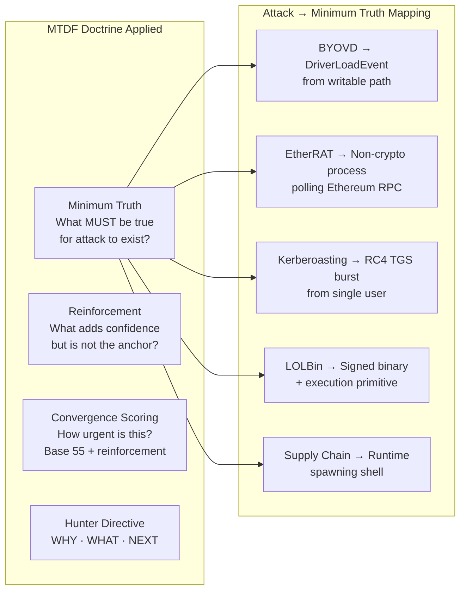

### The Two-Layer Architecture in IR Context

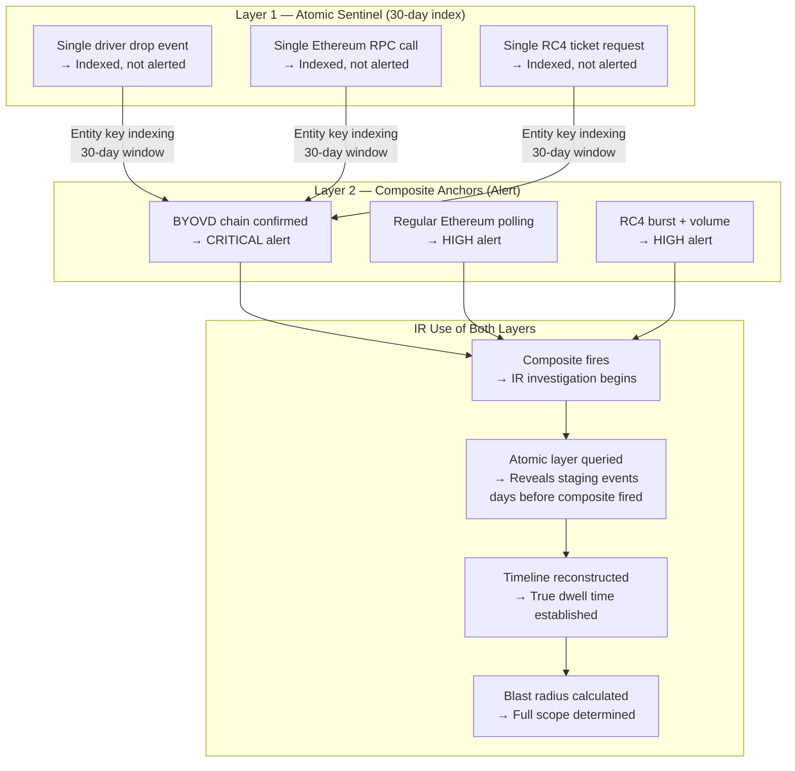

### Cousin Surface Coverage Map — Full IR Context

| Initial Technique | Pre-Cursor | Post-Exploitation | Persistence | Exfil |
|------------------|-----------|-------------------|-------------|-------|
| BYOVD kernel load | DLL sideload + driver stage | Process injection, LSASS | WMI subscription, registry run | Low-vol HTTPS C2 |
| Kerberoasting | Initial foothold + recon | Lateral with cracked creds | Service account persistence | Data exfil via owned account |
| LOLBin fileless | Phishing / drive-by | Credential harvest, lateral | Scheduled task, startup key | Clipboard, keylog |
| Supply chain | CI/CD access / pkg confusion | Secrets extract, signing key | Backdoor in build artefact | Downstream consumers |
| EtherRAT C2 | Any initial access | Any (C2 channel independent) | Any (C2 survives IOC rotation) | Blockchain write |

---

> [!NOTE]
> All KQL queries in this document are production-candidate and require tenant-specific
> tuning. Field names and ActionType values reflect MDE Advanced Hunting schema as of
> June 2026. Sentinel queries require appropriate data connectors enabled.

> [!IMPORTANT]
> **Senior IR Principle:** Never make containment decisions based on a single data point.
> The blast radius is always larger than the initial alert suggests. Scope before containing
> when dwell time permits — a premature containment that tips off the attacker can result
> in data destruction, ransomware deployment, or loss of evidence.

---

*Part of the Minimum Truth Detection Framework ecosystem*  
*Author: Ala Dabat | [github.com/azdabat](https://github.com/azdabat)*  
*Licensed under [CC BY-NC-SA 4.0](https://creativecommons.org/licenses/by-nc-sa/4.0/legalcode)*
