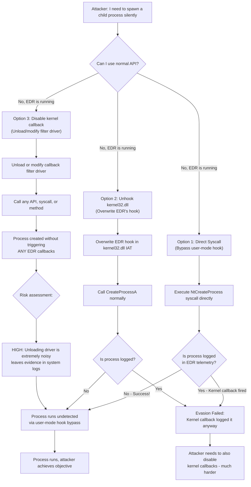
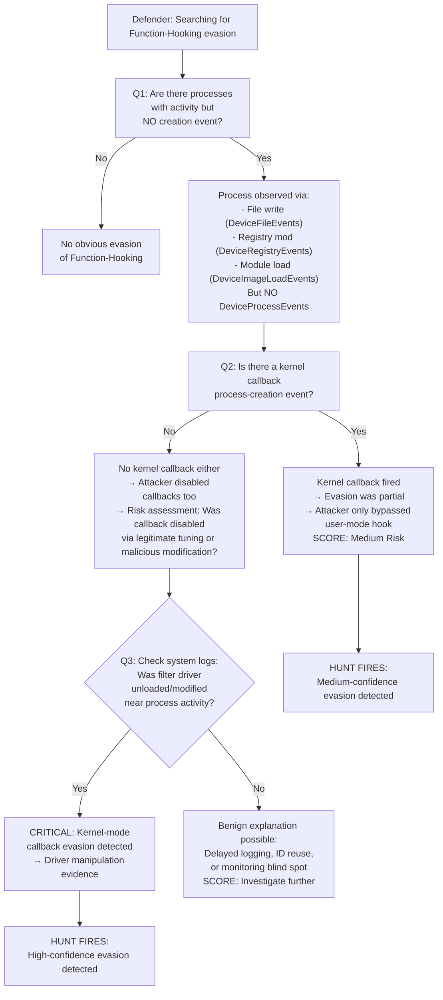
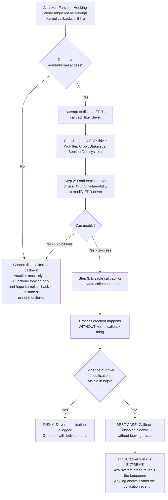
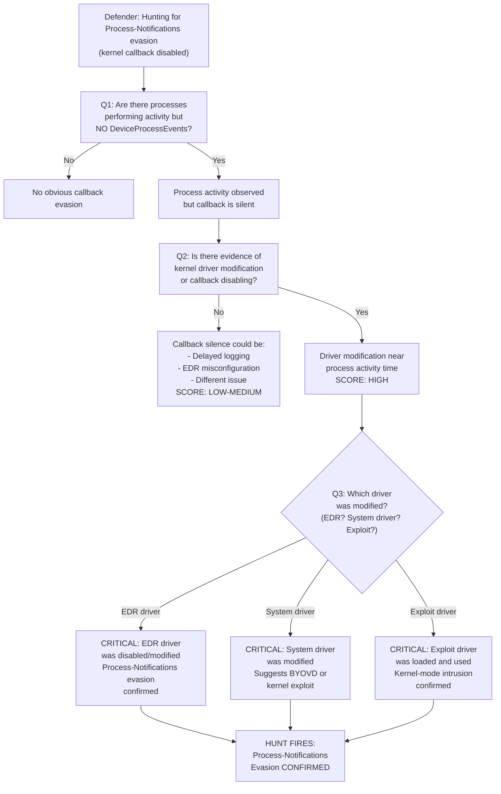
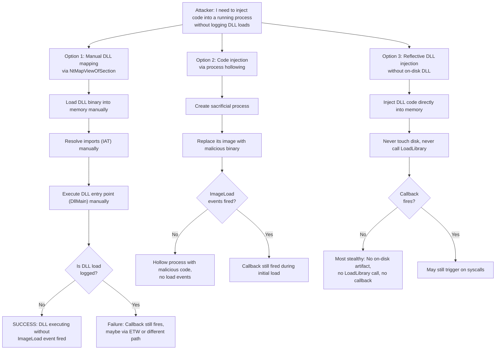
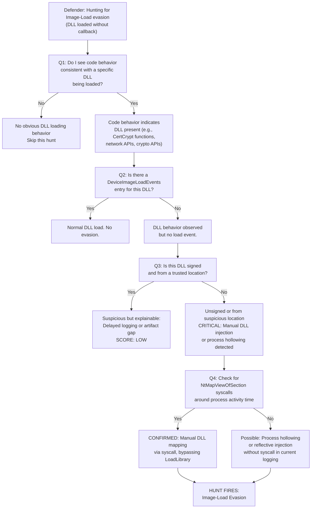
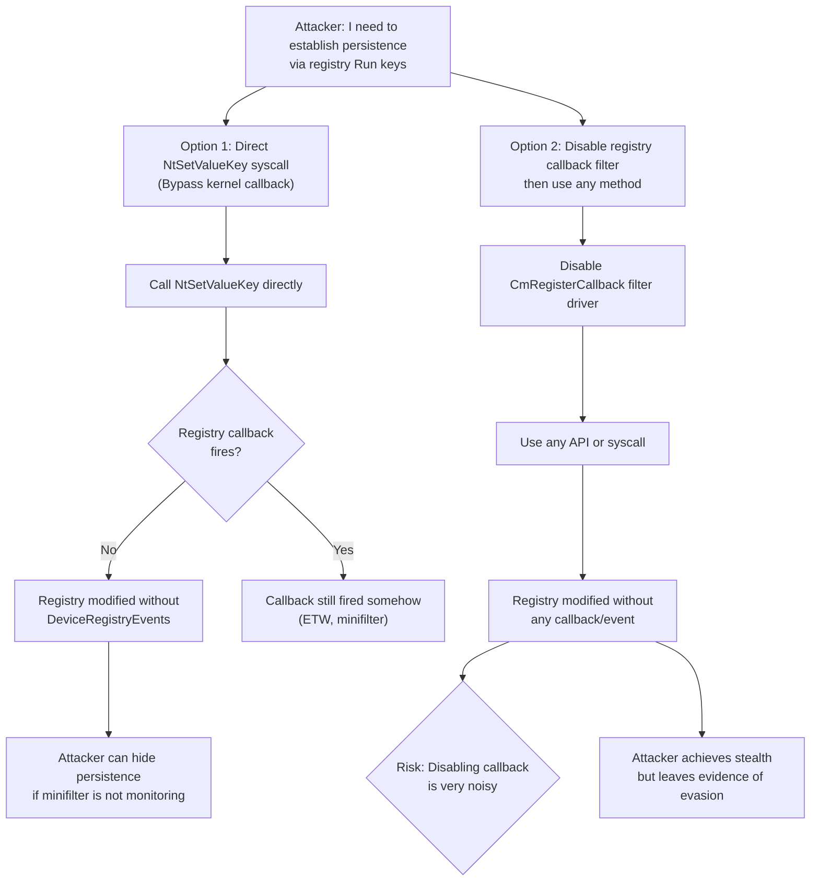
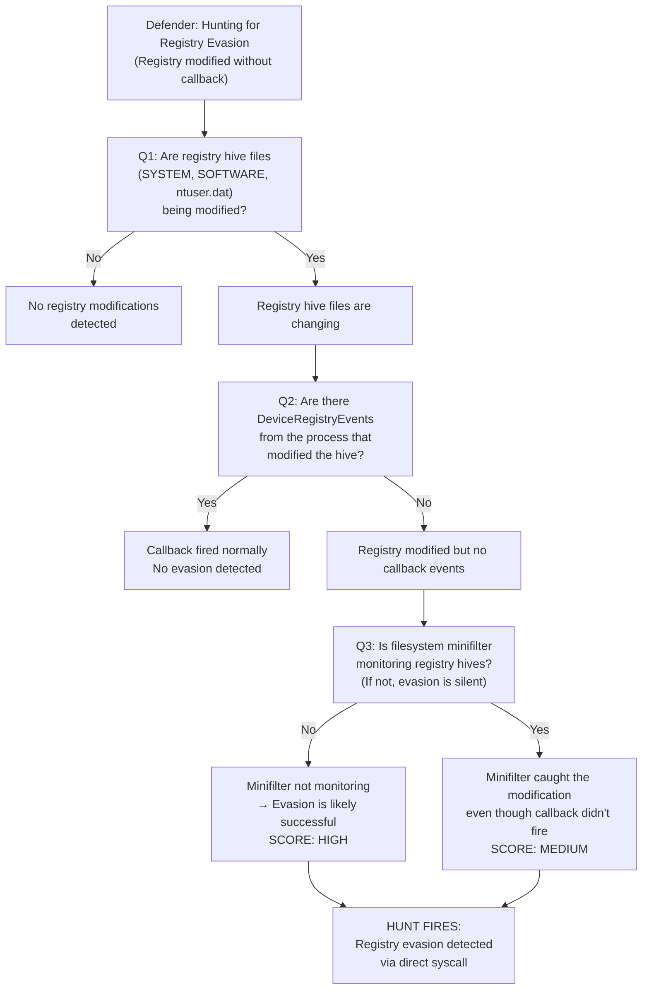
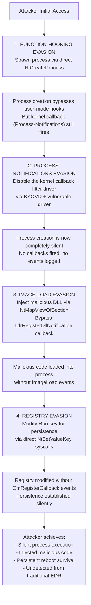
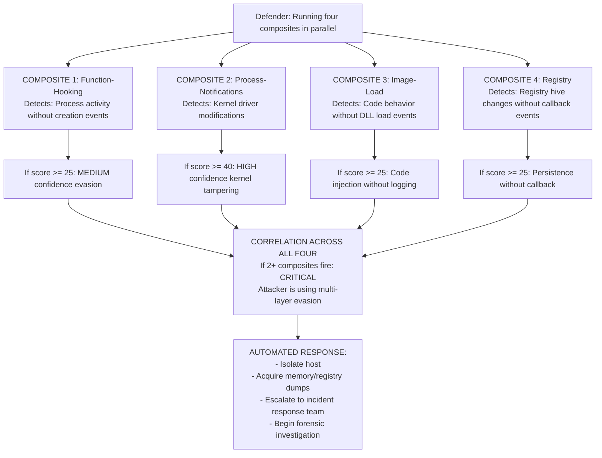

# EDR Sensor Evasion: Complete Attack-Defense Narrative & MTDF Composites

**Author:** Ala Dabat  
**Date:** 2026-07-05  
**Foundation:** Evading EDR by Matt Hand (Chapters 2, 3, 5) + MTDF (Minimum Truth Detection Framework)  
**Audience:** Blue team operators building production detection composites that understand attacker constraints

---

## Table of Contents
1. [Why This Matters](#why-this-matters)
2. [EDR Sensor Architecture Primer](#edr-sensor-architecture-primer)
3. [Part A: Function-Hooking Evasion](#part-a-function-hooking-evasion)
4. [Part B: Process-Notifications Evasion](#part-b-process-notifications-evasion)
5. [Part C: Image-Load Evasion](#part-c-image-load-evasion)
6. [Part D: Registry Evasion](#part-d-registry-evasion)
7. [Composite Integration & Attack Sequencing](#composite-integration--attack-sequencing)
8. [Blind Spots & Limitations](#blind-spots--limitations)

---

## Why This Matters

A detection rule is a pattern. A composite is a *theory about how the attacker succeeds*. The difference is profound:

- **Pattern-based rule:** "If process X creates file Y, alert."  
  **Problem:** Attacker avoids process X, uses alternate API, and rule never fires. Defender doesn't know the blind spot exists.

- **Theory-based composite:** "If operation Y occurs WITHOUT the telemetry that should precede it, the attacker bypassed sensor Z."  
  **Advantage:** Defender now understands *why* the attacker's technique works, can extend the detection to variations, and can harden the sensor that failed.

This document builds that theory. You'll understand not just *what* to detect, but *why the attacker chose that specific bypass*, what it costs them, and what they cannot hide.

---

## EDR Sensor Architecture Primer

From Matt Hand's **Evading EDR**, an EDR agent collects data from multiple independent sources:

```
Windows Kernel
    ├─ Process-Creation Callbacks (PsSetCreateProcessNotifyRoutineEx)
    ├─ Thread-Creation Callbacks
    ├─ Image-Load Callbacks (LdrRegisterDllNotification)
    ├─ Registry Callbacks (CmRegisterCallback)
    ├─ Object Callbacks (ObRegisterCallbacks)
    └─ Filesystem Minifilter Drivers

User-Mode DLL Layer (kernel32.dll, ntdll.dll, advapi32.dll)
    ├─ Function Hooks (EDR intercepts CreateProcessA, WriteProcessMemory, etc.)
    └─ Syscall Interception (EDR watches for direct syscalls)

Event Tracing for Windows (ETW)
    ├─ Microsoft-Windows-Threat-Intelligence (EtwTi) — kernel-mode event provider
    └─ Custom ETW Providers (EDR's own instrumentation)
```

**Critical insight:** These sources are *independent*. An attacker who bypasses the user-mode hook (Function-Hooking) might still trigger the kernel callback (Process-Notifications). A sophisticated attacker needs to bypass *multiple* sources simultaneously, which is expensive and error-prone.

---

# PART A: Function-Hooking Evasion

## Attack Narrative: What the Attacker Thinks

**Attacker's Goal:** Execute sensitive operations (process creation, file write, registry modification) without triggering EDR user-mode hooks.

**Attacker's Mental Model:**

```
Standard Call Path (BLOCKED by EDR):
  My Code → CreateProcessA (kernel32.dll HOOKED by EDR) → EDR callback fires → DETECTED

Alternative Path (to explore):
  My Code → Direct Syscall (NtCreateProcess) → Kernel handles it → No user-mode hook fired
```

**Why the attacker chose Function-Hooking evasion:**
1. **User-mode hooks are visible** — Attacker can inspect kernel32.dll's import address table (IAT) at runtime and see EDR's hooks.
2. **Syscalls are flexible** — Once the attacker jumps to the syscall layer, they've bypassed all user-mode hooks in one shot.
3. **It's documented** — Matt Hand's Chapter 2 explains exactly where the hooks are and how to work around them.

**Attacker's cost calculation:**
- **Development cost:** Medium. Direct syscalls require knowledge of syscall numbers, parameter encoding, and return-value handling. Not trivial, but well-documented (syscalldb.com, NTAPI documentation).
- **Runtime cost:** Low. Once the syscall gadget is in place, it runs as fast as the normal API (maybe faster, since it skips the user-mode hook overhead).
- **Detection cost:** High (for naive implementation). If the syscall happens but the kernel callback *also* fires, the EDR still logs it via Process-Notifications (the independent kernel-mode callback). Attacker needs to bypass kernel callbacks too.

**Attacker's assumption:**
> "If I bypass the user-mode hook on CreateProcessA, the process creation will happen silently, and the EDR won't log it."

**Reality check:** This assumption is **partially true but dangerous**.
- ✅ The user-mode hook on CreateProcessA won't fire.
- ❌ BUT the kernel callback on `PsSetCreateProcessNotifyRoutineEx` (Process-Notifications) probably *still* fires, unless the attacker also disabled that callback.
- ⚠️ If the attacker *did* disable the kernel callback, they left evidence: the callback filter driver was modified or unloaded.

---

## Defense Narrative: What the Defender Hunts For

**Defender's Goal:** Detect when an attacker bypasses user-mode hooks, even if they try to hide it with kernel-callback evasion.

**Defender's Mental Model:**

```
Expected Telemetry (normal operation):
  User calls CreateProcessA → kernel32.dll hook fires → EDR logs in DeviceProcessEvents
  AND kernel callback fires → EDR logs in ProcessCreationNotification queue
  Result: TWO independent confirmations of process creation

Evasion Attempted:
  User calls NtCreateProcess directly (syscall) → kernel32.dll hook DOES NOT fire
  Process IS created at kernel level, but ...
  ✓ Kernel callback SHOULD still fire (independent source)
  OR
  ✓ Process exists in memory and is running (observable via snapshot)

Defender Hunt:
  "I see a process running and performing activity (file writes, registry ops, network connections)
   BUT I have no DeviceProcessEvents for its creation. Where did it come from?"
```

**Defender's theory:** If a process is *active* but has *no creation event*, the attacker bypassed user-mode hooks and possibly disabled kernel callbacks too.

---

## Attack vs. Defense Flow Diagrams

### Attacker's Decision Tree



### Defender's Decision Tree (Hunting for Evasion)



---

## Attacker Assumptions vs. Telemetry Reality

| Attacker's Assumption | What Actually Happens in Telemetry | Detector's Response |
|---|---|---|
| "If I call `NtCreateProcess` directly, the user-mode hook on `CreateProcessA` won't fire." | ✅ Correct. The hook in kernel32.dll is bypassed. **BUT** ... | No DeviceProcessEvents from the user-mode hook, BUT ... |
| "...therefore, the EDR won't know I created a process." | ❌ Incorrect. The kernel callback `PsSetCreateProcessNotifyRoutineEx` fires anyway (independent source). | Kernel callback still logs it (if enabled). Detector: Check for process creation in kernel-mode telemetry. |
| "If the kernel callback fires, I can just disable it by unloading the filter driver." | ✅ Possible, but creates evidence: filter driver unload is logged in system event logs. | Detector: Correlate process activity + callback absence + driver modification events. Score increases. |
| "My process will run completely silently." | ❌ Process is running, so it will eventually perform activity: file I/O, registry ops, network connections. All of these generate telemetry. | Detector: Observe activity (file write, registry mod) from ProcessID X, but no creation event for X. **This is the smoking gun.** |
| "User-mode hooks are the primary detection mechanism." | ❌ False. User-mode hooks are *one* detection mechanism. Kernel callbacks, ETW, filesystem minifilters, and network filters are independent. | Detector: Multiple sources must all be silent for true evasion. If any one fires, evasion failed. MTDF composite scores across all sources. |

---

## Concrete Example: Matt Hand's Technique

**From Chapter 2 of Evading EDR:**

Attacker uses direct syscalls to:
1. **NtCreateProcess** → spawn process without triggering CreateProcessA hook
2. **NtWriteFile** → write to disk without triggering WriteFile hook
3. **NtSetValueKey** → modify registry without triggering RegSetValueEx hook

**Expected defender telemetry (all should fire):**
- `DeviceProcessEvents` - CreateProcess hook
- `DeviceFileEvents` - WriteFile hook
- `DeviceRegistryEvents` - RegSetValueEx hook

**Attacker's goal:** Bypass the user-mode hooks, so none of the above fire.

**Detector's job:** Notice that *some* of these sources are silent while *others* fire, indicating selective bypass (= user-mode hook evasion).

**Example scoring:**
- Process activity observed (file write, registry mod, module load) but no process creation event: **+25 points**
- Process ID reuse or timeline inconsistencies: **+20 points**
- Module load from process without creation event: **+15 points**
- Total score ≥ 40 = **HIGH confidence evasion detected**

---

## Minimum Truth Anchor for Function-Hooking Evasion

**Substrate-First or Intent-First?**

We use **Intent-First**, because:
- The attacker's *intent* is to bypass the user-mode hook on CreateProcessA.
- The *substrate* (kernel callback) is independent and may or may not fire.
- We're hunting for *evasion intent*, not the process creation itself.

**Minimum Truth Statement:**

> "A process is performing sensitive activity (file I/O, registry modification, module loading) AND this process has no recorded creation event in user-mode hook telemetry (DeviceProcessEvents) BUT has observable activity in time-bound event sources (DeviceFileEvents, DeviceImageLoadEvents, DeviceRegistryEvents). This indicates the attacker bypassed the CreateProcessA hook via direct syscall or unhooking."

**Reinforcement Signals (optional, scored, never dependent):**
1. Kernel callback process-creation event IS present (evasion was partial)
2. Kernel callback process-creation event is ABSENT (evasion was sophisticated, kernel callback also disabled)
3. Driver modification event near time of process activity (proof of callback filter tampering)
4. Process parent-child relationship missing or inconsistent (ID/relationship spoofing)
5. Module loads from process with no recorded parent (unsigned or anomalous DLLs)

**Cousin Techniques (what adjacent evasions look similar?):**
- **DLL Unhooking:** Instead of direct syscall, attacker overwrites EDR's function hook in kernel32.dll. Result is similar: CreateProcessA hook doesn't fire, but process creation still happens.
- **Indirect Syscalls via Trampoline:** Attacker calls GetProcAddress to get the real function, uses ROP gadgets or trampoline code to jump to syscall. Result is similar: avoids the direct call path the EDR hooked.
- **Process Hollowing + Unhooking:** Attacker creates a sacrificial process, unhooks it, then uses it to spawn children. Requires unhooking but adds stealth layer.

---

## MTDF Composite: Function-Hooking Evasion Detection

```kusto
// ============================================================================
// COMPOSITE: Function-Hooking Evasion (Direct Syscall / Unhooking)
// Framework: MTDF (Minimum Truth Detection Framework)
// Author: Ala Dabat | Date: 2026-07-05
// Minimum Truth: Process activity without user-mode hook telemetry = evasion
// ============================================================================

let Lookback = 7d;

// ────────────────────────────────────────────────────────────────────────────
// MINIMUM TRUTH ANCHOR: Processes with activity but NO creation event
// ────────────────────────────────────────────────────────────────────────────

let ProcessCreationEvents = 
    DeviceProcessEvents
    | where Timestamp > ago(Lookback)
    | distinct DeviceId, ProcessId;

let ProcessActivity_FileEvents =
    DeviceFileEvents
    | where Timestamp > ago(Lookback)
    | where ActionType in ("FileCreated", "FileModified")
    | project DeviceId, ProcessId=InitiatingProcessId, ActivityTime=Timestamp, ActivityType="FileWrite"
    | where isnotempty(ProcessId);

let ProcessActivity_RegistryEvents =
    DeviceRegistryEvents
    | where Timestamp > ago(Lookback)
    | where RegistryKey has_any (
        "HKLM\\SYSTEM\\CurrentControlSet",
        "HKCU\\Software\\Microsoft\\Windows\\CurrentVersion"
    )
    | project DeviceId, ProcessId=InitiatingProcessId, ActivityTime=Timestamp, ActivityType="RegistryMod"
    | where isnotempty(ProcessId);

let ProcessActivity_ImageLoadEvents =
    DeviceImageLoadEvents
    | where Timestamp > ago(Lookback)
    | project DeviceId, ProcessId=InitiatingProcessId, ActivityTime=Timestamp, ActivityType="ImageLoad"
    | where isnotempty(ProcessId);

let ProcessActivity_All =
    union ProcessActivity_FileEvents, ProcessActivity_RegistryEvents, ProcessActivity_ImageLoadEvents
    | summarize 
        FirstActivity = min(ActivityTime),
        LastActivity = max(ActivityTime),
        ActivityTypes = make_set(ActivityType, 10),
        ActivityCount = count()
      by DeviceId, ProcessId
    | where ActivityCount >= 3; // Must have sustained activity

let MinimumTruthGap =
    ProcessActivity_All
    | join kind=leftanti (ProcessCreationEvents) on DeviceId, ProcessId
    | project DeviceId, ProcessId, FirstActivity, LastActivity, ActivityCount, ActivityTypes;

// ────────────────────────────────────────────────────────────────────────────
// REINFORCEMENT SIGNAL 1: Kernel callback process-creation (if present)
// ────────────────────────────────────────────────────────────────────────────

let KernelCallbackCreations =
    DeviceEvents
    | where Timestamp > ago(Lookback)
    | where ActionType == "ProcessCreated"
    | project DeviceId, ProcessId=tolong(InitiatingProcessId), KernelCallbackTime=Timestamp
    | where isnotempty(ProcessId);

let ReinforcementSignal_1 =
    MinimumTruthGap
    | join kind=leftouter (KernelCallbackCreations) on DeviceId, ProcessId
    | extend KernelCallbackPresent = iif(isnotempty(KernelCallbackTime), 1, 0)
    | extend R1_Score = iif(KernelCallbackPresent == 0, 15, 0); // Bonus if callback also absent

// ────────────────────────────────────────────────────────────────────────────
// REINFORCEMENT SIGNAL 2: Driver modification events near activity time
// ────────────────────────────────────────────────────────────────────────────

let DriverModificationEvents =
    DeviceFileEvents
    | where Timestamp > ago(Lookback)
    | where FolderPath has_any ("\\Drivers\\", "\\System32\\Drivers\\")
    | where FileName matches regex @"\.sys$"
    | where ActionType in ("FileCreated", "FileModified", "FileDeleted")
    | project DeviceId, ModTime=Timestamp, DriverFile=FileName, ActionType;

let ReinforcementSignal_2 =
    ReinforcementSignal_1
    | join kind=leftouter (DriverModificationEvents) on DeviceId
    | where ModTime between ((FirstActivity - 5m) .. (LastActivity + 5m))
    | extend DriverModNearActivity = 1
    | extend R2_Score = iif(DriverModNearActivity == 1, 20, 0);

// ────────────────────────────────────────────────────────────────────────────
// REINFORCEMENT SIGNAL 3: Unsigned modules loaded from process
// ────────────────────────────────────────────────────────────────────────────

let UnsignedModuleLoads =
    DeviceImageLoadEvents
    | where Timestamp > ago(Lookback)
    | where SignatureStatus != "Signed" or Signer == ""
    | project DeviceId, ProcessId=InitiatingProcessId, LoadedModule=FileName, LoadTime=Timestamp
    | where isnotempty(ProcessId);

let ReinforcementSignal_3 =
    ReinforcementSignal_2
    | join kind=leftouter (UnsignedModuleLoads) on DeviceId, ProcessId
    | extend UnsignedModulesCount = count()
    | extend R3_Score = iif(UnsignedModulesCount >= 2, 10, iif(UnsignedModulesCount >= 1, 5, 0));

// ────────────────────────────────────────────────────────────────────────────
// SCORE & SEVERITY
// ────────────────────────────────────────────────────────────────────────────

ReinforcementSignal_3
| extend TotalScore = 25 + coalesce(R1_Score, 0) + coalesce(R2_Score, 0) + coalesce(R3_Score, 0)
| extend Severity = case(
    TotalScore >= 60, "CRITICAL",
    TotalScore >= 40, "HIGH",
    TotalScore >= 25, "MEDIUM",
    "LOW"
)
| extend HunterDirective = case(
    Severity == "CRITICAL",
        strcat("CRITICAL: Process ", tostring(ProcessId), " exhibits Function-Hooking evasion indicators. ",
               "No user-mode CreateProcess hook event, but sustained activity in ", tostring(ActivityTypes), ". ",
               "Kernel callback absent? Check for driver filter modification near activity time. ",
               "ACTION: Acquire memory dump. Inspect IAT (Import Address Table) for hook overwrites. ",
               "Check for direct syscall gadgets in process binary or injected DLL. ",
               "Cross-reference with ETW (Microsoft-Windows-Threat-Intelligence) for syscall activity."),
    Severity == "HIGH",
        strcat("HIGH: Process ", tostring(ProcessId), " shows Function-Hooking evasion pattern. ",
               "Activity observed (", tostring(ActivityTypes), ") but no user-mode creation hook. ",
               "Verify: (1) Is this a legitimate delayed-logging case? (2) Does kernel callback data exist in alternate telemetry? ",
               "If both negative: Strong indicator of direct syscall evasion. Escalate."),
    Severity == "MEDIUM",
        strcat("MEDIUM: Process ", tostring(ProcessId), " has telemetry gaps suggesting possible evasion. ",
               "Activity count: ", tostring(ActivityCount), ". Investigate creation context. "),
    "LOW: Minor discontinuities. Validate against alternative telemetry sources."
)
| project DeviceId, ProcessId, TotalScore, Severity, ActivityCount, ActivityTypes, 
          FirstActivity, LastActivity, KernelCallbackPresent, HunterDirective
| order by TotalScore desc
```

---

# PART B: Process-Notifications Evasion

## Attack Narrative: What the Attacker Thinks

**Attacker's Goal:** Disable the kernel-mode callback that fires when a process is created (`PsSetCreateProcessNotifyRoutineEx`).

**Why target this?**
- The Function-Hooking evasion (Part A) might fail if the kernel callback still fires.
- Kernel callbacks are an *independent* detection source — if the attacker can silence them, user-mode hooks become irrelevant.

**Attacker's Mental Model:**

```
Normal Process Creation (DETECTED):
  Process spawns → Kernel callback fires → EDR logs ProcessCreated event

Attacker's Plan:
  Step 1: Identify EDR's callback filter driver (WdFilter, CrowdStrike.sys, etc.)
  Step 2: Modify the filter driver's callback routine or disable it
  Step 3: Spawn process → Kernel callback no longer fires → No EDR logging
```

**Why it's tempting:**
- Kernel callbacks are at a higher privilege level than user-mode hooks.
- If the attacker has admin/kernel access, they can modify the callback filter driver.

**Attacker's cost calculation:**
- **Development cost:** Very High. Kernel-mode driver modification requires deep Windows internals knowledge, understanding of EDR's specific driver, and kernel-mode exploit development.
- **Runtime cost:** Medium. Modifying a running kernel driver requires a vulnerable driver (BYOVD) or a zero-day.
- **Detection cost:** Extremely High (unavoidable). Any modification to a kernel filter driver generates telemetry: system event logs, kernel audit logs, filesystem minifilter events (if another minifilter is watching), and potential system instability.

**Attacker's assumption:**
> "If I disable the kernel callback filter driver, the process creation will happen completely silently."

**Reality check:**
- ✅ The kernel callback truly does stop firing (if the attacker succeeds).
- ❌ BUT disabling a kernel driver is one of the *loudest* operations in Windows. It's logged in multiple independent places.
- ⚠️ The attacker's only way to hide the callback disable is to also disable logging (extremely conspicuous).

---

## Defense Narrative: What the Defender Hunts For

**Defender's Goal:** Detect when an attacker disables or modifies the kernel callback filter driver.

**Defender's Mental Model:**

```
Expected Telemetry (normal operation):
  Process spawns → Kernel callback fires → DeviceProcessEvents is populated
  Multiple telemetry sources confirm the event

Evasion Attempted (kernel callback disabled):
  Attacker modifies/disables EDR's filter driver
  Process spawns → Kernel callback no longer fires
  BUT ...
  ✓ The driver modification itself is logged (minifilter event, registry mod, filesystem change)
  ✓ ETW (Event Tracing for Windows) may still capture syscalls
  ✓ Process exists and will perform activity (file I/O, network, etc.)

Defender Hunt:
  "I see a process running and doing things, but NO DeviceProcessEvents, AND
   I see evidence that a kernel filter driver was modified around the same time.
   This is not a coincidence."
```

---

## Attack vs. Defense Flow Diagrams

### Attacker's Decision Tree (Process-Notifications)



### Defender's Decision Tree (Hunting for Process-Notifications Evasion)



---

## Attacker Assumptions vs. Telemetry Reality

| Attacker's Assumption | What Actually Happens in Telemetry | Detector's Response |
|---|---|---|
| "If I disable the EDR callback driver, no process-creation events will be logged." | ✅ Correct. The kernel callback no longer fires, so DeviceProcessEvents won't be populated. **BUT** ... | No DeviceProcessEvents, BUT ... |
| "...no one will know I disabled it." | ❌ Incorrect. Disabling a kernel driver is one of the loudest operations in Windows. It's logged in: registry modification, filesystem minifilter events, system event logs, and ETW kernel traces. | Detector: Correlate "no DeviceProcessEvents" + "kernel driver was modified/unloaded" + timing correlation. Score spikes. |
| "I'll use a BYOVD exploit to hide the driver modification." | ❌ Partially true. BYOVD can modify drivers, but the vulnerable driver itself must be loaded first, which is logged. | Detector: Observe vulnerable signed driver being loaded + kernel driver being modified near same time. This correlation is itself suspicious. |
| "Disabling the callback will make the process completely invisible." | ❌ False. The *callback* is silent, but the *process* is still running. It will perform I/O, registry operations, network connections, which may be logged by other sensors (minifilters, ETW, network drivers). | Detector: Observe process activity (files, registry, network) from ProcessID X, but no creation event. Combined with driver-mod evidence, confidence is very high. |
| "No one monitors kernel filter driver modifications." | ❌ False. Modern EDR systems *do* monitor driver modifications, and kernel audit logs capture this. | Detector: Use MTDF to score "driver modification near process activity" as a high-confidence signal. |

---

## Minimum Truth Anchor for Process-Notifications Evasion

**Substrate-First or Intent-First?**

We use **Intent-First** again, because:
- The attacker's *intent* is to disable the kernel callback.
- The *substrate* might be modified directly, or via BYOVD, or via kernel exploit.
- We're hunting for the *effect* (callback is silent) combined with *evidence* (driver was modified).

**Minimum Truth Statement:**

> "A process is performing sensitive activity (file I/O, registry modification, network connection) AND has no DeviceProcessEvents creation record (callback is silent) AND there is evidence that a kernel filter driver was modified or unloaded near the time of process activity. This indicates the attacker disabled the Process-Notifications callback."

**Reinforcement Signals (optional, scored, never dependent):**
1. EDR driver specifically was modified (not just any system driver)
2. BYOVD exploit driver was loaded before the driver modification
3. Vulnerable signed driver (known BYOVD candidate) was loaded
4. Process creation timestamp from other telemetry (ETW, event logs) contradicts the absence of DeviceProcessEvents
5. System event logs show driver unload events
6. Multiple kernel drivers were modified (suggests broad EDR evasion attempt)

**Cousin Techniques:**
- **BYOVD + Vulnerable Driver:** Attacker loads legitimate signed vulnerable driver, uses it to elevate privileges and modify EDR drivers.
- **Kernel-Mode Rootkit:** Attacker loads custom kernel driver that patches the callback filter driver in memory (more sophisticated, leaves disk footprints).
- **ETW Provider Disable:** Instead of disabling the callback, attacker disables ETW provider that logs process events.

---

## MTDF Composite: Process-Notifications Evasion Detection

```kusto
// ============================================================================
// COMPOSITE: Process-Notifications Evasion (Kernel Callback Disabled)
// Framework: MTDF (Minimum Truth Detection Framework)
// Author: Ala Dabat | Date: 2026-07-05
// Minimum Truth: Process activity + no callback events + driver modification = evasion
// ============================================================================

let Lookback = 7d;
let DriverModWindow = 5m;

// ────────────────────────────────────────────────────────────────────────────
// MINIMUM TRUTH ANCHOR: Processes with activity but NO kernel callbacks
// ────────────────────────────────────────────────────────────────────────────

let ProcessCreationEvents = 
    DeviceProcessEvents
    | where Timestamp > ago(Lookback)
    | distinct DeviceId, ProcessId;

// Activity from any source (same as Part A)
let ProcessActivity =
    union
        (DeviceFileEvents | where ActionType in ("FileCreated", "FileModified") 
         | project DeviceId, ProcessId=InitiatingProcessId, ActivityTime=Timestamp, ActivityType="FileIO"),
        (DeviceRegistryEvents | project DeviceId, ProcessId=InitiatingProcessId, ActivityTime=Timestamp, ActivityType="Registry"),
        (DeviceNetworkEvents | project DeviceId, ProcessId=InitiatingProcessId, ActivityTime=Timestamp, ActivityType="Network")
    | where isnotempty(ProcessId)
    | summarize 
        FirstActivity = min(ActivityTime),
        LastActivity = max(ActivityTime),
        ActivityTypes = make_set(ActivityType, 5),
        ActivityCount = count()
      by DeviceId, ProcessId
    | where ActivityCount >= 3;

let MinimumTruthGap =
    ProcessActivity
    | join kind=leftanti (ProcessCreationEvents) on DeviceId, ProcessId
    | project DeviceId, ProcessId, FirstActivity, LastActivity, ActivityCount, ActivityTypes;

// ────────────────────────────────────────────────────────────────────────────
// REINFORCEMENT SIGNAL 1: Kernel filter driver modifications
// (minifilter drivers in System32\Drivers\ for EDR, antimalware, etc.)
// ────────────────────────────────────────────────────────────────────────────

let DriverModifications =
    DeviceFileEvents
    | where Timestamp > ago(Lookback)
    | where FolderPath has "\\System32\\Drivers\\"
    | where FileName matches regex @"\.sys$"
    | where ActionType in ("FileCreated", "FileModified", "FileDeleted", "FileRenamed")
    | project DeviceId, ModTime=Timestamp, DriverFile=FileName, ModAction=ActionType;

let DriverModNearActivity =
    MinimumTruthGap
    | join kind=inner (DriverModifications) on DeviceId
    | where ModTime between ((FirstActivity - DriverModWindow) .. (LastActivity + DriverModWindow))
    | extend R1_TimingScore = 25; // High score for temporal correlation

// ────────────────────────────────────────────────────────────────────────────
// REINFORCEMENT SIGNAL 2: BYOVD vulnerable driver loads
// (Common BYOVD drivers: Gigabyte SmartLANGadget, HP Smart PSR, etc.)
// ────────────────────────────────────────────────────────────────────────────

let KnownByovdDrivers = dynamic([
    "gdrv.sys", // Gigabyte LAN driver
    "asio.sys", // ASMedia driver
    "AsusLANGDrv.sys", // ASUS LAN driver
    "HpqKbFiltr.sys" // HP Smart PSR
]);

let ByovdDriverLoads =
    DeviceImageLoadEvents
    | where Timestamp > ago(Lookback)
    | where FileName in (KnownByovdDrivers)
    | project DeviceId, LoadTime=Timestamp, ByovdDriver=FileName;

let ByovdNearActivity =
    MinimumTruthGap
    | join kind=inner (ByovdDriverLoads) on DeviceId
    | where LoadTime between ((FirstActivity - 10m) .. (FirstActivity + 5m))
    | extend R2_ByovdScore = 20;

// ────────────────────────────────────────────────────────────────────────────
// REINFORCEMENT SIGNAL 3: ETW kernel events for driver operations
// ────────────────────────────────────────────────────────────────────────────

let KernelEventLog =
    DeviceEvents
    | where Timestamp > ago(Lookback)
    | where ActionType in ("DriverLoaded", "DriverUnloaded")
    | project DeviceId, EventTime=Timestamp, EventType=ActionType, FileName;

let KernelEventNearActivity =
    MinimumTruthGap
    | join kind=inner (KernelEventLog) on DeviceId
    | where EventTime between ((FirstActivity - DriverModWindow) .. (LastActivity))
    | extend R3_EventScore = 15;

// ────────────────────────────────────────────────────────────────────────────
// CONSOLIDATE & SCORE
// ────────────────────────────────────────────────────────────────────────────

MinimumTruthGap
| join kind=leftouter (DriverModNearActivity) on DeviceId, ProcessId
| join kind=leftouter (ByovdNearActivity) on DeviceId, ProcessId
| join kind=leftouter (KernelEventNearActivity) on DeviceId, ProcessId
| extend TotalScore = 25 + coalesce(R1_TimingScore, 0) + coalesce(R2_ByovdScore, 0) + coalesce(R3_EventScore, 0)
| extend Severity = case(
    TotalScore >= 60, "CRITICAL",
    TotalScore >= 40, "HIGH",
    TotalScore >= 25, "MEDIUM",
    "LOW"
)
| extend HunterDirective = case(
    Severity == "CRITICAL",
        strcat("CRITICAL: Process-Notifications Evasion DETECTED. Process ", tostring(ProcessId), 
               " performing activity (", tostring(ActivityTypes), ") with NO creation events. ",
               "Kernel filter driver was modified near activity time. If BYOVD driver present, kernel exploit is near-certain. ",
               "ACTION: (1) Isolate host immediately. (2) Acquire driver binaries and kernel memory dump. ",
               "(3) Identify which EDR/security driver was modified. (4) Check for privilege escalation in event logs. ",
               "(5) Hunt for follow-on lateral movement or data exfil."),
    Severity == "HIGH",
        strcat("HIGH: Process-Notifications evasion suspected. Process ", tostring(ProcessId), 
               " shows activity without callback events + driver modification evidence. ",
               "Investigate: Was driver mod legitimate (EDR update/upgrade)? If not, escalate to CRITICAL."),
    Severity == "MEDIUM",
        strcat("MEDIUM: Process activity with no creation events detected. Driver modification timing unclear. ",
               "Validate: Is there a legitimate explanation for missing events?"),
    "LOW: Isolated findings. Requires additional context."
)
| project DeviceId, ProcessId, TotalScore, Severity, ActivityCount, ActivityTypes, 
          FirstActivity, LastActivity, HunterDirective
| order by TotalScore desc
```

---

# PART C: Image-Load Evasion

## Attack Narrative: What the Attacker Thinks

**Attacker's Goal:** Load a malicious DLL into a process without triggering the image-load notification callback (`LdrRegisterDllNotification`).

**Why target this?**
- Process creation itself might be logged, but DLL loads can be more subtle.
- If the attacker can load unsigned DLLs or code from suspicious locations without logging, they can inject malicious code post-creation.

**Attacker's Mental Model:**

```
Normal DLL Load (DETECTED):
  Process → LoadLibraryA() → kernel32.dll hook fires → LdrRegisterDllNotification callback fires → EDR logs ImageLoad event

Attacker's Plan:
  Process → Direct NtMapViewOfSection syscall → Manually map DLL into memory → Callbacks don't fire → Load is silent
```

**Why it's tempting:**
- DLL loads from scripts or legitimate applications are common, so malicious loads can blend in.
- If the attacker can make the load look legitimate (signed DLL from System32), it might not trigger rules.

**Attacker's cost calculation:**
- **Development cost:** Medium-High. Manual DLL mapping via syscalls requires understanding of PE file format, relocation tables, and IAT (Import Address Table) resolution.
- **Runtime cost:** Low (once implemented).
- **Detection cost:** Medium. DLL loading without a corresponding image-load event is observable; the DLL's effects (function calls, system APIs) will generate other telemetry.

**Attacker's assumption:**
> "If I load the DLL manually via syscalls, the LdrRegisterDllNotification callback won't fire, and EDR won't log it."

**Reality check:**
- ✅ The image-load notification truly doesn't fire.
- ❌ BUT the DLL's *effects* are still observable. When the DLL's code executes, it calls Windows APIs, which may trigger other callbacks (function-hooking, ETW, etc.).
- ⚠️ If the DLL is unsigned or from a suspicious location, that itself is an evasion indicator.

---

## Defense Narrative: What the Defender Hunts For

**Defender's Goal:** Detect when an attacker loads DLLs without triggering the image-load callback.

**Defender's Mental Model:**

```
Expected Telemetry (normal operation):
  Legitimate process loads DLL → LdrRegisterDllNotification fires → DeviceImageLoadEvents is populated
  Unsigned or suspicious DLLs are logged

Evasion Attempted (manual DLL mapping):
  Attacker loads DLL via NtMapViewOfSection syscall → LdrRegisterDllNotification callback doesn't fire
  BUT ...
  ✓ The DLL's code executes, calling APIs that ARE logged elsewhere
  ✓ Unsigned/suspicious DLLs are still anomalous
  ✓ DLL's effects (registry writes, file I/O, network) are logged

Defender Hunt:
  "I see API activity that could only come from a specific DLL
   (e.g., CertCrypt functions, network functions)
   BUT I have no DeviceImageLoadEvents for that DLL.
   This indicates manual mapping without the callback firing."
```

---

## Attack vs. Defense Flow Diagrams

### Attacker's Decision Tree (Image-Load)



### Defender's Decision Tree (Hunting for Image-Load Evasion)



---

## Attacker Assumptions vs. Telemetry Reality

| Attacker's Assumption | What Actually Happens in Telemetry | Detector's Response |
|---|---|---|
| "If I manually map the DLL via syscalls, the LdrRegisterDllNotification callback won't fire." | ✅ Correct. The callback doesn't fire because the attacker bypassed the LoadLibrary path. | No DeviceImageLoadEvents for the DLL, BUT ... |
| "Therefore, EDR won't know the DLL was loaded." | ❌ Incorrect. The *callback* is silent, but the *DLL's code* is executing. When the DLL calls Windows APIs, those calls may be logged. | Detector: Observe code behavior (function calls, API usage) that could only come from the DLL, but no load event. |
| "I can load any DLL, even unsigned ones, without detection." | ❌ Partially true. Unsigned DLLs from suspicious paths are themselves anomalous. | Detector: Cross-reference function behavior with known DLLs. If behavior matches a DLL but load event is missing, score increases. |
| "Once the DLL is loaded, no one will trace it back." | ❌ False. The DLL's effects are still observable: registry modifications, file I/O, API calls, memory access patterns. | Detector: Use behavior-based analysis (which DLL's functions are being called?) + timing (when was this behavior first observed?) to infer DLL presence. |
| "Manual mapping is faster and quieter than LoadLibrary." | ✅ True, it's faster and doesn't trigger the callback. ❌ But it's also error-prone. Any mistake in IAT resolution or relocation causes crashes, which *are* logged. | Detector: Process crashes followed by new process spawns with suspicious DLL behavior = evasion attempt. |

---

## Minimum Truth Anchor for Image-Load Evasion

**Substrate-First or Intent-First?**

We use **Behavior-First** here (a variant of Intent-First), because:
- The attacker's intent is to load code without logging.
- The *substrate* is the code's observable behavior (API calls, registry mods).
- We're hunting for *code behavior* that doesn't match any logged DLL.

**Minimum Truth Statement:**

> "A process is executing code that exhibits the behavioral signature of a specific DLL (e.g., cryptographic functions, network API patterns) AND there is no DeviceImageLoadEvents record for that DLL AND the DLL is either unsigned or from a suspicious location. This indicates the attacker manually loaded the DLL via syscalls, bypassing the image-load callback."

**Reinforcement Signals (optional, scored, never dependent):**
1. NtMapViewOfSection syscall observed around process activity time
2. Process memory shows evidence of manually-mapped PE file (via memory forensics, if available)
3. Process IAT (Import Address Table) has anomalous entries
4. Unsigned DLL from writable path (e.g., %TEMP%, user %AppData%)
5. DLL behavior matches known malware DLL signature (behavioral profiling)
6. Multiple DLLs loaded without corresponding events (sustained injection)

**Cousin Techniques:**
- **Reflective DLL Injection:** Load DLL from memory without on-disk artifact or LoadLibrary call.
- **Process Hollowing:** Replace a legitimate process's image with malicious code, no separate load event.
- **Module Stomping:** Overwrite a legitimate DLL in memory with malicious code (legitimate DLL's load event fires, but behavior doesn't match).

---

## MTDF Composite: Image-Load Evasion Detection

```kusto
// ============================================================================
// COMPOSITE: Image-Load Evasion (Manual DLL Mapping / Reflective Injection)
// Framework: MTDF (Minimum Truth Detection Framework)
// Author: Ala Dabat | Date: 2026-07-05
// Minimum Truth: Code behavior without corresponding ImageLoad event = evasion
// ============================================================================

let Lookback = 7d;

// ────────────────────────────────────────────────────────────────────────────
// SUSPICIOUS CODE BEHAVIOR: API call patterns from known malicious DLLs
// ────────────────────────────────────────────────────────────────────────────

let SuspiciousApiPatterns = dynamic([
    "CryptEncrypt", "CryptDecrypt", "CryptCreateHash", // Cryptographic patterns
    "LoadRemoteLibrary", "VirtualAllocEx", "CreateRemoteThread", // Injection patterns
    "InternetOpenA", "HttpSendRequestA", "InternetReadFile", // Network patterns
    "RegOpenKeyExA", "RegSetValueExA", "RegDeleteKeyExA" // Persistent registry patterns
]);

let SuspiciousCodeBehavior =
    DeviceProcessEvents
    | where Timestamp > ago(Lookback)
    | where ProcessCommandLine has_any (SuspiciousApiPatterns) or FileName in~ ("rundll32.exe", "regsvcs.exe", "mshta.exe")
    | project DeviceId, ProcessId, BehaviorTime=Timestamp, BehaviorType="SuspiciousAPI";

// ────────────────────────────────────────────────────────────────────────────
// IMAGE LOADS FOR THESE PROCESSES: Should be logged
// ────────────────────────────────────────────────────────────────────────────

let ImageLoadsLogged =
    DeviceImageLoadEvents
    | where Timestamp > ago(Lookback)
    | project DeviceId, ProcessId=InitiatingProcessId, LoadedDll=FileName, LoadTime=Timestamp
    | where isnotempty(ProcessId);

let ImageLoadGap =
    SuspiciousCodeBehavior
    | join kind=leftanti (ImageLoadsLogged) on DeviceId, ProcessId
    | project DeviceId, ProcessId, BehaviorTime, BehaviorType;

// ────────────────────────────────────────────────────────────────────────────
// REINFORCEMENT SIGNAL 1: Unsigned or suspicious-path DLL loads
// ────────────────────────────────────────────────────────────────────────────

let WritablePaths = dynamic([
    "\\Temp\\", "\\ProgramData\\", "\\Users\\", "\\Downloads\\",
    "\\Desktop\\", "\\AppData\\", "\\Public\\"
]);

let UnsignedDllLoads =
    DeviceImageLoadEvents
    | where Timestamp > ago(Lookback)
    | where (SignatureStatus != "Signed" or Signer == "")
         or FolderPath has_any (WritablePaths)
    | project DeviceId, ProcessId=InitiatingProcessId, UnsignedDll=FileName, LoadTime=Timestamp
    | where isnotempty(ProcessId);

let R1_UnsignedScore =
    ImageLoadGap
    | join kind=inner (UnsignedDllLoads) on DeviceId, ProcessId
    | extend R1_Score = 20;

// ────────────────────────────────────────────────────────────────────────────
// REINFORCEMENT SIGNAL 2: NtMapViewOfSection syscalls
// (Evidence of manual DLL mapping)
// ────────────────────────────────────────────────────────────────────────────

let SyscallActivity =
    DeviceProcessEvents
    | where Timestamp > ago(Lookback)
    | where ProcessCommandLine has_any ("NtMapViewOfSection", "NtAllocateVirtualMemory", "NtProtectVirtualMemory")
    | project DeviceId, ProcessId, SyscallTime=Timestamp
    | where isnotempty(ProcessId);

let R2_SyscallScore =
    ImageLoadGap
    | join kind=inner (SyscallActivity) on DeviceId, ProcessId
    | where SyscallTime between ((BehaviorTime - 5m) .. (BehaviorTime + 5m))
    | extend R2_Score = 25;

// ────────────────────────────────────────────────────────────────────────────
// REINFORCEMENT SIGNAL 3: Reflective DLL indicators
// (No on-disk artifact, code executing from memory)
// ────────────────────────────────────────────────────────────────────────────

let MemoryOnlyExecution =
    union
        (DeviceProcessEvents | where ProcessCommandLine has "reflective" or ProcessCommandLine has "shellcode"),
        (DeviceImageLoadEvents | where FolderPath == "" or FolderPath has "\\KnownDlls\\")
    | project DeviceId, ProcessId=InitiatingProcessId, IndicatorTime=Timestamp
    | where isnotempty(ProcessId);

let R3_MemoryOnlyScore =
    ImageLoadGap
    | join kind=inner (MemoryOnlyExecution) on DeviceId, ProcessId
    | extend R3_Score = 15;

// ────────────────────────────────────────────────────────────────────────────
// CONSOLIDATE & SCORE
// ────────────────────────────────────────────────────────────────────────────

ImageLoadGap
| join kind=leftouter (R1_UnsignedScore) on DeviceId, ProcessId
| join kind=leftouter (R2_SyscallScore) on DeviceId, ProcessId
| join kind=leftouter (R3_MemoryOnlyScore) on DeviceId, ProcessId
| extend TotalScore = 25 + coalesce(R1_Score, 0) + coalesce(R2_Score, 0) + coalesce(R3_Score, 0)
| extend Severity = case(
    TotalScore >= 60, "CRITICAL",
    TotalScore >= 40, "HIGH",
    TotalScore >= 25, "MEDIUM",
    "LOW"
)
| extend HunterDirective = case(
    Severity == "CRITICAL",
        strcat("CRITICAL: Image-Load Evasion DETECTED. Process ", tostring(ProcessId), 
               " exhibiting suspicious code behavior (API calls, syscalls) with NO corresponding ImageLoad events. ",
               "Indicators: Unsigned DLLs, NtMapViewOfSection syscalls, memory-only execution. ",
               "ACTION: (1) Acquire process memory dump immediately. (2) Analyze for manually-mapped DLL structures (PE headers, IAT). ",
               "(3) Cross-reference behavior with known malware DLL signatures. (4) Hunt for follow-on persistence or lateral movement."),
    Severity == "HIGH",
        strcat("HIGH: Image-Load evasion suspected. Process ", tostring(ProcessId), 
               " shows API behavior without logged DLL loads + syscall evidence. ",
               "Investigate: Is there a legitimate explanation (delayed logging, artifact gap)? If not, escalate."),
    Severity == "MEDIUM",
        strcat("MEDIUM: Suspicious API behavior with possible DLL loading gap. ",
               "Validate against additional telemetry sources (ETW, memory analysis)."),
    "LOW: Isolated findings. Requires additional context."
)
| project DeviceId, ProcessId, TotalScore, Severity, BehaviorType, BehaviorTime, HunterDirective
| order by TotalScore desc
```

---

# PART D: Registry Evasion

## Attack Narrative: What the Attacker Thinks

**Attacker's Goal:** Modify the registry (for persistence, configuration, or evasion) without triggering the registry-notification callback (`CmRegisterCallback`).

**Why target this?**
- Registry modifications are a primary persistence mechanism (Run keys, scheduled task configs, service configurations).
- If the attacker can modify registry silently, they can establish persistence without being logged.

**Attacker's Mental Model:**

```
Normal Registry Modification (DETECTED):
  Process → RegSetValueExA (kernel32 hook) → kernel callback fires → DeviceRegistryEvents logged

Attacker's Plan:
  Process → Direct NtSetValueKey syscall → Kernel callback doesn't fire → Registry modified silently
```

**Why it's tempting:**
- Registry persistence is necessary for true post-exploitation.
- If the registry modification isn't logged, the attacker can establish persistence undetected.

**Attacker's cost calculation:**
- **Development cost:** Low. Direct syscalls to registry are well-documented.
- **Runtime cost:** Very Low. Syscalls are faster than API calls.
- **Detection cost:** Low (if kernel callback is the only source). Medium-High (if registry minifilter is enabled).

**Attacker's assumption:**
> "If I modify the registry via direct syscalls, the kernel callback won't fire, and EDR won't log it."

**Reality check:**
- ✅ The kernel callback (CmRegisterCallback) doesn't fire.
- ❌ BUT if a filesystem minifilter is monitoring the registry hive files themselves (ntuser.dat, SYSTEM, SOFTWARE), it will detect file modifications.
- ✅ The registry modification is persistent on disk, observable via offline registry analysis.
- ⚠️ If the attacker disables the minifilter, that's evidence of evasion.

---

## Defense Narrative: What the Defender Hunts For

**Defender's Goal:** Detect when an attacker modifies the registry without triggering the notification callback.

**Defender's Mental Model:**

```
Expected Telemetry (normal operation):
  Process modifies registry → CmRegisterCallback fires → DeviceRegistryEvents logged
  AND filesystem minifilter logs registry hive file modifications

Evasion Attempted (direct syscall):
  Process calls NtSetValueKey → CmRegisterCallback doesn't fire
  BUT ...
  ✓ Registry hive file is modified on disk (filesystem minifilter sees it)
  ✓ Registry value change is persistent (observable via registry query or offline analysis)
  ✓ If minifilter is disabled, that's evidence of evasion

Defender Hunt:
  "I see registry hive files being modified (SYSTEM, SOFTWARE, ntuser.dat) via filesystem minifilter
   BUT I have no DeviceRegistryEvents from the CmRegisterCallback.
   This indicates the attacker modified the registry directly via syscalls."
```

---

## Attack vs. Defense Flow Diagrams

### Attacker's Decision Tree (Registry)



### Defender's Decision Tree (Hunting for Registry Evasion)



---

## Attacker Assumptions vs. Telemetry Reality

| Attacker's Assumption | What Actually Happens in Telemetry | Detector's Response |
|---|---|---|
| "If I call NtSetValueKey directly, the CmRegisterCallback won't fire." | ✅ Correct. The callback is bypassed when using syscalls directly. | No DeviceRegistryEvents from the callback, BUT ... |
| "Therefore, my registry changes won't be logged." | ❌ Incorrect. The registry hive file is still modified on disk. If a filesystem minifilter is monitoring registry hive files, it logs the modification. | Detector: Cross-reference filesystem modifications (minifilter) with registry events. If hive is modified but no registry events, score increases. |
| "I can establish persistence in the Run key silently." | ✅ True, the registry modification itself is silent. ❌ But the persistence is *not* hidden — when the malware runs at next login, it performs activity that's observable. | Detector: Monitor Run keys for orphaned entries (entries that don't correspond to any installed application). |
| "No one monitors registry hive files directly." | ❌ Modern EDR systems do monitor filesystem activity on registry hives, especially through minifilters. | Detector: Minifilter logs SYSTEM/SOFTWARE/ntuser.dat file modifications. Even if callback is silent, file modification is observed. |
| "If I disable the registry callback, no one will know." | ❌ Disabling a kernel filter driver is extremely noisy (same as disabling process-creation callbacks). | Detector: Same scoring as Process-Notifications evasion: driver modification + registry silence = high confidence. |

---

## Minimum Truth Anchor for Registry Evasion

**Substrate-First or Intent-First?**

We use **Dual-Source** here:
- **Intent-First:** The attacker's intent is to modify the registry without logging.
- **Substrate-First:** The registry hive is physically modified on disk (filesystem source) OR remains silent in registry callback logs (registry source).

**Minimum Truth Statement:**

> "A registry hive file (SYSTEM, SOFTWARE, ntuser.dat) is modified (observed via filesystem minifilter) AND there are NO corresponding DeviceRegistryEvents from the registry callback for that modification. This indicates the attacker bypassed the registry callback via direct syscalls."

**Reinforcement Signals (optional, scored, never dependent):**
1. Registry hive modification near the time of process activity (temporal correlation)
2. Specific registry keys modified (Run, Startup, Services) known for persistence
3. Process is unprivileged but modified registry (requires escalation evasion)
4. Registry callback filter driver was disabled/modified (same evidence as Process-Notifications evasion)
5. Multiple registry hive files modified simultaneously (suggests bulk registry manipulation)
6. Registry value data contains suspicious payloads (encoded commands, file paths to writable locations)

**Cousin Techniques:**
- **Offline Registry Hive Modification:** Attacker takes SAM/SYSTEM hive offline (via shadow copy or disk access), modifies it, restores it.
- **Registry Backup/Restore Evasion:** Attacker modifies registry, then restores a "clean" backup to hide changes (leaves backup creation event).
- **Transacted Registry (TxR):** Use Windows Transactional NTFS (TxF) to modify registry in a transaction, which may bypass some callbacks.

---

## MTDF Composite: Registry Evasion Detection

```kusto
// ============================================================================
// COMPOSITE: Registry Evasion (Direct Syscall Registry Modification)
// Framework: MTDF (Minimum Truth Detection Framework)
// Author: Ala Dabat | Date: 2026-07-05
// Minimum Truth: Registry hive modification + no callback events = evasion
// ============================================================================

let Lookback = 7d;

// ────────────────────────────────────────────────────────────────────────────
// REGISTRY HIVE FILES: Monitor filesystem modifications
// ────────────────────────────────────────────────────────────────────────────

let RegistryHiveFiles = dynamic([
    "SYSTEM", "SOFTWARE", "SECURITY", "SAM", // System registry hives
    "ntuser.dat", "usrclass.dat" // User registry hives
]);

let RegistryHiveModifications =
    DeviceFileEvents
    | where Timestamp > ago(Lookback)
    | where FolderPath has_any ("\\Windows\\System32\\config\\", "\\Users\\")
    | where FileName in (RegistryHiveFiles)
    | where ActionType in ("FileCreated", "FileModified", "FileWritten")
    | project DeviceId, HiveModTime=Timestamp, HiveFile=FileName, ModAction=ActionType;

// ────────────────────────────────────────────────────────────────────────────
// REGISTRY EVENTS: Should correspond to the hive modifications
// ────────────────────────────────────────────────────────────────────────────

let RegistryEventsLogged =
    DeviceRegistryEvents
    | where Timestamp > ago(Lookback)
    | project DeviceId, ProcessId=InitiatingProcessId, RegEventTime=Timestamp, RegistryKey, RegistryValueName
    | where isnotempty(ProcessId);

// ────────────────────────────────────────────────────────────────────────────
// MINIMUM TRUTH: Registry hive modified but NO callback events from process
// ────────────────────────────────────────────────────────────────────────────

let MinimumTruthGap =
    RegistryHiveModifications
    | join kind=inner (DeviceProcessEvents) on DeviceId
    | where HiveModTime between ((Timestamp - 1m) .. (Timestamp + 1m))
    | project DeviceId, ProcessId=ProcessId, HiveModTime, HiveFile, InitiatingProcess=FileName
    | join kind=leftanti (RegistryEventsLogged) on DeviceId, ProcessId
    | where HiveModTime between ((HiveModTime - 5m) .. (HiveModTime + 5m))
    | project DeviceId, ProcessId, HiveModTime, HiveFile, InitiatingProcess;

// ────────────────────────────────────────────────────────────────────────────
// REINFORCEMENT SIGNAL 1: Persistence registry keys
// (Run, Startup, Services, Task Scheduler configs)
// ────────────────────────────────────────────────────────────────────────────

let PersistenceRegistryKeys = dynamic([
    "HKLM\\SYSTEM\\CurrentControlSet\\Services",
    "HKCU\\Software\\Microsoft\\Windows\\CurrentVersion\\Run",
    "HKCU\\Software\\Microsoft\\Windows\\CurrentVersion\\RunOnce",
    "HKCU\\Software\\Microsoft\\Windows\\CurrentVersion\\Explorer\\StartupApproved",
    "HKCU\\Software\\Microsoft\\Windows NT\\CurrentVersion\\Winlogon"
]);

let PersistenceKeyModifications =
    DeviceRegistryEvents
    | where Timestamp > ago(Lookback)
    | where RegistryKey has_any (PersistenceRegistryKeys)
    | project DeviceId, ProcessId=InitiatingProcessId, PersistRegTime=Timestamp
    | where isnotempty(ProcessId);

let R1_PersistenceScore =
    MinimumTruthGap
    | join kind=inner (PersistenceKeyModifications) on DeviceId, ProcessId
    | extend R1_Score = 25; // High score for persistence registry keys

// ────────────────────────────────────────────────────────────────────────────
// REINFORCEMENT SIGNAL 2: Unprivileged process modifying system registry
// (Normally requires admin rights)
// ────────────────────────────────────────────────────────────────────────────

let UnprivilegedRegistryMod =
    DeviceRegistryEvents
    | where Timestamp > ago(Lookback)
    | where RegistryKey has "HKLM\\SYSTEM"
    | project DeviceId, ProcessId=InitiatingProcessId, ProcessAccount=InitiatingProcessAccountName
    | where ProcessAccount !has "SYSTEM" and ProcessAccount !has "Admin"
    | where isnotempty(ProcessId);

let R2_PrivilegeScore =
    MinimumTruthGap
    | join kind=inner (UnprivilegedRegistryMod) on DeviceId, ProcessId
    | extend R2_Score = 20; // Unprivileged access to system registry is suspicious

// ────────────────────────────────────────────────────────────────────────────
// REINFORCEMENT SIGNAL 3: Registry callback filter driver disabled/modified
// ────────────────────────────────────────────────────────────────────────────

let DriverModifications =
    DeviceFileEvents
    | where Timestamp > ago(Lookback)
    | where FolderPath has "\\System32\\Drivers\\"
    | where FileName matches regex @"\.sys$"
    | where ActionType in ("FileModified", "FileDeleted", "FileRenamed")
    | project DeviceId, DriverModTime=Timestamp;

let R3_DriverEvasionScore =
    MinimumTruthGap
    | join kind=inner (DriverModifications) on DeviceId
    | where DriverModTime between ((HiveModTime - 10m) .. (HiveModTime + 10m))
    | extend R3_Score = 30; // Very high score if callback driver was modified

// ────────────────────────────────────────────────────────────────────────────
// CONSOLIDATE & SCORE
// ────────────────────────────────────────────────────────────────────────────

MinimumTruthGap
| join kind=leftouter (R1_PersistenceScore) on DeviceId, ProcessId
| join kind=leftouter (R2_PrivilegeScore) on DeviceId, ProcessId
| join kind=leftouter (R3_DriverEvasionScore) on DeviceId, ProcessId
| extend TotalScore = 25 + coalesce(R1_Score, 0) + coalesce(R2_Score, 0) + coalesce(R3_Score, 0)
| extend Severity = case(
    TotalScore >= 70, "CRITICAL",
    TotalScore >= 45, "HIGH",
    TotalScore >= 25, "MEDIUM",
    "LOW"
)
| extend HunterDirective = case(
    Severity == "CRITICAL",
        strcat("CRITICAL: Registry Evasion DETECTED. Registry hive ", HiveFile, " modified by process ", tostring(ProcessId), 
               " (", InitiatingProcess, ") with NO corresponding registry events. ",
               "Indicators: Persistence keys modified, unprivileged registry access, kernel driver tampering. ",
               "ACTION: (1) Isolate host. (2) Acquire registry hive dumps (SYSTEM, SOFTWARE, ntuser.dat). ",
               "(3) Identify registry modifications via offline analysis or Volume Shadow Copy. ",
               "(4) Correlate with process lineage and check for privilege escalation indicators. ",
               "(5) Hunt for malware artifacts in persistence locations."),
    Severity == "HIGH",
        strcat("HIGH: Registry evasion suspected. Hive modification without callback events. ",
               "Process: ", InitiatingProcess, " (PID ", tostring(ProcessId), "). ",
               "Investigate: (1) Is registry callback monitoring enabled? (2) Does alternate telemetry show registry change? ",
               "(3) Check for privilege escalation or driver modification near activity time."),
    Severity == "MEDIUM",
        strcat("MEDIUM: Registry hive modification with possible evasion indicators. ",
               "Validate against offline registry analysis or Volume Shadow Copy data."),
    "LOW: Isolated findings. Requires additional context or alternate telemetry."
)
| project DeviceId, ProcessId, TotalScore, Severity, HiveFile, InitiatingProcess, HiveModTime, HunterDirective
| order by TotalScore desc
```

---

# Composite Integration & Attack Sequencing

## How Attackers Chain These Four Evasion Techniques

A sophisticated attacker doesn't use just *one* evasion technique. They use all four in sequence, each one covering for the others:



## Defender's Multi-Composite Detection Strategy

Rather than treating these four evusions as separate hunts, deploy them as a **composite suite** that scores cumulative evasion:



---

# Blind Spots & Limitations

## What These Composites CAN'T Detect

1. **Legitimate Delayed Logging:** EDR sometimes logs events out-of-order or with delays. A process may perform activity before its creation event is logged. Composites may flag this as evasion.
   - **Mitigation:** Tuning grace period on time-correlation (e.g., allow 30 seconds between activity and creation event).

2. **EDR Misconfiguration:** If callbacks or minifilters are intentionally disabled (e.g., by SOC for testing), composites will flag false positives.
   - **Mitigation:** Maintain an allow-list of approved EDR disablement windows.

3. **Legacy Systems:** Older Windows systems may not populate all telemetry sources. Composites may over-score based on missing telemetry, not actual evasion.
   - **Mitigation:** Adjust scoring by OS version.

4. **ETW-Level Evasion:** If the attacker also disables ETW providers (Microsoft-Windows-Threat-Intelligence), we lose an independent verification source. These composites rely on ETW gaps to confirm syscall-based evasion.
   - **Mitigation:** Monitor ETW provider disable events separately.

5. **Kernel-Mode Rootkit:** If the attacker loads a custom kernel rootkit (not BYOVD, but actual malware driver), they can patch telemetry collection itself. These composites become unreliable.
   - **Mitigation:** Use out-of-band monitoring (kernel debugger, hypervisor, offline analysis).

## What These Composites CAN Detect (With High Confidence)

1. **Direct Syscall-Based Evasion:** Function-Hooking, Process-Notifications (partial), Image-Load, Registry evasions via syscalls.
2. **BYOVD Exploitation:** When vulnerable drivers are loaded + kernel drivers are modified.
3. **Process Injection Without Logging:** DLL injection, reflective injection, process hollowing.
4. **Persistence Establishment Silently:** Registry modifications for Run keys, scheduled tasks, service registration.
5. **Multi-Layer Evasion Attempts:** When 2+ composites fire, confidence is very high that a sophisticated attacker is active.

---

## Conclusion: From Theory to Production

These four composites embody Matt Hand's **Evading EDR** concepts as operational detection rules. By understanding the attacker's mental model (what they assume will be silent), you can hunt for the gaps (what actually isn't silent).

**Key principles:**
- **Minimum Truth matters:** Anchor every composite on an indisputable fact (e.g., "process activity exists").
- **Reinforcement signals compound:** Multiple independent pieces of evidence increase confidence.
- **Cousin techniques are real:** Document variations so you don't miss the attacker's Plan B.
- **Composites outlast signatures:** Signatures detect *this specific malware*. Composites detect *this class of evasion techniques*.

**Next steps for your SOC:**
1. Deploy these four composites continuously in Sentinel/MDE.
2. Tune scoring thresholds based on your environment's telemetry quality.
3. Correlate across composites: 2+ firing = escalate immediately.
4. For every true positive, add a cousin technique variant.
5. For every false positive, document the legitimate explanation and update scoring.

---

**End of Comprehensive Attack-Defense Narrative**

---

## Quick Reference: Four Composites Side-by-Side

| Composite | Minimum Truth | Key Reinforcement | Blind Spot | Escalation Threshold |
|---|---|---|---|---|
| **Function-Hooking** | Activity without user-mode creation event | Unsigned DLL loads; module load from orphan process; kernel callback absent | Legitimate delayed logging | Score >= 40 = HIGH |
| **Process-Notifications** | Activity + no kernel callbacks + driver modification | BYOVD driver load; system event log driver-unload; vulnerable driver present | Legitimate EDR updates/patches | Score >= 60 = CRITICAL |
| **Image-Load** | Code behavior without corresponding DLL load event | Unsigned DLL; DLL from writable path; NtMapViewOfSection syscall | Behavioral profiling false positives | Score >= 40 = HIGH |
| **Registry** | Registry hive modified + no callback events | Persistence registry keys; unprivileged system registry access; driver filter tampering | Offline registry modification; TxF evasion | Score >= 45 = HIGH |

Deploy all four. Correlate across. Escalate on multi-layer hits. Iterate on blind spots.

