# MTDF Threat Hunting Framework — Complete Guide
### PEAK · TaHiTI · MITRE-Mapped KQL Examples

**Author:** Ala Dabat | 2026
**Framework:** [Minimum Truth Detection Framework](https://github.com/azdabat/Minimum-Truth-Detection-Framework-ADX-Validated-Composite-Rules)
**Primary sources:** [hunt.io — Threat Hunting Framework](https://hunt.io/glossary/threat-hunting-framework) · [hunt.io — PEAK Framework](https://hunt.io/glossary/peak-threat-hunting-framework) · [hunt.io — TaHiTI Framework](https://hunt.io/glossary/tahiti-threat-hunting-framework)

---

## A correction made while building this guide

Going back to the primary TaHiTI source material for this pass surfaced something
worth fixing rather than quietly carrying forward: **TaHiTI has 7 phases, not 6.**
Your existing `HUNT_PROMPT` doctrine (and the `T1-T6` lifecycle naming) was missing
TaHiTI's real **Phase 2 — Scoping and Prioritizing Threats** as its own numbered
phase. Last session's `hq_scope` question patched the *content* of this gap into
the intake form, but never renumbered the lifecycle labels to match. This guide
uses the correct 7-phase numbering throughout, and the companion prompt update
fixes the labels in the live doctrine to match.

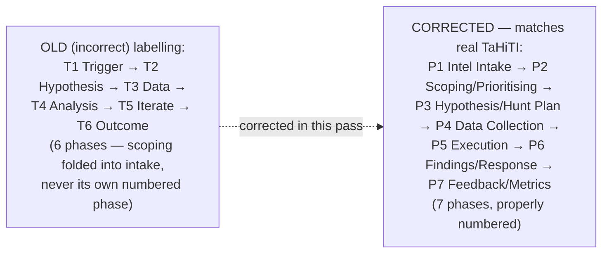

---

## Part 1 — What a Threat Hunting Framework Actually Does

A threat hunting framework is a **documented, repeatable process** for planning,
running, and operationalising hunts — not a one-off investigation technique.
Without one, hunting becomes hero-driven (dependent on individual analyst
expertise, lost when they leave) rather than an institutional capability.

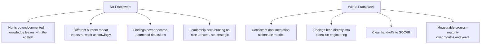

**The five components every effective framework needs** (per the source material):
intelligence-driven hypotheses, supporting data, adversary model-based
correlation, field-tested scenarios, and automation. MTDF's three-layer
inference spectrum (Primitive/Router/Composite) *is* the "automation" and
"adversary model-based correlation" components — this is exactly why MTDF and
PEAK/TaHiTI integrate cleanly rather than competing.

---

## Part 2 — PEAK: Prepare, Execute, Act with Knowledge

PEAK (Splunk, 2023) is the **execution-cycle framework** — it tells you *how
a single hunt moves through its lifecycle*, regardless of what triggered it.

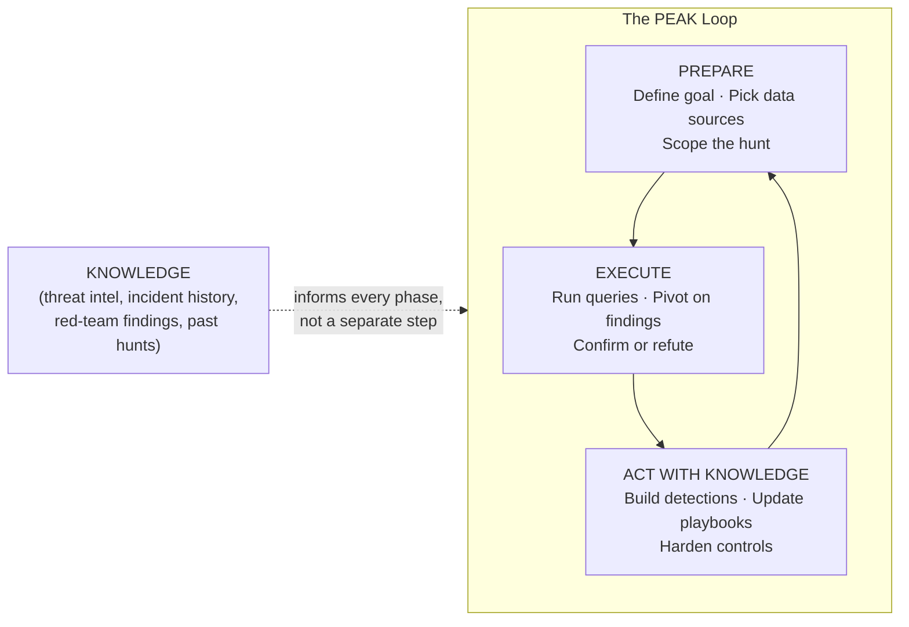

### The three PEAK hunt types

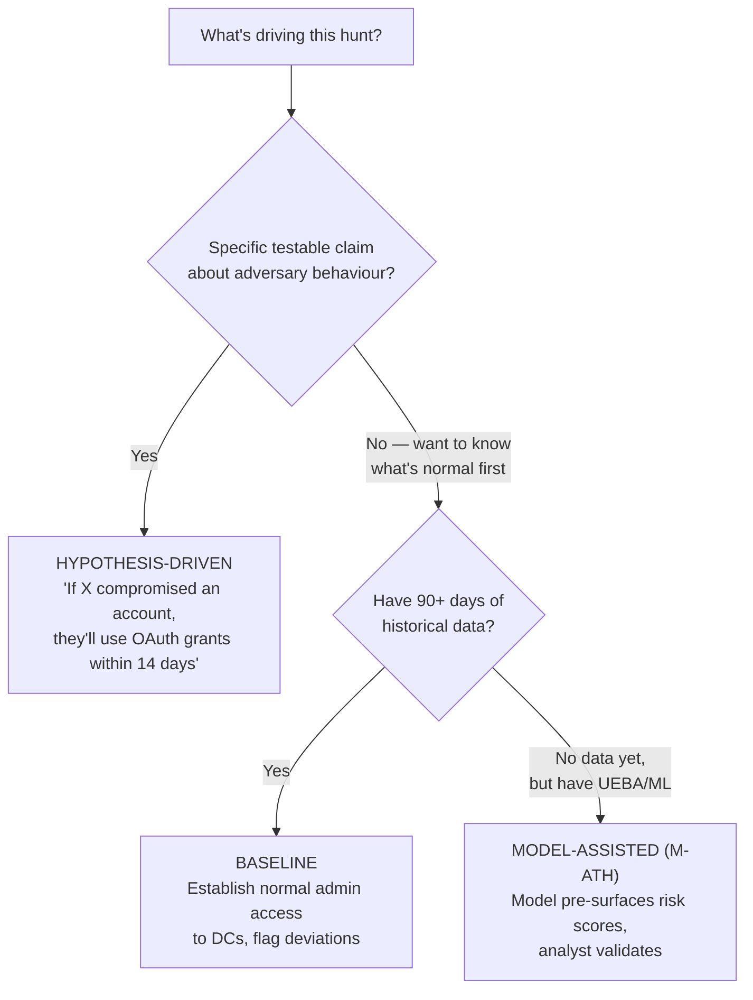

| Hunt Type | Best For | Key Requirement | MTDF Mapping |
|---|---|---|---|
| Hypothesis-Driven | Investigating specific threat intel | Clear, testable, falsifiable claim | Hunt's **E — Entity** and **A — Anomaly** types |
| Baseline | Understanding normal, surfacing anomalies | 90+ days historical data | Hunt's **B — Baseline** type |
| Model-Assisted | Scaling with automation | ML/UEBA capability | Hunt's **M — Model-Assisted** type |

This is the exact three-type structure already corrected into your live
`HUNT_PROMPT` (B/M split from the old conflated "Pattern" bucket) — confirmed
accurate against the primary source, not just internally consistent.

---

## Part 3 — TaHiTI: The 7 Real Phases

TaHiTI (Dutch Payments Association, 2018) is the **intelligence-integration
framework** — it tells you *where the hunt's hypothesis comes from* and how
intelligence flows through the entire lifecycle, not just at the start.

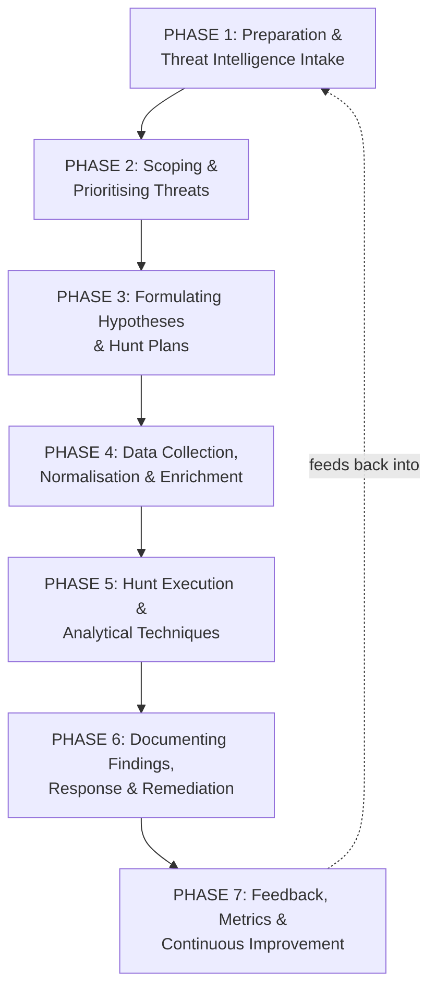

### Phase 1 — Sources of intelligence (the open-source question, answered directly)

This is exactly where your "can we use open-source threat intelligence"
question fits. TaHiTI's own Phase 1 names these legitimate intake sources —
all of them open or commercially-available, none requiring proprietary access:

| Source Category | Examples | Open-Source? |
|---|---|---|
| Government advisories | CISA, NCSC, CERT-EU | ✅ Fully open |
| MITRE ATT&CK mappings | attack.mitre.org | ✅ Fully open |
| ISAC/sector communities | FS-ISAC, sector-specific sharing groups | Membership-gated, not paid |
| Commercial CTI feeds | Vendor threat intel platforms | ❌ Paid |
| Internal incident history | Your own past IR cases | Internal, not external |
| Red/purple team findings | Your own exercises | Internal |
| Malware sandbox results | Detonated samples (yours or shared) | Mixed |

**Direct answer:** yes — CISA advisories, MITRE ATT&CK, and CERT-EU bulletins
are all legitimate, free, citable intel sources for Hunt's Trigger/Scoping
questions. What's **not yet built** is live automated ingestion of these feeds
into the app (e.g., a STIX/TAXII puller) — right now, you'd manually paste a
CISA advisory's content into Hunt's intake, the same way Novel Threat already
handles a pasted CVE or article. Automated feed ingestion is a real, separate
feature — flagged as a roadmap item, not something to claim is already live.

### Phase 2 — Scoping and Prioritising (the gap this guide fixes)

Not every piece of intel deserves a hunt. TaHiTI ranks using four factors:

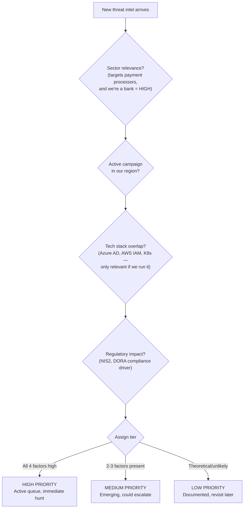

This is precisely what your `hq_scope` question already implements — confirmed
correct against the primary source.

### Phases 3-7 — Hypothesis through Continuous Improvement

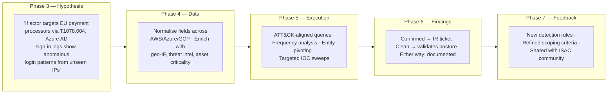

**Key metrics TaHiTI tracks** (Phase 7): hunts per quarter, intel-derived vs.
incident-derived ratio, time to confirm/refute, hunts yielding new detections,
dwell time reduction. These map directly onto what your Hunt Record/Hunt
Library should be capturing per session — currently captured qualitatively in
your doctrine's Hunt Record format, not yet tracked as aggregate metrics
across sessions (a Rule Library-adjacent feature, not yet built).

---

## Part 4 — How PEAK and TaHiTI Combine (and Map to MTDF)

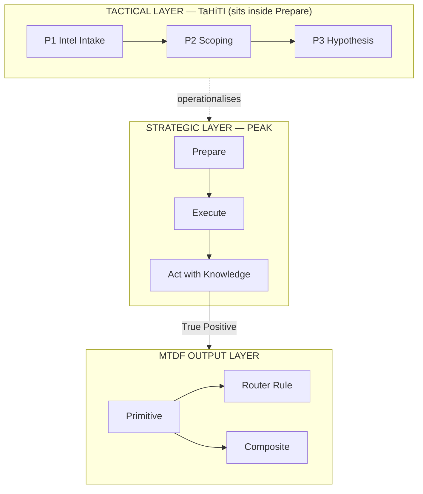

| PEAK Phase | TaHiTI Equivalent | MTDF Output |
|---|---|---|
| Prepare | Phases 1-3 (Intel → Scoping → Hypothesis) | — |
| Execute | Phases 4-5 (Data → Execution) | Architecture 4 Hunt Query |
| Act with Knowledge | Phases 6-7 (Findings → Feedback) | Primitive / Router / Composite, per noise-domain test |

This is the precise relationship your doctrine's "connective tissue" paragraph
already states in prose — this table just makes it literal.

## Part 5 — Worked Hunt Examples Across Major MITRE Tactics

Every example below follows the same structure: PEAK type declared, TaHiTI
hypothesis stated in the mandatory falsifiable format, then the Architecture 4
hunt query — tagged, never scored, exactly per MTDF Hunt doctrine.

---

### Example 1 — Registry-Based Persistence (T1547.001 — Run Keys)

**PEAK Type:** E — Entity (Intel-driven: known persistence technique)
**TaHiTI Phase 3 Hypothesis:** *"I hypothesise that an attacker has established
persistence via a Run key because no legitimate software deployment occurred
in this window, which would be visible as a new RegistryValueData payload in
DeviceRegistryEvents."*

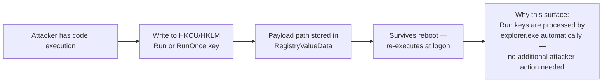

```kql
// ============================================================================
// HUNT QUERY: Run Key Persistence — Non-Standard Payload Path
// ============================================================================
// PEAK Type: E — Entity | TaHiTI Phase: 5 — Execution
// MITRE: T1547.001
// ⚠ HUNT MODE — NOT FOR PRODUCTION DEPLOYMENT ⚠
// Schema Confidence: DeviceRegistryEvents fields confirmed against MTDF
// Schema Reference. Fields used: Timestamp, DeviceId, DeviceName, ActionType,
// RegistryKey, RegistryValueData, InitiatingProcessFileName,
// InitiatingProcessAccountName. No hallucinated fields.
// ============================================================================

let lookback = 30d;  // user-specified — Run key persistence often dormant for weeks

DeviceRegistryEvents
| where Timestamp > ago(lookback)
| where ActionType == "RegistryValueSet"
| where RegistryKey has_any (
    @"\Software\Microsoft\Windows\CurrentVersion\Run",
    @"\Software\Microsoft\Windows\CurrentVersion\RunOnce"
)
| extend
    HasWritablePath   = toint(RegistryValueData matches regex
                          @"(?i)(\\temp\\|\\appdata\\|\\programdata\\|\\users\\public\\)"),
    HasEncodedPayload = toint(RegistryValueData has_any ("-enc", "frombase64string", "iex")),
    IsScriptParent    = toint(InitiatingProcessFileName in~
                          ("wscript.exe", "cscript.exe", "powershell.exe", "cmd.exe"))
| extend HuntSignals = strcat(
    iif(HasWritablePath == 1,   "[WRITABLE_PATH] ", ""),
    iif(HasEncodedPayload == 1, "[ENCODED_PAYLOAD] ", ""),
    iif(IsScriptParent == 1,    "[SCRIPT_PARENT] ", "")
)
| project
    Timestamp, DeviceName, RegistryKey, RegistryValueData,
    InitiatingProcessFileName, InitiatingProcessAccountName,
    HuntSignals, DeviceId
| sort by Timestamp desc
| take 10000

// HUNT ANALYST NOTES:
// HIGH CONFIDENCE: writable-path payload + encoded content together.
// NOISE: legitimate installers commonly write Run keys pointing to
//   Program Files paths — these will NOT match HasWritablePath.
// PROMOTION TRIGGER: confirmed malicious Run key entry → Composite Sensor,
//   Substrate-First if the path alone is the anchor, Intent-First if an
//   encoded/obfuscated payload is required to distinguish from legitimate use.
```

---

### Example 2 — Scheduled Task "Run Once" Persistence (T1053.005)

**PEAK Type:** B — Baseline (establishing what "normal" task creation looks
like, then flagging deviation)
**TaHiTI Phase 3 Hypothesis:** *"I hypothesise that an attacker created a
one-time scheduled task for immediate execution because the task's start time
and creation time are nearly identical, which would be visible as a `/sc once`
or near-zero-delay task in DeviceProcessEvents schtasks invocations."*

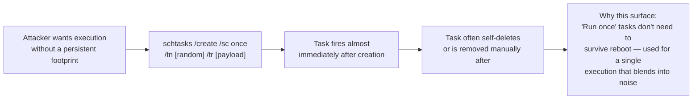

```kql
// ============================================================================
// HUNT QUERY: Scheduled Task — Run-Once With Near-Zero Delay
// ============================================================================
// PEAK Type: B — Baseline | TaHiTI Phase: 5 — Execution
// MITRE: T1053.005
// ⚠ HUNT MODE — NOT FOR PRODUCTION DEPLOYMENT ⚠
// Schema Confidence: DeviceProcessEvents fields confirmed.
// Fields used: Timestamp, DeviceId, DeviceName, ProcessCommandLine,
// InitiatingProcessFileName, InitiatingProcessAccountName.
// ============================================================================

let lookback = 14d;

DeviceProcessEvents
| where Timestamp > ago(lookback)
| where FileName =~ "schtasks.exe"
| where ProcessCommandLine has "/create"
| extend
    IsRunOnce       = toint(ProcessCommandLine has_any ("/sc once", "/sc ONCE")),
    HasImmediateRun = toint(ProcessCommandLine matches regex @"(?i)/st\s+\d{2}:\d{2}"),
    HasWritablePath = toint(ProcessCommandLine matches regex
                        @"(?i)(\\temp\\|\\appdata\\|\\programdata\\|\\public\\)"),
    HasSuspiciousTR = toint(ProcessCommandLine has_any
                        ("powershell", "cmd.exe /c", "-enc", "wscript", "mshta"))
| where IsRunOnce == 1
| extend HuntSignals = strcat(
    iif(HasWritablePath == 1,  "[WRITABLE_PATH] ", ""),
    iif(HasSuspiciousTR == 1,  "[SUSPICIOUS_PAYLOAD] ", ""),
    iif(HasImmediateRun == 1,  "[IMMEDIATE_RUN] ", "")
)
| project
    Timestamp, DeviceName, AccountName, ProcessCommandLine,
    InitiatingProcessFileName, HuntSignals, DeviceId
| sort by Timestamp desc
| take 10000

// HUNT ANALYST NOTES:
// BASELINE FIRST: run this query unfiltered (remove "where IsRunOnce==1")
// over 30 days to establish what legitimate /sc once usage looks like in
// YOUR environment — some backup/deployment tools use this pattern.
// HIGH CONFIDENCE: writable-path payload + suspicious /tr content together.
// PROMOTION TRIGGER: if a clean baseline shows /sc once is genuinely rare
// outside IT automation, this becomes a strong Composite anchor
// (Intent-First — the /sc once + suspicious payload combination is the signal).
```

---

### Example 3 — rundll32.exe Multi-Vector Abuse Hunt (T1218.011 / T1003.001)

**PEAK Type:** E — Entity (intel-driven: known LOLBin abuse family)
**TaHiTI Phase 3 Hypothesis:** *"I hypothesise that rundll32.exe is being used
for credential access or proxy execution because the binary itself carries no
inherent risk, which would be visible as a dangerous export name (MiniDump,
LaunchINFSection, FileProtocolHandler) in the command line, in
DeviceProcessEvents."*

This is the same attack surface built into your live Composite — the hunt
version below is what you would have run *before* building that composite,
to validate the technique was actually present in your environment first.

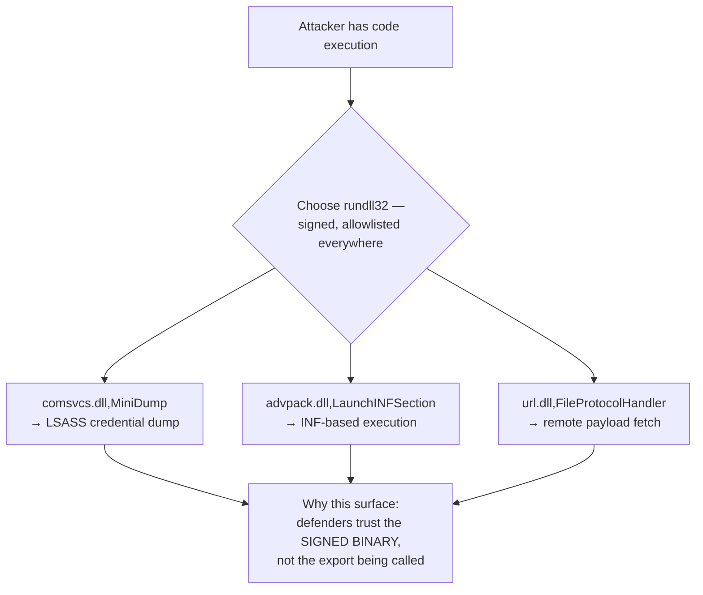

```kql
// ============================================================================
// HUNT QUERY: rundll32.exe — Dangerous Export Sweep
// ============================================================================
// PEAK Type: E — Entity | TaHiTI Phase: 5 — Execution
// MITRE: T1218.011, T1003.001
// ⚠ HUNT MODE — NOT FOR PRODUCTION DEPLOYMENT ⚠
// Schema Confidence: DeviceProcessEvents fields confirmed.
// ============================================================================

let lookback = 30d;
let DangerousExports = dynamic([
    "minidump", "launchinfsection", "fileprotocolhandler",
    "shellexec_rundll", "runhtmlapplication", "control_rundll"
]);

DeviceProcessEvents
| where Timestamp > ago(lookback)
| where FileName =~ "rundll32.exe"
| where isnotempty(ProcessCommandLine)
| extend CmdLower = tolower(ProcessCommandLine)
| where CmdLower has_any (DangerousExports)
    or CmdLower matches regex @"(?i)(\\users\\|\\temp\\|\\appdata\\)"
| extend
    HasMiniDump      = toint(CmdLower has "minidump" or CmdLower matches regex @"#24"),
    HasLaunchINF     = toint(CmdLower has "launchinfsection"),
    HasRemoteURL     = toint(CmdLower matches regex @"(?i)(https?|ftp)://"),
    HasWritablePath  = toint(CmdLower matches regex @"(?i)(\\users\\|\\temp\\|\\appdata\\)")
| extend HuntSignals = strcat(
    iif(HasMiniDump == 1,     "[MINIDUMP] ", ""),
    iif(HasLaunchINF == 1,    "[LAUNCHINF] ", ""),
    iif(HasRemoteURL == 1,    "[REMOTE_URL] ", ""),
    iif(HasWritablePath == 1, "[WRITABLE_PATH] ", "")
)
| project
    Timestamp, DeviceName, AccountName, ProcessCommandLine,
    InitiatingProcessFileName, HuntSignals, DeviceId
| sort by Timestamp desc
| take 10000

// HUNT ANALYST NOTES:
// HIGH CONFIDENCE: [MINIDUMP] tag — treat as credential theft until proven
// otherwise, per MTDF's "false negative worse than false positive" doctrine.
// NOISE: SCCM/Intune service contexts triggering Control_RunDLL — check
// InitiatingProcessFileName against known management tooling before discarding.
// PROMOTION TRIGGER: this is the exact hunt that should precede building
// the rundll32 Composite documented elsewhere in your Rule Library —
// confirms which sub-techniques are ACTUALLY present before committing
// scoring weights to each one.
```

---

### Example 4 — OAuth Consent Grant / Token Abuse Hunt (T1528 / T1621 / T1078.004)

**PEAK Type:** A — Anomaly (situational: following an MFA fatigue campaign
advisory) — this is the exact TaHiTI walkthrough scenario from the primary
source material, adapted to MTDF's Architecture 4 shape.

**TaHiTI Phase 3 Hypothesis:** *"I hypothesise that an MFA fatigue attack
succeeded because a user received an unusually high volume of MFA prompts in
a short window followed by a successful authentication, which would be visible
as a failure-then-success pattern within 10 minutes in SigninLogs, followed by
a new OAuth application consent grant in AuditLogs."*

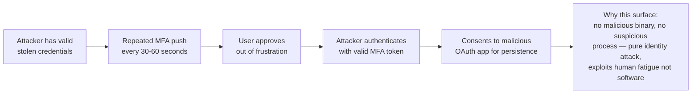

```kql
// ============================================================================
// HUNT QUERY: MFA Fatigue → OAuth Consent Grant Correlation
// ============================================================================
// PEAK Type: A — Anomaly | TaHiTI Phase: 5 — Execution
// MITRE: T1621 (MFA Request Generation), T1528 (Steal Application Access Token)
// ⚠ HUNT MODE — NOT FOR PRODUCTION DEPLOYMENT ⚠
// Schema Confidence: SigninLogs/AuditLogs fields confirmed against MTDF
// Schema Reference (Sentinel section).
// ============================================================================

let lookback = 14d;

// HUNT PHASE 1: HYPOTHESIS SURFACE — MFA failure burst per user
let MFABursts =
    SigninLogs
    | where TimeGenerated > ago(lookback)
    | where ResultType in ("50074", "50076") or tostring(Status.errorCode) == "500121"
    | summarize
        FailCount = count(),
        FirstFail = min(TimeGenerated),
        LastFail  = max(TimeGenerated)
      by UserPrincipalName
    | where FailCount >= 5;

// HUNT PHASE 2: CONTEXT ENRICHMENT — success shortly after the burst
let SuccessAfterBurst =
    SigninLogs
    | where TimeGenerated > ago(lookback)
    | where ResultType == "0"
    | join kind=inner (MFABursts) on UserPrincipalName
    | where TimeGenerated > LastFail and TimeGenerated < LastFail + 1h
    | extend MinutesAfterBurst = datetime_diff("minute", TimeGenerated, LastFail);

// HUNT PHASE 3: SIGNAL TAGGING — correlate with new OAuth consent
let NewConsents =
    AuditLogs
    | where TimeGenerated > ago(lookback)
    | where OperationName has_any ("Consent to application", "Add app role assignment")
    | project ConsentTime = TimeGenerated, ConsentUser = tostring(InitiatedBy.user.userPrincipalName),
              TargetApp = tostring(TargetResources[0].displayName);

SuccessAfterBurst
| join kind=leftouter (NewConsents) on $left.UserPrincipalName == $right.ConsentUser
| extend
    HasConsentNearby = toint(isnotempty(ConsentTime) and
                          ConsentTime between (TimeGenerated .. TimeGenerated + 1h))
| extend HuntSignals = strcat(
    "[MFA_BURST_", tostring(FailCount), "] ",
    iif(MinutesAfterBurst < 10, "[RAPID_SUCCESS] ", ""),
    iif(HasConsentNearby == 1, "[OAUTH_CONSENT_NEARBY] ", "")
)
| project
    TimeGenerated, UserPrincipalName, FailCount, MinutesAfterBurst,
    TargetApp, HuntSignals
| sort by FailCount desc
| take 10000

// HUNT ANALYST NOTES:
// HIGH CONFIDENCE: [OAUTH_CONSENT_NEARBY] tag — this is the exact pattern
// from the TaHiTI primary source's worked example. Treat as confirmed
// account takeover, not just suspicious.
// PIVOT: once flagged, check TargetApp's publisher verification status and
// requested scopes — a newly-registered app with broad mail/files scope
// requesting consent minutes after an MFA burst is near-certain malicious.
// PROMOTION TRIGGER: per the TaHiTI walkthrough, this exact pattern should
// become a permanent Composite — "more than 3 MFA challenges in under 5
// minutes" was the threshold that worked in the source material's own
// post-hunt detection rule.
```

---

## Part 6 — Investigation Methodology: The Entity Key Model

Every advanced investigation pivots on shared identifiers across telemetry
surfaces — this is what turns isolated hunt findings into a full attack story.

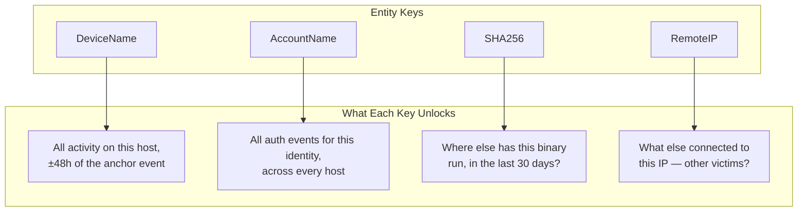

---

## Part 7 — Summary: What This Guide Adds to MTDF

| Addition | Why It Matters |
|---|---|
| Corrected 7-phase TaHiTI numbering | Your doctrine's `T1-T6` labelling was missing a real phase — now fixed |
| Confirmed B/M PEAK split is accurate | Verified against primary source, not just internally consistent |
| Open-source intel sourcing answered directly | CISA/MITRE/CERT-EU are legitimate; live feed ingestion is a roadmap item, not built yet |
| Four worked KQL hunts | Registry persistence, scheduled task run-once, rundll32 multi-vector, OAuth/MFA fatigue — spanning Persistence, Execution, Credential Access, and Identity tactics |
| Entity key investigation model | Makes explicit what was implicit in MTDF's "stitch via entity keys" doctrine |
