# Threat Hunting
### A Senior Analyst's Complete Reference — Detection, Investigation & Incident Response

**Author:** Ala Dabat | 2026  
**Framework:** [Minimum Truth Detection Framework](https://github.com/azdabat/Minimum-Truth-Detection-Framework-ADX-Validated-Composite-Rules)  
**License:** [CC BY-NC-SA 4.0](https://creativecommons.org/licenses/by-nc-sa/4.0/legalcode)

---

> *"Threat hunting is not the absence of alerts. It is the deliberate search for adversary behaviour that has not yet produced an alert — and the engineering of detections so that next time, it does."*

---

## Table of Contents

- [What Is Threat Hunting?](#what-is-threat-hunting)
- [The Hunting Frameworks](#the-hunting-frameworks)
- [The MTDF Hunting Doctrine](#the-mtdf-hunting-doctrine)
- [Threat Hunt Types](#threat-hunt-types)
- [The Hunt Lifecycle](#the-hunt-lifecycle)
- [Data Sources & Telemetry](#data-sources--telemetry)
- [Hypothesis Generation](#hypothesis-generation)
- [Advanced Threat Catalogue — 2026](#advanced-threat-catalogue--2026)
- [Investigation Methodology](#investigation-methodology)
- [Incident Response Integration](#incident-response-integration)
- [Repository Structure](#repository-structure)

---

## What Is Threat Hunting?

Threat hunting is the proactive, analyst-driven search for attacker activity that has bypassed automated detection. It is distinct from alert triage (reactive), detection engineering (proactive-automated), and penetration testing (adversarial simulation).

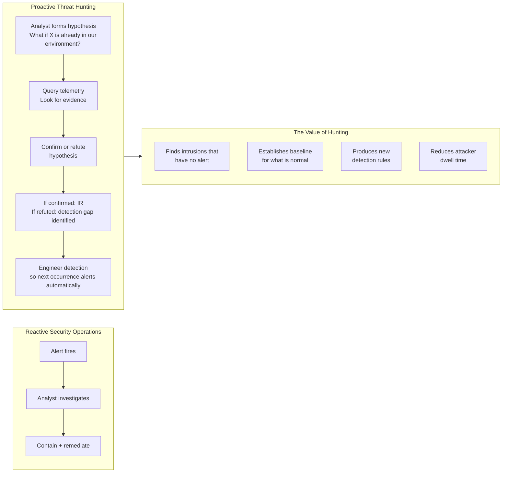

### The Core Principle

Every threat hunt starts with a question that cannot be answered by existing alerts:

> *"Is there evidence that [specific adversary behaviour] has occurred in our environment that we have not yet detected?"*

The answer is either:
- **Yes** → incident response begins
- **No** → the hunt produced a detection gap analysis — which techniques would have evaded our current coverage?

Both outcomes are valuable. A hunt that finds nothing is not a failed hunt — it is evidence of either clean environment or detection gaps. The distinction is determined by the quality of the hypothesis and the completeness of the telemetry coverage.

---
## Router Rules vs Primitives — The Three-Layer Detection Architecture

> *"A primitive captures what happened.*  
> *A router rule asks whether it matters.*  
> *A composite confirms that it does."*

---

### Primitives Are Atomic

A primitive is the irreducible telemetric fact. It answers one question with zero inference:

```
scrcons.exe loaded vbscript.dll
bitsadmin.exe executed
rundll32.exe invoked comsvcs.dll
```

No scoring. No context. No intent. Just the raw substrate event captured and indexed. Primitives live in the **atomic sentinel layer** — the silent 30-day rolling index that catches what composites miss and connects Day 0 staging to Day 3 activation.

---

### Router Rules Are Behavioural Threat Hunts

A router rule is a behavioural hunt that has been given structure, a scoring model, and a routing output. It asks a higher-order question than a primitive:

```
Is there evidence of ingress transfer intent anywhere on this estate?
Is there evidence of AD reconnaissance activity anywhere on this estate?
Is there evidence of script proxy execution intent anywhere on this estate?
```

These are hunt hypotheses expressed as always-on rules. The four-phase MTDF structure, the convergence scoring, the soft penalties, the routing directive — all of that is behavioural analysis, not raw telemetry capture. A router rule is operationally a threat hunt that has been promoted to a scheduled detection.

---

### The Three-Layer Model

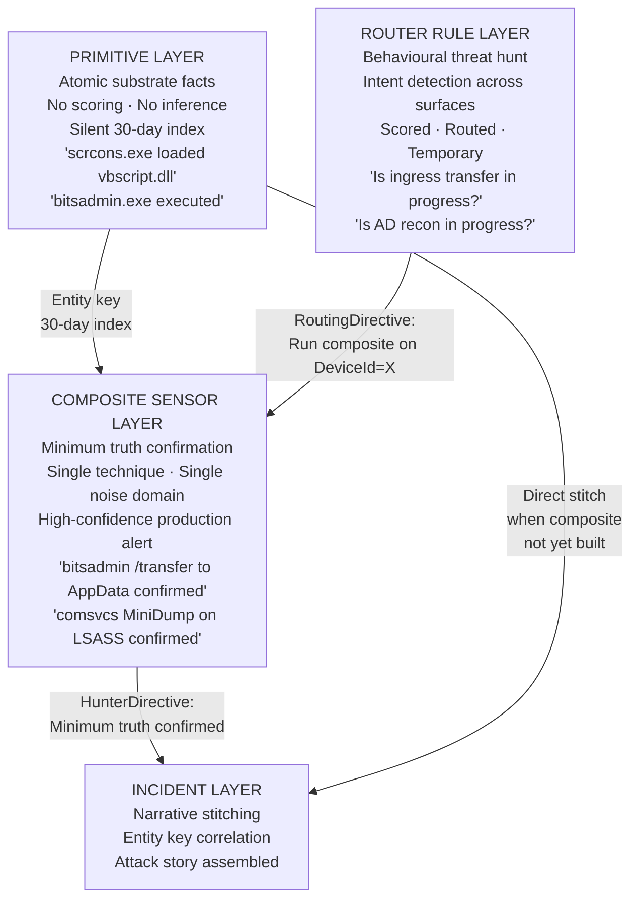

---

### The Practical Distinction

| Layer | Question Asked | Output | Lifecycle |
|-------|---------------|--------|-----------|
| **Primitive** | Did this substrate event exist? | Raw indexed fact | Permanent |
| **Router Rule** | Is this adversary goal in progress? | RoutingDirective | Temporary |
| **Composite Sensor** | Did this specific attack happen? | HunterDirective | Permanent |
| **Incident Layer** | What is the full attack story? | Narrative + blast radius | Case lifecycle |

---

### What Happens When You Strip a Router Rule Down

Strip the scoring, remove the routing, remove the phase structure, keep only the Phase 1 filter — you get a primitive collector. That is literally what the atomic sentinel layer is built from.

The Phase 1 broad surface filter of Hunt Pack 04 (Ingress Tool Transfer), run with no threshold and no scoring, becomes a primitive index of every LOLBin downloader execution on the estate for the last 30 days.

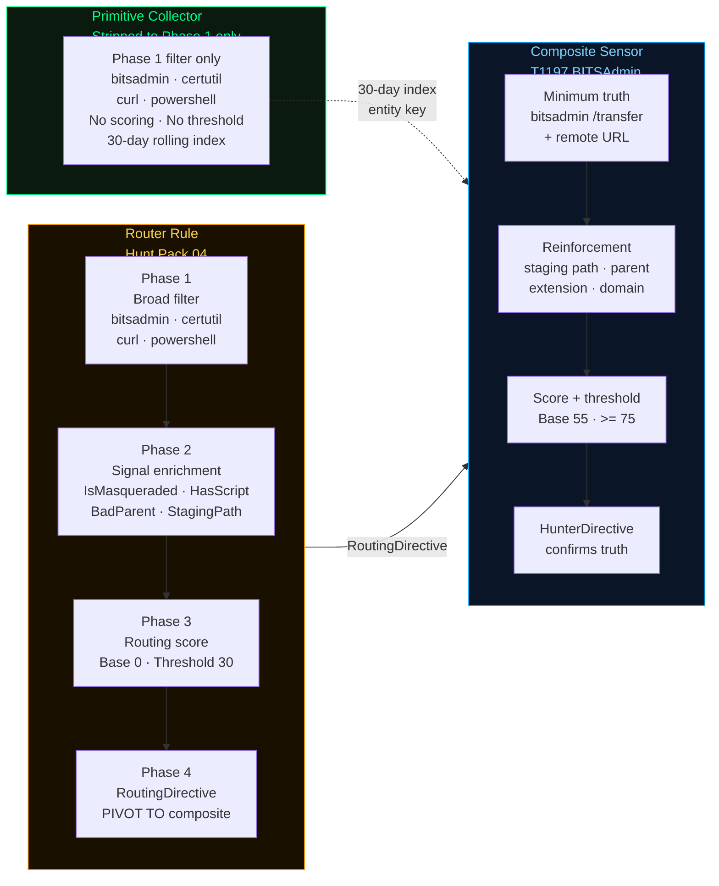

That is architecturally valid and useful — but it serves a different purpose. The primitive index is the net. The router rule is the structured hunt. The composite is the anchor.

---

### The Insight That Connects All Three

The MTDF framework already implicitly contained all three layers:

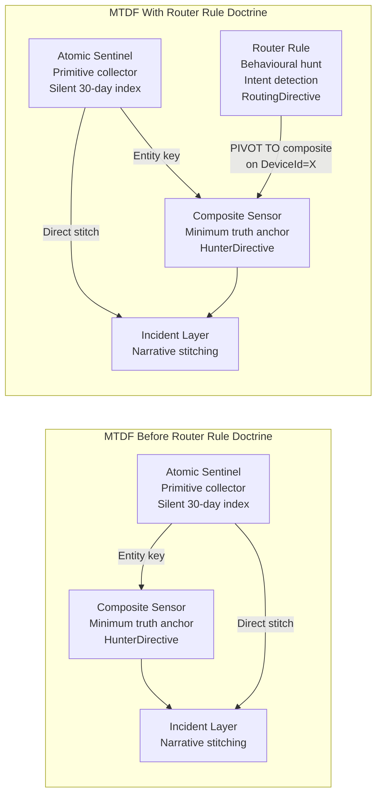

The router rule fills the **gap between primitive and composite** — it is the structured behavioural hunt that surfaces intent across technique families while the composites are being built to confirm truth.

---

### The Coverage Pipeline in Full

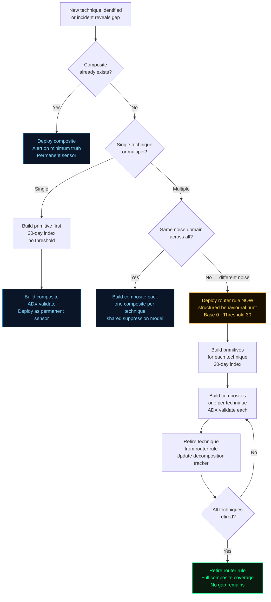

---

### Summary

```
Primitive    → the substrate event, indexed, no inference
Router Rule  → the behavioural hunt, structured, intent-level, temporary
Composite    → the minimum truth confirmation, permanent, high-confidence
Incident     → the narrative, assembled from all three

Strip a router rule to Phase 1 only → primitive collector
Promote a router rule technique to ADX-validated anchor → composite sensor
A router rule that is never retired → coverage debt
A composite without a primitive backing it → gap in the 30-day index
```

> **The primitive is the net.**  
> **The router rule is the structured hunt.**  
> **The composite is the anchor.**  
> **The incident is the story.**

see: https://github.com/azdabat/Router-Rule-Franework/new/main
---

## The Hunting Frameworks

### PEAK — The Primary Hunt Execution Framework

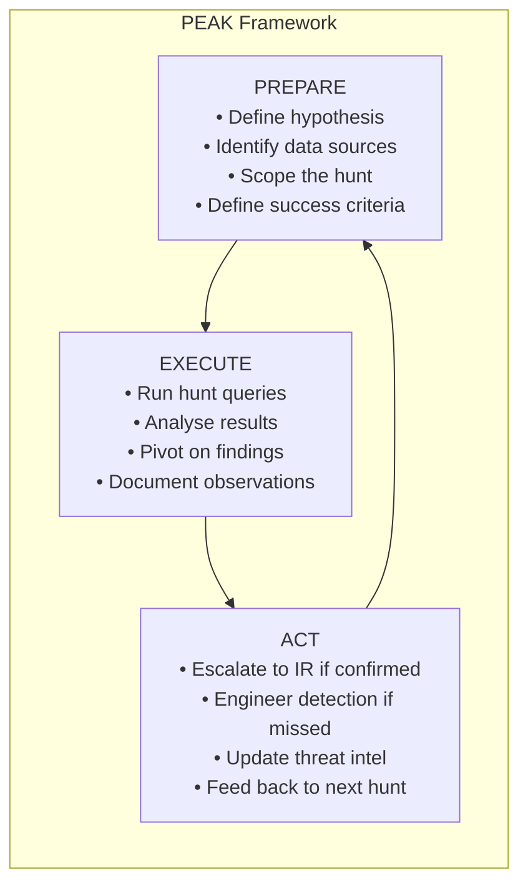

**PREPARE phase deliverables:**
- Written hypothesis statement
- Data sources required (MDE tables, Sentinel tables, network logs)
- Time window and scope (which business units, which device types)
- Success criteria (what does "found" look like vs "not found")
- Estimated time

**EXECUTE phase deliverables:**
- Hunt queries with results
- Pivots taken and why
- Anomalies observed (including benign findings that need baselining)
- IOBs (Indicators of Behaviour) identified

**ACT phase deliverables:**
- IR referral if confirmed
- Detection rule engineered if missed
- Hunt report for documentation
- Next hypothesis derived from findings

### TAHITI — Threat-Intelligence Driven Hunting

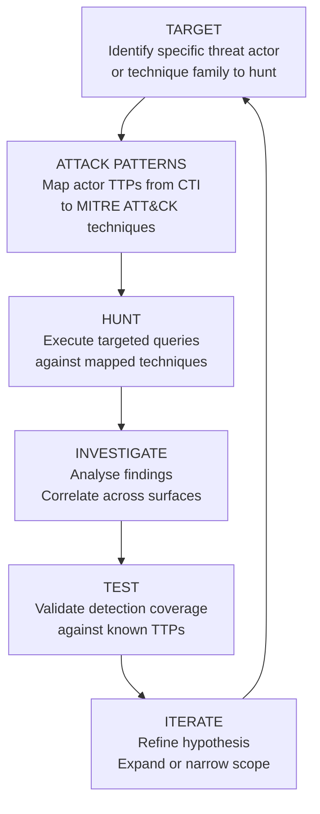

### MTDF Alignment to PEAK and TAHITI

| PEAK Phase | MTDF Equivalent | TAHITI Phase | MTDF Equivalent |
|-----------|----------------|-------------|----------------|
| Prepare | Minimum truth identification | Target | Threat actor TTP mapping |
| Execute | Hunt query (low threshold composite) | Attack Patterns | Cousin technique ecosystem |
| Act | Detection rule engineering | Hunt | 4-phase composite rule |
| → | Cousin rule generation | Investigate | Atomic primitive collector |
| → | ADX validation + receipt | Test | ADX-Docker validation |
| → | GitHub commit | Iterate | Threshold calibration |

---

## The Detection Inference Spectrum — All Layers Are Hunts

> *"A primitive captures what happened.*  
> *A router rule asks whether it matters.*  
> *A composite confirms that it does.*  
> *All three are hunts. What changes is the claim being made."*

---

The distinction between primitives, router rules, and composite sensors is not **hunt vs non-hunt**. Every layer is a threat hunt. The distinction is **specificity of claim** and **depth of inference** — how much the rule asserts about what the evidence means, and how much evidence is required before that assertion is made.

---

### The Spectrum of Inference

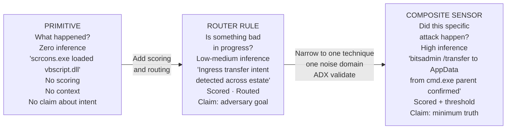

---

### The Claim Each Layer Makes

The difference is not the analytical activity — all three are threat hunts. The difference is what claim the hunt is making and how much evidence is required to make it.

| Layer | Hunt Claim | Evidence Required | Analyst Action |
|-------|-----------|------------------|----------------|
| **Primitive** | "This event occurred" | The event itself — no interpretation | Index it · stitch it later |
| **Router Rule** | "Adversary intent is present" | Convergence of intent signals across a technique family | Triage — run the composite on this DeviceId |
| **Composite Sensor** | "This specific attack occurred" | Minimum truth anchor + optional reinforcement | Investigate — create incident |

---

### The More Accurate Model

Rather than three separate layers, this is a **continuous spectrum of inference** with three operating points that the MTDF has formalised. All three points are active hunts operating at different levels of specificity.

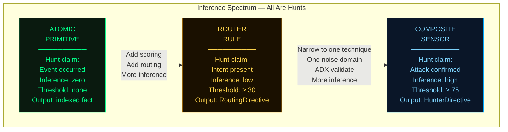

---

### What Changes as You Move Across the Spectrum

**From primitive to router rule:** a scoring model and routing output are added. The hunt now makes a claim about intent rather than just recording an event. The primitive `bitsadmin.exe executed` becomes the router rule claim `ingress transfer intent is present across this technique family`.

**From router rule to composite sensor:** the scope narrows to one technique, the rule is validated against real telemetry in ADX, a unified suppression model is applied, and the threshold is raised. The router rule claim `ingress transfer intent` becomes the composite claim `bitsadmin /transfer with remote URL and AppData staging path confirmed`.

**Primitives are not passive.** When you run a 30-day primitive collector across the estate looking for `scrcons.exe` loading script DLLs, you are hunting. You are asking a question of telemetry and receiving a list of facts. The inference depth is zero — but the analytical act is identical to every other layer.

---

### The Full Pipeline — From Event to Incident

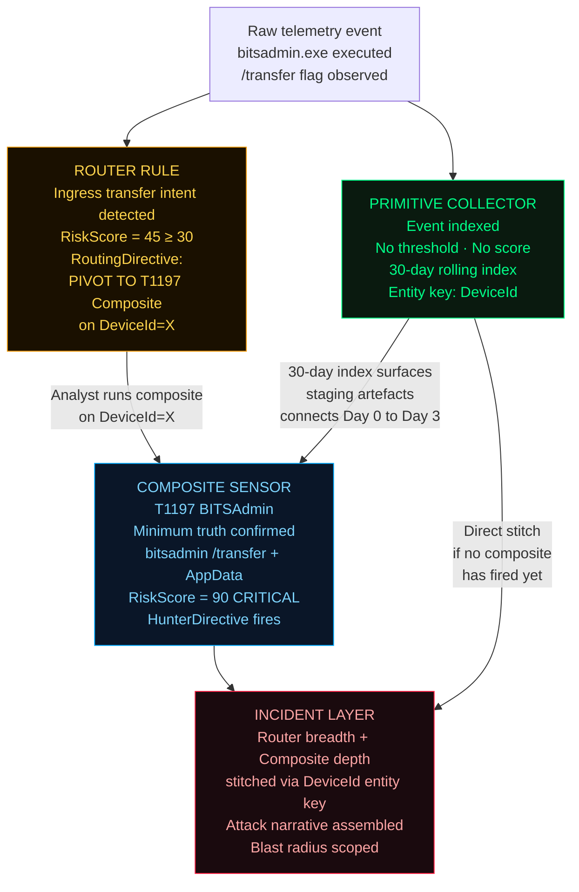

---

### What Happens When You Strip a Router Rule Down

Remove the scoring, remove the routing, remove the phase structure — keep only the Phase 1 broad surface filter. The router rule becomes a primitive collector.

The Phase 1 filter of Hunt Pack 04 (Ingress Tool Transfer) with no threshold and no scoring is a primitive index of every LOLBin downloader execution on the estate for the last 30 days. That is architecturally valid and useful — but it serves a different purpose at a different inference point on the spectrum.

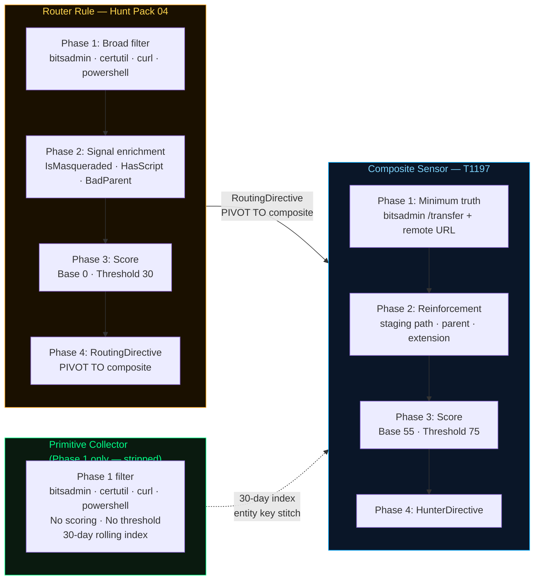

---

### The Corrected Framework Statement

```
Primitives        → threat hunts at zero inference
Router Rules      → threat hunts at low-medium inference
Composite Sensors → threat hunts at high inference

All three are hunts.
What changes is the claim being made,
the evidence required to make it,
and the action the analyst takes when it fires.
```

---

### Inference Depth at a Glance

| Property | Primitive | Router Rule | Composite Sensor |
|----------|-----------|-------------|-----------------|
| **Inference depth** | Zero | Low — medium | High |
| **Hunt claim** | Event occurred | Adversary goal in progress | Specific attack confirmed |
| **Base score** | None | 0 | 55 |
| **Threshold** | None | ≥ 30 | ≥ 75 |
| **Output** | Indexed fact | RoutingDirective | HunterDirective |
| **Lifecycle** | Permanent | Temporary | Permanent once ADX validated |
| **Analyst action** | Stitch via entity key | Run composite on DeviceId | Investigate · create incident |
| **Noise tolerance** | High — wide net | Medium — scored intent | Low — minimum truth required |
| **Analogy** | The net | The structured hunt | The anchor |

---

> **The primitive is the net.**  
> **The router rule is the structured hunt.**  
> **The composite is the anchor.**  
> **The incident is the story.**  
> **All three are hunts. The inference depth is what separates them.**


---

## The MTDF Hunting Doctrine

### Minimum Truth Applied to Hunting

The Minimum Truth doctrine — originally designed for continuous detection rules — applies equally to threat hunting. Every hunt hypothesis has a minimum truth: the irreducible behavioural condition that must be true if the suspected activity occurred.

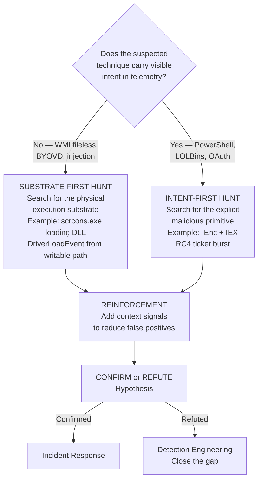

### Hunt Threshold vs Detection Threshold

A fundamental distinction that determines hunt query design:

| Parameter | Detection Rule | Hunt Query |
|-----------|---------------|-----------|
| Purpose | Continuous alert generation | One-time hypothesis testing |
| Threshold | High (RiskScore ≥ 75) | Lower (RiskScore ≥ 45) |
| False positives | Minimised | Acceptable — analyst reviews all |
| Time window | Rolling (24h, 7d) | Specific to hunt period |
| Output | Alert for every match | Dataset for analyst analysis |
| Action | Automated SOC ticket | Analyst investigation |

---

## Threat Hunt Types

### Type 1 — Intelligence-Led Hunt

Triggered by external threat intelligence: a new CVE, a published campaign report, a government advisory, or a vendor threat brief.

**Process:**
1. Receive CTI (e.g. CISA advisory on SilverFox BYOVD)
2. Map TTPs to MITRE ATT&CK techniques
3. Identify which techniques the environment has telemetry for
4. Build hypotheses for each technique
5. Execute hunts in priority order (highest-impact techniques first)
6. Engineer detections for any gaps found

### Type 2 — Baseline Anomaly Hunt

Driven by deviation from established baseline behaviour. Requires a documented baseline.

**Process:**
1. Establish what "normal" looks like for a process, account, or system
2. Query for deviations from that baseline
3. Investigate deviations that cannot be explained by known operational changes
4. Update baseline when legitimate changes occur

**Example hypotheses:**
- *"Are there PowerShell processes running on hosts where PowerShell has never run before?"*
- *"Are there accounts authenticating from new geographic locations?"*
- *"Are there new scheduled tasks created in the last 30 days that are not in our approved list?"*

### Type 3 — Post-Incident Retroactive Hunt

Triggered after a confirmed incident. Looks for the same techniques across the wider estate.

**Process:**
1. Extract IOBs (Indicators of Behaviour) from confirmed incident
2. Scope retroactive hunt to 30–90 days
3. Hunt for same behaviour on all other hosts
4. Determines whether incident was isolated or widespread

### Type 4 — Coverage Gap Hunt

Designed to identify what the current detection estate would miss. No specific threat in mind — testing resilience.

**Process:**
1. Select a MITRE ATT&CK technique family
2. Simulate the technique in a lab environment
3. Check whether existing detections fire
4. If they do not: build the detection
5. Document coverage gaps in the MTDF roadmap

---

## The Hunt Lifecycle

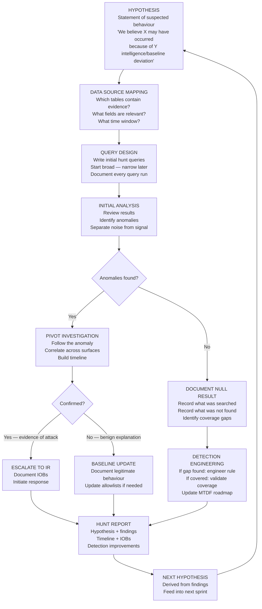

---

## Data Sources & Telemetry

### MDE Advanced Hunting — Priority Tables for Threat Hunting

| Table | Primary Use | Key Hunting Fields |
|-------|-------------|-------------------|
| `DeviceProcessEvents` | Process execution, LOLBin chains, injection markers | FileName, ProcessCommandLine, InitiatingProcessFileName, InitiatingProcessSignerType |
| `DeviceNetworkEvents` | C2 beaconing, data exfil, lateral movement | RemoteIP, RemoteUrl, RemotePort, InitiatingProcessFileName |
| `DeviceFileEvents` | Malware staging, credential files, persistence artefacts | FileName, FolderPath, ActionType, InitiatingProcessFileName |
| `DeviceRegistryEvents` | Persistence (Run keys, Services, TaskCache) | RegistryKey, RegistryValueData, InitiatingProcessFileName |
| `DeviceImageLoadEvents` | DLL sideloading, BYOVD precursor, WMI fileless | FileName, Signer, InitiatingProcessFileName, IsSigned |
| `DeviceEvents` | AMSI bypass, DriverLoadEvent, LSASS access | ActionType, AdditionalFields, FileName |
| `DeviceLogonEvents` | Lateral movement, credential use, anomalous auth | LogonType, RemoteIP, AccountName, IsLocalAdmin |
| `IdentityLogonEvents` | Kerberoasting, pass-the-hash, identity anomalies | Protocol, AccountName, FailureReason, LogonType |
| `IdentityQueryEvents` | LDAP enumeration, BloodHound-style recon | QueryType, QueryTarget, AccountName |
| `CloudAppEvents` | Cloud lateral movement, SaaS abuse | ActionType, AccountUpn, IPAddress, Application |
| `AlertEvidence` | Correlate with existing detections | AlertId, EntityType, SHA256, RemoteIP |

### Sentinel — Priority Tables

| Table | Primary Use | Key Fields |
|-------|-------------|-----------|
| `SecurityEvent` | Windows auth, process creation (4688), service install (7045) | EventID, Account, ProcessName, CommandLine |
| `WindowsEvent` (Sysmon) | Rich process/network/file/registry telemetry | EventID, EventData (parse_xml) |
| `AuditLogs` | Entra ID changes, consent grants, app assignments | OperationName, InitiatedBy, TargetResources |
| `SigninLogs` | Authentication anomalies, MFA fatigue, impossible travel | UserPrincipalName, RiskDetail, IPAddress, Location |
| `IdentityInfo` | Account context enrichment | AccountUpn, Department, JobTitle, IsAdmin |
| `CommonSecurityLog` | Network/proxy/firewall traffic | SourceIP, DestinationIP, RequestURL, DeviceVendor |

### Telemetry Gaps — What EDR Cannot See

Understanding what is NOT in your telemetry is as important as knowing what is. These are the most common structural blind spots:

| Blind Spot | Reason | Compensating Control |
|-----------|--------|---------------------|
| Kernel-level activity after BYOVD | EDR minifilter removed | ETW kernel provider, Sysmon (if not also killed) |
| Direct syscall execution | Bypasses usermode hooks | Memory scanning, ETW |
| Encrypted C2 content | TLS termination not at endpoint | Proxy inspection, network metadata |
| Blockchain C2 channel | No suspicious domain | Process + frequency analysis |
| WMI fileless payload content | DLL load only, no cmdline | Registry EventConsumer query |
| In-memory process activity | No disk artefact | AMSI events, ETW, memory acquisition |
| Pre-sensor activity | Before EDR deployed | Log retention check, cloud audit logs |

---

## Hypothesis Generation

### From Threat Intelligence

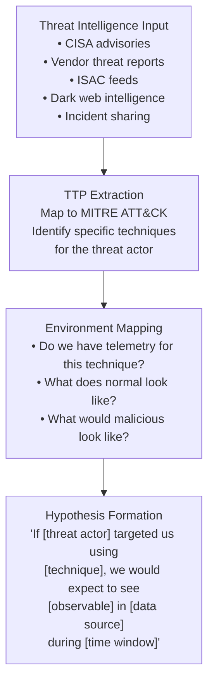

### Hypothesis Template

Every hunt hypothesis should be written in this format before any queries are run:

```
HUNT ID:        HUNT-2026-001
DATE:           2026-01-01
ANALYST:        Ala Dabat
TRIGGER:        [Intelligence source / baseline deviation / coverage gap]

HYPOTHESIS:
If [specific adversary / technique] is present in our environment,
we expect to see [specific observable behaviour] in [specific data source]
during [time window], because [rationale].

NULL HYPOTHESIS:
If no evidence is found, this indicates either:
(a) The technique has not been used against us, OR
(b) Our telemetry does not cover this technique (detection gap)

DATA SOURCES:   [List tables and log sources]
TIME WINDOW:    [Start → End]
SCOPE:          [Business units, device types, accounts]
SUCCESS CRITERIA: [What does a positive finding look like?]
PRIORITY:       [CRITICAL / HIGH / MEDIUM / LOW]
```

### Hypothesis Examples by Threat Type

| Threat | Hypothesis | Key Data Source |
|--------|-----------|----------------|
| BYOVD staging | Signed driver dropped to temp path in last 30 days | DeviceFileEvents |
| Kerberoasting | RC4 TGS volume spike from user account | IdentityLogonEvents |
| C2 beaconing | Regular outbound HTTPS to first-seen domain by non-browser | DeviceNetworkEvents |
| Credential dumping | Non-AV process opened LSASS with read rights | DeviceEvents |
| Persistence | New scheduled task or run key created by non-admin process | DeviceRegistryEvents |
| Lateral movement | Network logon type 3 from workstation to workstation | DeviceLogonEvents |
| Data staging | Large archive created in temp by user process | DeviceFileEvents |
| Supply chain | Build agent spawning shells or accessing credential files | DeviceProcessEvents |

---

## Advanced Threat Catalogue — 2026

### Threat 1 — BYOVD: SilverFox / ValleyRAT

**Why it evades EDR:** Kernel-level execution kills the EDR from a layer it cannot defend. After Stage 6, the attacker operates in a detection vacuum.

**Minimum truth anchor:** `DriverLoadEvent` from a user-writable path, preceded by the sideload → stage → service registration chain.

**Hunt priority:** CRITICAL. If this fires, assume EDR is blind.

**Full R&D documentation:** [Advanced_Threat_Hunting_RD.md](./Advanced_Threat_Hunting_RD.md)

---

### Threat 2 — Blockchain C2: EtherRAT

**Why it evades EDR:** The C2 channel uses public blockchain infrastructure. Every IP and domain involved is legitimate. No suspicious network IOC exists.

**Minimum truth anchor:** A non-crypto process polling Ethereum RPC endpoints at regular intervals consistent with a beacon pattern.

**Hunt priority:** HIGH. Long dwell time expected — retroactive hunting essential.

**Full R&D documentation:** [Advanced_Threat_Hunting_RD.md](./Advanced_Threat_Hunting_RD.md)

---

### Threat 3 — AI-Generated Polymorphic Malware

**Why it evades EDR:** Each payload variant has a unique hash and structure. Signature-based controls have no applicable signature. Byte-flip variants preserve valid driver signatures.

**Minimum truth anchor:** Behavioural sequence — what the attack must do regardless of the payload's appearance.

**Hunt priority:** HIGH. Requires behavioural composite rules, not IOC-based detection.

**Full R&D documentation:** [AI_Accelerated_Attack_Surface_Evolution.md](https://github.com/azdabat/-AI-LLM-Autonomous-Systems/blob/main/AI-Accelerated%20Attack%20Surface%20Evolution.md)

---

### Threat 4 — MFA Fatigue / Push Bombing (2026 Critical)

**Why it evades detection:** Attacker uses valid stolen credentials and repeatedly pushes MFA prompts until the user approves out of frustration. No malicious binary. No suspicious process. Pure identity attack.

**Attack flow:**

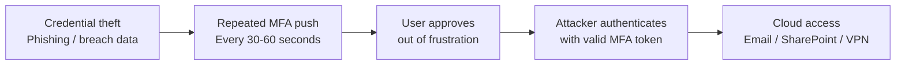

**Minimum truth anchor:** Unusual volume of MFA requests from a single account in a short window, followed by a successful authentication from an anomalous IP or location.

**Hunt queries:**

```kql
// MFA Fatigue Hunt 1: Push bombing pattern detection

SigninLogs
| where TimeGenerated > ago(7d)
| where ResultType == "50074"  // MFA required but failed
      or ResultType == "50076"
      or Status.errorCode == 500121  // Auth interrupted
| summarize
    FailedMFA     = count(),
    UniqueIPs     = dcount(IPAddress),
    Locations     = make_set(tostring(Location.countryOrRegion), 10),
    FirstAttempt  = min(TimeGenerated),
    LastAttempt   = max(TimeGenerated)
  by UserPrincipalName
| extend WindowMinutes = datetime_diff("minute", LastAttempt, FirstAttempt)
| extend AttemptsPerMin = iff(WindowMinutes > 0,
    todouble(FailedMFA) / WindowMinutes, todouble(FailedMFA))
| where FailedMFA > 5
| extend Severity = case(
    FailedMFA > 20 or AttemptsPerMin > 3, "CRITICAL",
    FailedMFA > 10, "HIGH",
    "MEDIUM"
)
| order by FailedMFA desc
```

```kql
// MFA Fatigue Hunt 2: Success after repeated failures (the critical pattern)
// A success after 5+ failures = likely MFA fatigue attack succeeded

let MFAFailures =
    SigninLogs
    | where TimeGenerated > ago(7d)
    | where ResultType in ("50074", "50076") or
            Status.errorCode == 500121
    | summarize FailCount = count(), LastFail = max(TimeGenerated)
      by UserPrincipalName;

SigninLogs
| where TimeGenerated > ago(7d)
| where ResultType == "0"  // Successful sign-in
| join kind=inner (MFAFailures) on UserPrincipalName
| where FailCount >= 5
| where TimeGenerated > LastFail
| extend MinutesSinceFail = datetime_diff("minute", TimeGenerated, LastFail)
| where MinutesSinceFail < 60
| project
    TimeGenerated, UserPrincipalName, IPAddress,
    Location = tostring(Location.countryOrRegion),
    AppDisplayName, FailCount, MinutesSinceFail,
    HunterDirective = strcat(
        "CRITICAL: MFA fatigue pattern — ",
        tostring(FailCount), " failed MFA attempts followed by success ",
        tostring(MinutesSinceFail), " minutes later. ",
        "Verify with user immediately. If not user-initiated: revoke session tokens."
    )
| order by FailCount desc
```

**Cousin techniques:** Adversary-in-the-Middle (T1557), Token theft (T1528), Pass-the-cookie, Cloud lateral movement.

---

### Threat 5 — LSASS Protection Bypass via PPL Downgrade (2026)

**Why it evades detection:** Windows Protected Process Light (PPL) prevents standard LSASS dumps. Modern attackers bypass PPL using BYOVD or by patching the PPL flag in kernel memory — achieving LSASS access that many detection rules miss because they assume PPL protection is intact.

**Attack flow:**

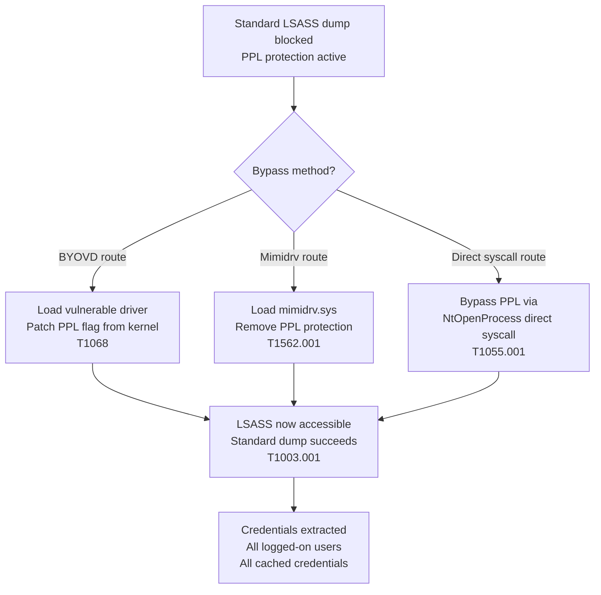

**Hunt queries:**

```kql
// PPL Bypass Hunt 1: mimidrv.sys or PPL-related driver loads

DeviceEvents
| where Timestamp > ago(7d)
| where ActionType == "DriverLoadEvent"
| where FileName =~ "mimidrv.sys"
      or SHA256 in (
        // Known mimidrv hashes — supplement with current TI
        "d0e93e75aacbe55b1a75b9c879b1f5a78d2cebe8"
      )
| project Timestamp, DeviceName, AccountName, FileName, FolderPath, SHA256
```

```kql
// PPL Bypass Hunt 2: LSASS access after kernel driver load
// Sequence: DriverLoadEvent → LSASS handle → dump

let DriverLoads =
    DeviceEvents
    | where Timestamp > ago(7d)
    | where ActionType == "DriverLoadEvent"
    | project DeviceId, DriverTime = Timestamp, DriverFile = FileName;

let LsassAccess =
    DeviceEvents
    | where Timestamp > ago(7d)
    | where ActionType in ("OpenProcessApiCall", "AccessProcessHandle")
    | where FileName =~ "lsass.exe"
    | where InitiatingProcessFileName !in~ (
        "MsMpEng.exe", "SenseIR.exe", "csrss.exe", "wininit.exe"
    )
    | project DeviceId, AccessTime = Timestamp,
              AccessorProcess = InitiatingProcessFileName,
              AccessorHash    = InitiatingProcessSHA256;

DriverLoads
| join kind=inner (LsassAccess) on DeviceId
| where AccessTime between (DriverTime .. DriverTime + 15m)
| project DriverTime, AccessTime, DeviceId,
          DriverFile, AccessorProcess, AccessorHash,
          HunterDirective = "CRITICAL: Kernel driver load followed by LSASS access — PPL bypass suspected. Acquire memory immediately."
| order by DriverTime desc
```

---

### Threat 6 — DNS-over-HTTPS C2 Tunnelling

**Why it evades detection:** DNS tunnelling via traditional DNS is detectable through DNS query volume and length anomalies. DNS-over-HTTPS (DoH) encrypts DNS traffic inside HTTPS — indistinguishable from normal web browsing at the network layer.

**Minimum truth anchor:** A non-browser process making high-frequency HTTPS requests to known DoH providers (1.1.1.1, 8.8.8.8, dns.google, cloudflare-dns.com) with a pattern inconsistent with normal DNS resolution.

```kql
// DoH C2 Hunt: Non-browser processes using DoH providers

let DoHProviders = dynamic([
    "dns.google", "cloudflare-dns.com", "doh.opendns.com",
    "doh.cleanbrowsing.org", "dns.nextdns.io", "1.1.1.1", "8.8.8.8"
]);

DeviceNetworkEvents
| where Timestamp > ago(7d)
| where RemoteUrl has_any (DoHProviders)
      or RemoteIP in ("1.1.1.1", "8.8.8.8", "9.9.9.9", "208.67.222.222")
| where RemotePort == 443
// Exclude browsers and known DNS tools
| where InitiatingProcessFileName !in~ (
    "chrome.exe", "msedge.exe", "firefox.exe", "brave.exe",
    "opera.exe", "iexplore.exe", "svchost.exe"
)
| summarize
    RequestCount = count(),
    FirstSeen    = min(Timestamp),
    LastSeen     = max(Timestamp),
    UniqueURLs   = dcount(RemoteUrl)
  by DeviceName, InitiatingProcessFileName, InitiatingProcessSHA256
| extend DwellMins   = datetime_diff("minute", LastSeen, FirstSeen)
| extend ReqPerMin   = iff(DwellMins > 0, todouble(RequestCount)/DwellMins, todouble(RequestCount))
| where RequestCount > 20
| order by RequestCount desc
```

---

## Investigation Methodology

### The Senior Analyst Investigation Process

```mermaid
flowchart TD
    A["INITIAL SIGNAL\nAlert or hunt finding"] --> B

    B["STEP 1 — VERIFY\nIs this a true positive?\nCan it be explained by legitimate activity?\nIs the data source reliable?"] --> C

    C["STEP 2 — SCOPE\nWhat is the blast radius?\nHow many hosts/accounts affected?\nWhat is the estimated dwell time?"] --> D

    D["STEP 3 — TIMELINE\nWhen did this start?\nWhat happened before the alert?\nWhat has happened since?"] --> E

    E["STEP 4 — TECHNIQUE MAPPING\nWhat MITRE technique is this?\nWhat are the cousin techniques?\nHas anything adjacent fired?"] --> F

    F["STEP 5 — PIVOT\nCorrelate across all telemetry surfaces\nFollow entity keys (DeviceName, AccountName, SHA256)\nExpand scope if lateral movement detected"] --> G

    G["STEP 6 — CONTAIN\nDecide containment approach\nIsolate vs monitor (dwell time consideration)\nCoordinate with IR lead"] --> H

    H["STEP 7 — EVIDENCE\nPreserve all evidence before remediation\nMemory dump if kernel tamper suspected\nExport telemetry with timestamps"] --> I

    I["STEP 8 — ERADICATE\nRemove persistence mechanisms\nRotate exposed credentials\nRestore security products\nPatch exploited vectors"] --> J

    J["STEP 9 — DETECT\nEngineer detection for this technique\nValidate in ADX\nDeploy to production\nUpdate coverage matrix"]
```

### The Entity Key Investigation Model

All advanced investigation pivots on entity keys — the common identifiers that connect events across different telemetry surfaces.

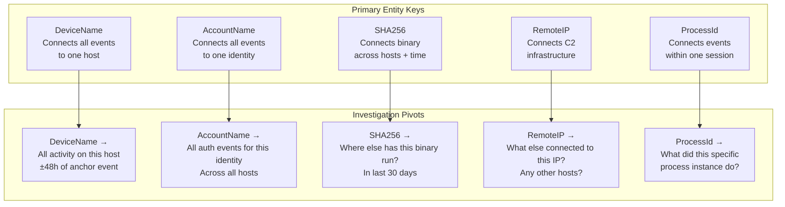

### Attacks Hidden in Legitimate System Files

One of the most challenging investigation scenarios is when malicious payloads are hidden inside or executed through legitimate system components. Key techniques and investigation approaches:

| Technique | How It Hides | Detection Surface | Hunt Approach |
|-----------|-------------|------------------|--------------|
| DLL Sideloading | Malicious DLL same name as legitimate, loaded first | DeviceImageLoadEvents — signer mismatch | Check Signer ≠ InitiatingProcessSigner |
| Process Hollowing | Legitimate process memory replaced with malicious code | DeviceEvents — memory anomalies | NtUnmapViewOfSection + WriteProcessMemory sequence |
| Atom Bombing | Inject via Windows Atom Tables — no API hooks | ETW kernel events | Rare — look for GlobalAddAtom + NtQueueApcThread |
| Heaven's Gate | 32-bit process switches to 64-bit to bypass hooks | Memory forensics | Unusual WoW64 transitions |
| Reflective DLL | DLL loaded from memory, never written to disk | AMSI events, ETW | ProcessCommandLine has Reflection.Assembly |
| COM Hijacking | Malicious COM server registered in HKCU | DeviceRegistryEvents — CLSID in HKCU | HKCU\Software\Classes\CLSID writes |
| PEB Stomping | Fake process name in Process Environment Block | Memory forensics | PEB.ImagePathName ≠ actual executable path |

---

## Incident Response Integration

### When a Hunt Becomes an Incident

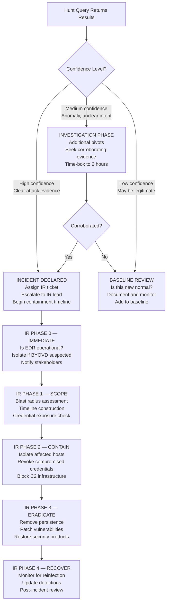

### The Detection Improvement Loop

Every incident must produce at least one detection improvement:

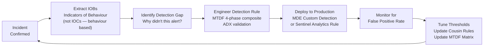

---

## Repository Structure

```
Threat-Hunting/
│
├── README.md                              ← This file — comprehensive reference guide
│
├── Advanced_Threat_Hunting_RD.md          ← Deep-dive R&D: BYOVD, EtherRAT, Kerberoasting,
│                                             LOLBin fileless, supply chain + full IR methodology
│
├── hunt-queries/
│   ├── byovd/
│   │   ├── silverfox_tier1_atomic.kql
│   │   ├── silverfox_tier2_chain.kql
│   │   └── silverfox_tier3_fullchain.kql
│   ├── c2/
│   │   ├── etherrat_blockchain_c2.kql
│   │   └── doh_tunnelling.kql
│   ├── identity/
│   │   ├── kerberoasting.kql
│   │   ├── asrep_roasting.kql
│   │   └── mfa_fatigue.kql
│   ├── execution/
│   │   ├── lolbin_chains.kql
│   │   ├── fileless_injection.kql
│   │   └── wmi_fileless.kql
│   └── ir/
│       ├── master_timeline.kql
│       └── blast_radius.kql
│
├── playbooks/
│   ├── BYOVD_IR_Playbook.md
│   ├── Kerberoasting_IR_Playbook.md
│   └── Fileless_IR_Playbook.md
│
└── methodology/
    ├── Hunt_Hypothesis_Templates.md
    └── Blast_Radius_Assessment_Guide.md
```

---

## Framework Alignment

This repository aligns with:

| Framework | Alignment |
|-----------|-----------|
| **MITRE ATT&CK** | All hunt queries map to specific technique IDs |
| **PEAK** | Hunt lifecycle follows Prepare → Execute → Act |
| **TAHITI** | Intelligence-led hunts follow Target → Attack → Hunt → Investigate → Test → Iterate |
| **NIST CSF** | Detect (DE.AE, DE.CM) and Respond (RS.AN, RS.MI) functions |
| **MTDF** | All composites follow Minimum Truth → Reinforcement → Scoring → Hunter Directive |

---

*Author: Ala Dabat | [github.com/azdabat](https://github.com/azdabat)*  
*Licensed under [CC BY-NC-SA 4.0](https://creativecommons.org/licenses/by-nc-sa/4.0/legalcode)*  
*Part of the [Minimum Truth Detection Framework](https://github.com/azdabat/Minimum-Truth-Detection-Framework-ADX-Validated-Composite-Rules) ecosystem*
